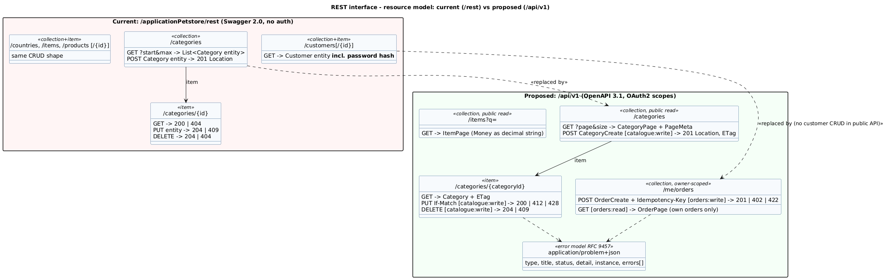

# PetStore EE7 — REST Interface Design Review and Proposed API v1

| Item | Value |
|---|---|
| Current contract | `src/main/webapp/swagger.json` (Swagger 2.0, generated by `swagger-maven-plugin` at build time) |
| Proposed contract | [`openapi-v1.yaml`](openapi-v1.yaml): **OpenAPI 3.1.0**, validated with `openapi-spec-validator` |
| Conventions used as yardstick | RFC 9110 (HTTP semantics) · RFC 9457 (problem details) · RFC 8594 (Sunset header) · OWASP API Security Top 10 2023 · Microsoft REST API Guidelines · Zalando RESTful API Guidelines |
| Decision | [ADR-0005](../architecture/adr/0005-versioned-dto-based-rest-api.md) |

## 1. Current interface inventory

Five resources, each with the same CRUD shape: `categories`, `countries`, `customers`, `items`, `products`.

| Method | Path | Success | Errors | Notes |
|---|---|---|---|---|
| GET | `/rest/{resource}?start=&max=` | 200, list of **entities** | — | Offset paging with no total count or links |
| POST | `/rest/{resource}` | 201 + `Location` | — | Accepts an entity; client can set `id` and `version` |
| GET | `/rest/{resource}/{id}` | 200 | 404 | |
| PUT | `/rest/{resource}/{id}` | 204 | 409 on `OptimisticLockException` | The path `id` is ignored; the body's `id` wins |
| DELETE | `/rest/{resource}/{id}` | 204 | 404 | Hard delete; FK violations surface as 500 |

## 2. Review against conventions

| # | Convention | Current | Gap / risk | Proposed (v1) |
|---|---|---|---|---|
| A1 | Authentication and authorisation (OWASP API2, API5:2023) | None | Anyone can create, modify or delete catalogue data and customers | OAuth 2.0 bearer tokens; scopes `catalogue:write`, `orders:*` |
| A2 | Object-level authorisation (API1:2023 BOLA) | `/customers/{id}` returns any customer | Enumeration of every customer | Owner-scoped `/me/...` resources; no public customer CRUD |
| A3 | Property-level exposure (API3:2023) | Entity serialisation includes `password`, `uuid`, `version` | Password hashes leak (SEC-04); mass assignment of `id`/`role` | Separate read/write DTOs, `additionalProperties: false` |
| A4 | Versioning | Unversioned `/rest` | Breaking changes affect every client | `/api/v1`; deprecate `/rest` with `Deprecation` + `Sunset` (RFC 8594) |
| A5 | Error model | Bare status codes; 500 with server HTML on constraint violations | Clients cannot parse errors | `application/problem+json` (RFC 9457) with field errors; 422 for validation |
| A6 | Pagination | `start`/`max` without metadata | Clients cannot build pagers; unbounded `max` (API4:2023 unrestricted resource consumption) | `page`/`size`, max 100, `PageMeta` with totals |
| A7 | Concurrency | `version` in body; 409 | Not the HTTP-native mechanism | `ETag` + `If-Match`; 412 on mismatch, 428 when the header is missing |
| A8 | Money | `Float unitCost` | Floating-point rounding errors | `Money { amount: "10.00", currency: "USD" }` |
| A9 | Idempotency of order creation | n/a | Double submission creates two orders | `Idempotency-Key` header on `POST /me/orders` |
| A10 | Contract format | Swagger 2.0 generated from annotations | Code-first; contract drifts | Contract-first OpenAPI 3.1 with CI linting (Spectral) and contract tests |
| A11 | Media types | JSON and XML | XML doubles the attack surface (XXE) and test effort | JSON only |
| A12 | Transport | HTTP :8080 | Credentials and data in clear text | HTTPS only, HSTS (at the edge; see the target architecture) |

## 3. Proposed v1 at a glance

- `GET /api/v1/categories`, `GET /api/v1/categories/{categoryId}`: public reads.
- `POST|PUT|DELETE /api/v1/categories...`: administrators only (`catalogue:write`), with `If-Match` on `PUT`.
- `GET /api/v1/items?q=`: public keyword search, paged.
- `GET|POST /api/v1/me/orders`: the authenticated customer's own orders. Placing an order takes a PSP `paymentToken`, never a card number (ADR-0007).

The full schema, security scheme and responses are in [`openapi-v1.yaml`](openapi-v1.yaml). The matching test cases are
TC-API-xx and TC-SEC-xx in the [test catalogue](../testing/test-cases.md).
