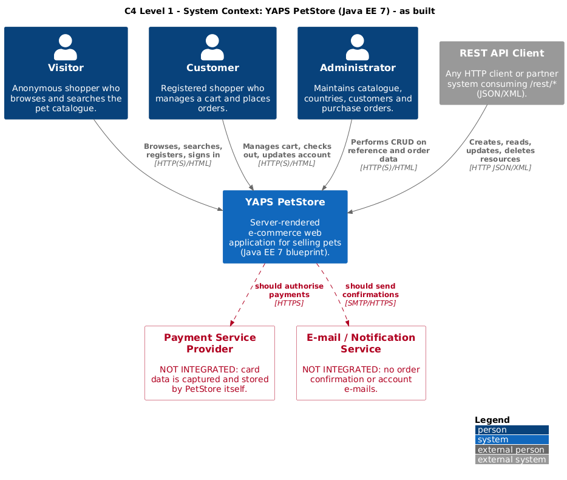
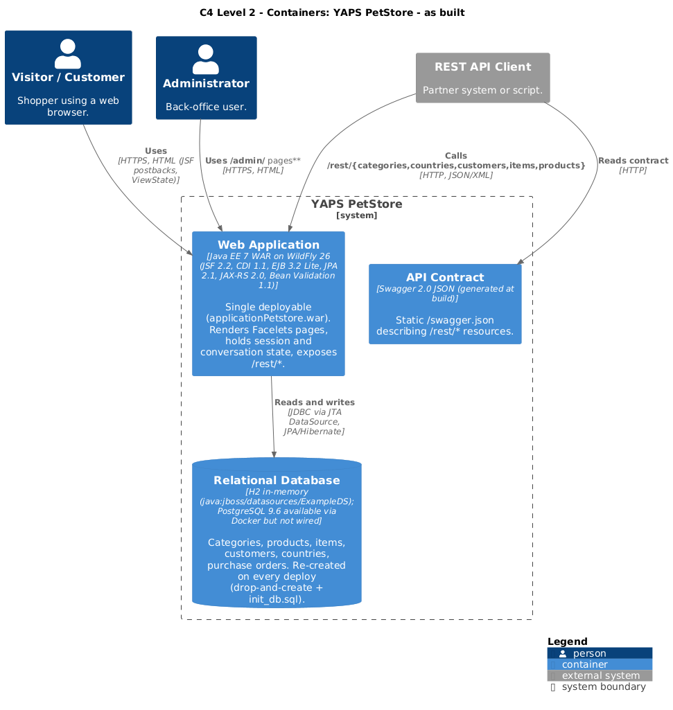
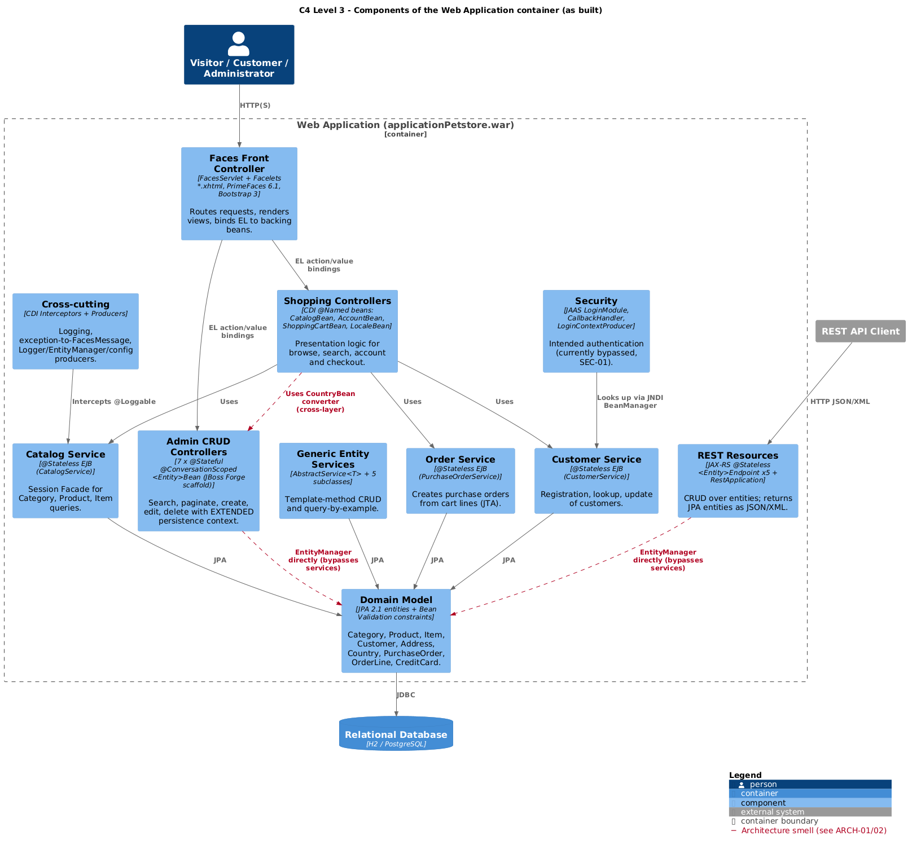
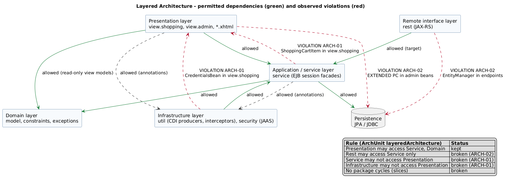
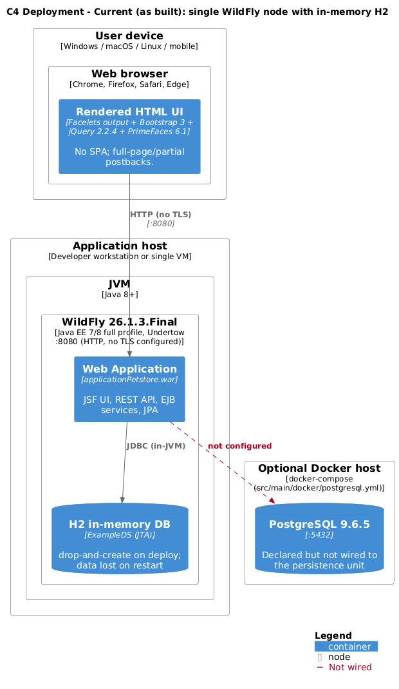
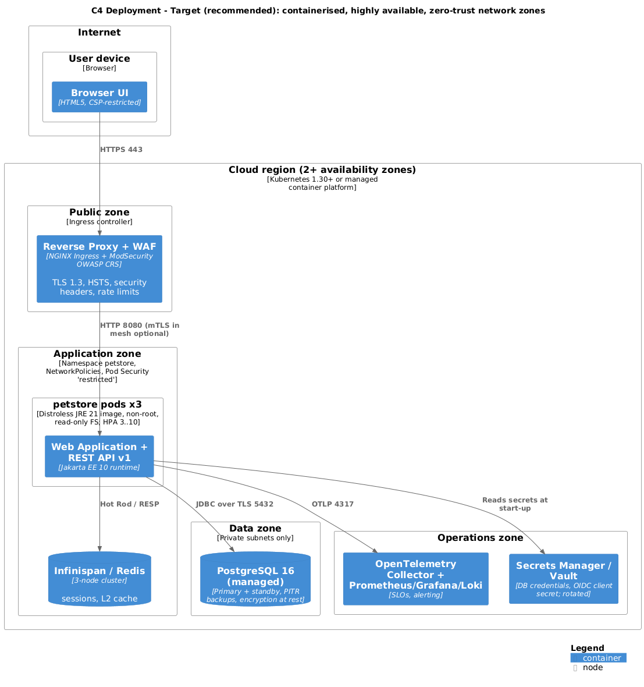
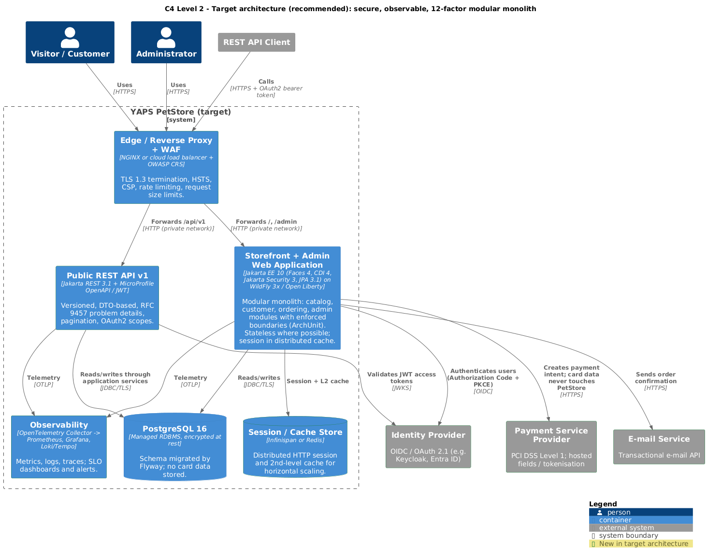

# PetStore EE7 — Architecture Description

| Item | Value |
|---|---|
| Standard / template | Structure follows **arc42** (v8); views follow the **C4 model** (context, container, component, deployment); architecture description concepts follow **ISO/IEC/IEEE 42010:2022** (stakeholders, concerns, viewpoints) |
| Quality model | **ISO/IEC 25010:2023** product quality characteristics |
| Decisions | Recorded as ADRs in [MADR 3](https://adr.github.io/madr/) format under [`adr/`](adr/) |
| Detailed design | UML 2.5.1 model in [`../uml/`](../uml/README.md) |
| Baseline | `agoncal-application-petstore-ee7` @ `725839c` |
| Sources | `src/*.puml` (PlantUML + bundled C4-PlantUML stdlib) · rendered to `rendered/*.png|svg` by [`../render.sh`](../render.sh) |

---

## 1. Introduction and goals

YAPS PetStore is a teaching and reference application that shows how to combine the Java EE 7 technologies (JSF, CDI,
EJB Lite, JPA, Bean Validation, JAX-RS) in one e-commerce web application.

| Stakeholder | Concern | Addressed in |
|---|---|---|
| Students / developers | How the Java EE 7 specifications fit together | §4, §5, UML model |
| Lecturer / reviewer | Conformance to standards, patterns and good practice | §9, §11, ADRs |
| Shopper (Visitor, Customer) | Find pets, buy them securely | §3, [UX](../ux/README.md) |
| Administrator | Maintain reference data and orders | §3, [UX](../ux/README.md) |
| Operator | Deploy, run, observe, recover | §7, §8 |
| Security / compliance | Authentication, data protection, PCI DSS, OWASP | §10, §11, [testing](../testing/README.md) |

**Top quality goals** (ISO/IEC 25010:2023)

| Priority | Characteristic | Goal |
|---|---|---|
| 1 | Maintainability (modularity, analysability) | Code must stay a clear, idiomatic example of each Java EE specification |
| 2 | Security (confidentiality, integrity, authenticity, accountability) | No account takeover, no disclosure of card or password data |
| 3 | Functional suitability | Browse → cart → order works end to end with correct totals |
| 4 | Interaction capability (usability, accessibility) | WCAG 2.2 AA; bilingual (en/fr) |

## 2. Constraints

- Java EE 7 APIs only (the `javax.*` namespace); must run on WildFly 10–26. It does not run on WildFly 27 or later, which use Jakarta EE 10.
- Single Maven WAR module; Java 8 source/target level.
- Third-party libraries limited to PrimeFaces, Bootstrap/jQuery WebJars, Swagger annotations and Log4j.
- Licence: CC BY-SA 3.0 (see the project `README.md`).

## 3. Context and scope

The system has **no external integrations**. Payment and notification are shown as *gaps* (red): the application
captures and stores card data itself, and it sends no e-mail.

## 4. Solution strategy

| Concern | Approach (as built) |
|---|---|
| Presentation | Server-side rendering with **JSF 2.2 Facelets** (MVC, with `FacesServlet` as Front Controller), PrimeFaces 6.1 and Bootstrap 3 |
| Business logic | **EJB 3.2 Lite `@Stateless` session facades**, container-managed JTA transactions |
| Wiring and cross-cutting | **CDI 1.1**: DI with qualifiers, producers, interceptors, one (unused) decorator |
| Persistence | **JPA 2.1** / Hibernate, named queries, Criteria API, `@Version` optimistic locking, 2nd-level cache on catalogue entities |
| Validation | **Bean Validation 1.1** with composed custom constraints |
| Remote interface | **JAX-RS 2.0**: five CRUD resources that return JPA entities (Swagger 2.0 contract) |
| Security | JAAS `LoginModule` (disabled in code) plus a session-scoped logged-in flag |
| Deployment | Single WAR on WildFly with an in-memory H2 database |

## 5. Building block view

### 5.1 Level 2 — Containers

### 5.2 Level 3 — Components of the web application

The red dashed relationships are **architecture smells**, detailed in §9 and §11.

### 5.3 Layering rules

The legend lists the rules an ArchUnit `layeredArchitecture()` test would enforce. Four of the five rules are broken today.

## 6. Runtime view

Runtime scenarios are modelled as UML interactions in the design model:
[BrowseCatalogue](../uml/markdown/behaviour/13e-sequence-browse-catalogue.md),
[SignIn](../uml/markdown/behaviour/13b-sequence-sign-in.md),
[CreateAccount](../uml/markdown/behaviour/13f-sequence-create-account.md),
[AddItemToCart](../uml/markdown/behaviour/14-communication-add-to-cart.md),
[ConfirmOrder](../uml/markdown/behaviour/13a-sequence-confirm-order.md),
[SignOut](../uml/markdown/behaviour/13g-sequence-sign-out.md),
[REST CRUD](../uml/markdown/behaviour/13c-sequence-rest-category.md) and the end-to-end
[ShoppingJourney](../uml/markdown/behaviour/15-interaction-overview-shopping.md).

## 7. Deployment view

### 7.1 Current (development grade)

### 7.2 Target (production grade, recommended)

## 8. Cross-cutting concepts

| Concept | As built | Recommended |
|---|---|---|
| Logging | `@Loggable` interceptor writes entry/exit at INFO for every business call | Structured JSON logs; entry/exit at DEBUG; correlation ID from W3C `traceparent` |
| Error handling | `@CatchException` turns every exception into a `FacesMessage` and hides the cause | Distinguish business from technical errors; RFC 9457 problem details for REST; error IDs in logs |
| Transactions | Container-managed JTA on `@Stateless`; admin beans use an EXTENDED persistence context | Keep CMT; avoid EXTENDED contexts across requests |
| Concurrency | `@Version` on every entity; REST returns 409 on conflict | Also send `ETag` / `If-Match` on REST |
| Session state | `@SessionScoped` account, `@ConversationScoped` cart | Replicate sessions or externalise the cart so the app can scale out |
| i18n | JSF resource bundles `Messages` (en, fr) | Keep; add locale negotiation from `Accept-Language` |
| Configuration | `config.properties` via `@ConfigProperty` producer | MicroProfile Config (12-factor: environment variables, secrets manager) |
| Security | See ADR-0004 and ADR-0006 | Jakarta Security + OIDC, role-based access, security headers |

## 9. Architectural patterns — review

| Pattern (source) | Where applied | Assessment | Recommendation |
|---|---|---|---|
| **Layered architecture** (Buschmann et al., POSA 1) | Packages `view` / `rest` → `service` → `model` | Partly applied; cycles between `service`/`security` and `view.shopping` (ARCH-01) | Move DTOs out of `view`; enforce with ArchUnit |
| **Model-View-Controller + Front Controller** (POSA 1; Fowler, PoEAA) | `FacesServlet`, Facelets, backing beans | Idiomatic JSF | Keep; keep business logic out of beans |
| **Boundary-Control-Entity** (Jacobson) | View/REST (boundary), services (control), entities | Boundaries sometimes skip control (ARCH-02) | Route REST and admin through services |
| **Session Facade** (Core J2EE) | `CatalogService`, `CustomerService`, `PurchaseOrderService` | Good transaction boundary | Keep; move REST onto facades |
| **Remote Facade** (PoEAA) | JAX-RS endpoints | Exposes JPA entities directly (SEC-04) | DTOs, versioned `/api/v1` (ADR-0005) |
| **Transaction Script vs Domain Model** (PoEAA) | Logic in services; entities have little behaviour (anaemic) | Acceptable for a demo, but totals logic is missing (BUG-02) | Put pricing behind a `PriceCalculator` with decorators |
| **Monolith** (single deployable) | One WAR | Appropriate at this scale | Evolve to a *modular* monolith with enforced module boundaries (ADR-0002) |
| **Stateful server session** | Conversation-scoped cart, session-scoped login | Needs sticky sessions to scale out | Distributed session store (target architecture) |
| **Shared database** | One schema for all modules | Fine within a monolith | One schema per module, owned by that module |
| **Client-server / thin client** | Browser renders server HTML | Simple, SEO-friendly | Keep; add progressive enhancement |

Design patterns (GoF, Core J2EE, PoEAA) are catalogued in UML in
[20-pattern-catalogue](../uml/markdown/patterns/20-pattern-catalogue.md). The **recommended target-state patterns** are in
[29-target-state-patterns](../uml/markdown/patterns/29-target-state-patterns.md).

### Target container architecture

## 10. Quality requirements — scenarios

| ID | Characteristic | Stimulus → response (measure) | As built |
|---|---|---|---|
| QS-1 | Security / authenticity | Attacker signs in with a valid login and a wrong password → rejected, attempt logged, account locked after 5 failures | **Fails** (SEC-01) |
| QS-2 | Security / confidentiality | Anonymous `GET /rest/customers` → 401 | **Fails** (SEC-02, SEC-04) |
| QS-3 | Functional correctness | Order of 2 × $10 at 20% VAT, 5% discount → stored `total` = computed value | **Fails** (BUG-02: `total` is null) |
| QS-4 | Performance efficiency | 50 concurrent users browse the catalogue → p95 < 300 ms | Not measured |
| QS-5 | Reliability / recoverability | Application restart → no data loss | **Fails** (in-memory H2, drop-and-create) |
| QS-6 | Maintainability / modularity | New entity added → ArchUnit rules still pass, no package cycles | **Fails** (ARCH-01) |
| QS-7 | Interaction capability / accessibility | Keyboard-only user completes checkout → possible, WCAG 2.2 AA | Not verified; see [UX review](../ux/README.md) |

## 11. Risks and technical debt

The finding IDs match the [UML model README](../uml/README.md#3-findings-raised-while-reverse-engineering-the-code).

| ID | Risk | Severity | Mitigation (ADR) |
|---|---|---|---|
| SEC-01 | Password never verified at sign-in | High | ADR-0006 |
| SEC-02 | No authorisation on `/admin/**` and `/rest/**` | High | ADR-0006 |
| SEC-03 | Unsalted SHA-256 password hashes | High | ADR-0006 (`Pbkdf2PasswordHash`) |
| SEC-04 | Password hash exposed via REST | Medium | ADR-0005 (DTOs) |
| SEC-05 | Card number stored in clear text | Medium | ADR-0007 (payment provider tokenisation) |
| SEC-07 | Session not invalidated at logout | Low | ADR-0006 |
| SEC-08 | Default credentials `user/user - admin/admin` printed on the sign-in page | High | Remove the hint; rotate seed passwords; seed data for development only |
| ARCH-01/02 | Layering violations, bypassing the facades | Low | ADR-0005, ArchUnit |
| OPS-01 | Schema dropped on every deploy | Medium | ADR-0008 (Flyway, PostgreSQL) |
| DEP-01 | End-of-life platform (Java EE 7) and front-end libraries with known CVEs | Medium | ADR-0008 (Jakarta EE 10), SCA in CI |

## 12. Architecture decision records

| ADR | Title | Status |
|---|---|---|
| [0001](adr/0001-record-architecture-decisions.md) | Record architecture decisions | Accepted |
| [0002](adr/0002-single-war-monolith-on-java-ee7.md) | Single WAR monolith on Java EE 7 | Accepted (retrospective) |
| [0003](adr/0003-server-side-ui-with-jsf.md) | Server-side UI with JSF Facelets | Accepted (retrospective) |
| [0004](adr/0004-jaas-authentication.md) | Authentication with a custom JAAS LoginModule | Superseded by 0006 |
| [0005](adr/0005-versioned-dto-based-rest-api.md) | Versioned, DTO-based REST API | Proposed |
| [0006](adr/0006-jakarta-security-with-oidc.md) | Jakarta Security with OIDC and role-based access | Proposed |
| [0007](adr/0007-delegate-card-handling-to-psp.md) | Delegate card handling to a payment service provider | Proposed |
| [0008](adr/0008-migrate-to-jakarta-ee-10-postgresql-flyway.md) | Migrate to Jakarta EE 10, PostgreSQL and Flyway | Proposed |

## 13. Glossary

| Term | Meaning |
|---|---|
| Conversation | CDI scope that spans several requests and is started and ended explicitly (used for the cart and the admin editors) |
| Session Facade | A stateless service that is the transactional entry point to a group of entities |
| C4 | Context, Containers, Components, Code: a hierarchical way to diagram software architecture |
| PSP | Payment Service Provider (for example Stripe or Adyen) |
| OIDC | OpenID Connect: an identity layer on top of OAuth 2.0 |
