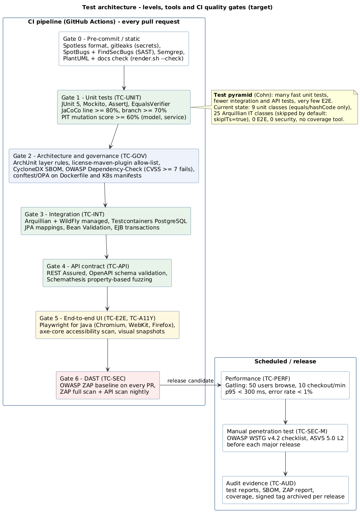

# PetStore EE7 — Test Strategy and Plan

| Item | Value |
|---|---|
| Standard | Structure follows the **ISO/IEC/IEEE 29119-3:2021** test plan and test case specification; levels follow ISTQB CTFL v4.0 |
| Security baseline | **OWASP ASVS 5.0** Level 2, **OWASP WSTG v4.2**, OWASP API Security Top 10 2023, PCI DSS v4.0.1 (card data) |
| Accessibility baseline | **WCAG 2.2** Level AA |
| Test cases | [`test-cases.md`](test-cases.md) (65 cases) and [`test-cases.csv`](test-cases.csv), both generated by [`gen_test_cases.py`](gen_test_cases.py) |
| Traceability | Test case → use case (UC-xx, [UML 10a/10b](../uml/markdown/behaviour/10a-use-case-shopping.md)), finding (SEC/BUG/UX/ARCH), quality scenario (QS-x, [architecture §10](../architecture/README.md#10-quality-requirements--scenarios)) |

## 1. Scope and objectives

In scope:
- the storefront and admin UIs;
- the `/rest` API and the proposed `/api/v1`;
- services, persistence and security;
- the build and supply chain.

Out of scope: WildFly itself and browser vendors.

The tests have three objectives:
1. Confirm the functional behaviour of every use case.
2. Expose the known defects with a failing test *before* they are fixed (test-first remediation).
3. Guard the target architecture with automated gates.

## 2. Current state (baseline)

| Area | Found in repository | Assessment |
|---|---|---|
| Unit tests | 9 classes `model/*Test`: `equals`/`hashCode` with EqualsVerifier | Very thin; no business logic tested |
| Integration tests | 25 Arquillian classes (`model/*IT`, `service/*IT`, `rest/*EndpointIT`, `view/admin/*BeanIT`): 68 `@Test` methods in total | Good CRUD smoke coverage, but they are **skipped by default** (`skipITs=true`) and need a WildFly profile |
| Shopping flow (AccountBean, CatalogBean, ShoppingCartBean, CatalogService) | None | **Gap:** the revenue path is untested |
| E2E UI, accessibility, security, performance | None | **Gap** |
| Coverage / mutation | No JaCoCo or PIT in `pom.xml` | **Gap:** no measurable exit criterion |

## 3. Test architecture and levels

| Level | ID prefix | What | Tools | Environment | When |
|---|---|---|---|---|---|
| Unit | TC-UNIT | Pure logic: pricing, cart, constraints, hashing | JUnit 5, Mockito, AssertJ, EqualsVerifier | JVM | Every commit |
| Integration | TC-INT | JPA mappings, transactions, EJB/CDI wiring | Arquillian (WildFly managed), Testcontainers PostgreSQL | Ephemeral containers | Every PR |
| API / contract | TC-API | HTTP semantics, schema, errors, paging | REST Assured, Schemathesis, Spectral lint | Deployed WAR | Every PR |
| End-to-end | TC-E2E | User journeys per use case | Playwright for Java | Deployed WAR + seed data | Every PR (smoke), nightly (full) |
| Accessibility | TC-A11Y | WCAG 2.2 AA | axe-core in Playwright, manual NVDA/VoiceOver | As E2E | Every PR (axe), per release (manual) |
| Security | TC-SEC | OWASP WSTG / ASVS / API Top 10 | SpotBugs+FindSecBugs, Semgrep, gitleaks, OWASP Dependency-Check, OWASP ZAP, manual pentest | As E2E; pentest on staging | PR (SAST/SCA/ZAP baseline), nightly (ZAP full), release (pentest) |
| Governance / policy as code | TC-GOV | Architecture rules, licences, SBOM, container policy, docs sync | ArchUnit, license-maven-plugin, CycloneDX, conftest/OPA, `docs/render.sh --check` | CI | Every PR |
| Audit | TC-AUD | Security event logging, release evidence | Log assertions, GitHub release artifacts | CI / release | Release |
| Performance | TC-PERF | Load and response-time objectives | Gatling | Performance environment | Nightly / release |

## 4. Entry and exit criteria

| Gate | Entry | Exit (must pass to merge / release) |
|---|---|---|
| Pull request | Builds; pre-commit hooks pass | All TC-UNIT, TC-INT, TC-API and E2E smoke pass; JaCoCo line ≥ 80% and branch ≥ 70% on changed code; no new SpotBugs/Semgrep high findings; Dependency-Check has no CVSS ≥ 7.0; ZAP baseline has no High; axe finds no serious/critical violations; ArchUnit passes; docs check passes |
| Release | All PR gates green on `main` | Full E2E and ZAP full scan green; Critical/High TC-SEC pass; manual pentest report with no open High; SBOM and licence report attached; performance objectives met |

## 5. Test data and environments

- **Seed data:** `init_db.sql` (5 categories, 16 products, 32 items, 6 customers, 226 countries) for development only. For CI, use a dedicated Flyway `testdata` location. **Never** ship accounts with known passwords (SEC-08).
- **Cards:** test PANs only (for example `4111 1111 1111 1111`), and never in production. Target: PSP sandbox tokens (ADR-0007).
- **Isolation:** every integration and E2E run gets a fresh PostgreSQL container, and tests do not depend on execution order.

## 6. Defect management

A test that exposes a known finding is committed first, marked `@Disabled("SEC-01")` or tagged `known-defect`, and is
enabled in the same PR as the fix. The column *Expected on current build* in the catalogue records the expected
outcome: 30 of the 65 cases are expected to **FAIL** today, and each is linked to its finding ID.

## 7. Traceability summary

Every use case UC01–UC21 is covered by at least one test case (see the matrix at the end of
[`test-cases.md`](test-cases.md)). Every Critical/High finding in the
[architecture risk list](../architecture/README.md#11-risks-and-technical-debt) has at least one failing test that proves it.
