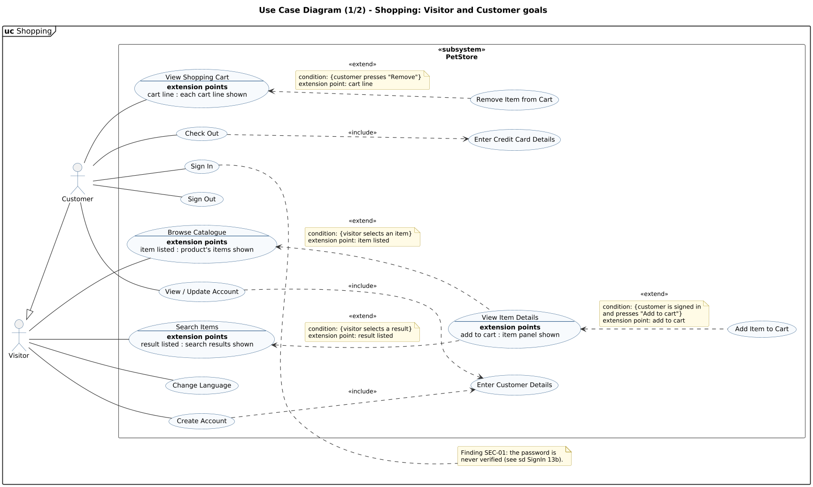

<!-- GENERATED by docs/uml/gen_markdown.py from the .puml source. Do not edit by hand. -->
# Use Case Diagram (1/2) - Shopping: Visitor and Customer goals

| Property | Value |
|---|---|
| UML 2.5.1 diagram kind | Use Case |
| Frame heading (Annex A) | `uc Shopping` |
| Summary | Shopping goals of Visitor and Customer with <<include>>, <<extend>>, extension points and extend conditions. |
| PlantUML source | [`src/behaviour/10a-use-case-shopping.puml`](../../src/behaviour/10a-use-case-shopping.puml) |
| Rendered | [PNG](../../rendered/behaviour/10a-use-case-shopping.png) · [SVG](../../rendered/behaviour/10a-use-case-shopping.svg) |
| References | [sd SignIn](../behaviour/13b-sequence-sign-in.md) |
| Referenced by | none |

## Diagram



## PlantUML source

The block below is the exact content of `src/behaviour/10a-use-case-shopping.puml`. It includes the shared
style file `../_style.iuml` (reproduced underneath) so it renders identically in any
PlantUML tool when saved next to that file.

```plantuml
@startuml 10a-use-case-shopping
' @kind: Use Case
' @summary: Shopping goals of Visitor and Customer with <<include>>, <<extend>>, extension points and extend conditions.
!include ../_style.iuml
left to right direction
mainframe **uc** Shopping
title Use Case Diagram (1/2) - Shopping: Visitor and Customer goals

' ---------------------------------------------------------------------------
' UML 2.5.1 clause 18 conformance
'  * Actor-UseCase links are binary Associations: plain solid lines (18.2.1.4).
'  * <<include>>: dashed open arrow FROM the including (base) use case TO the
'    included use case (18.1.4).
'  * <<extend>>: dashed open arrow FROM the extending use case TO the extended
'    use case (18.1.4). The extended use case lists its ExtensionPoints in an
'    "extension points" compartment; condition + extension point are shown in
'    a note attached to the Extend arrow (Figure 18.3).
'  * Subject is a rectangle named top-left with its keyword <<subsystem>>.
' ---------------------------------------------------------------------------

actor "Visitor" as visitor
actor "Customer" as customer
visitor <|-- customer

rectangle "<<subsystem>>\n**PetStore**" as sys {
  usecase UC01 as "Browse Catalogue
  --
  **extension points**
  item listed : product's items shown"
  usecase UC02 as "Search Items
  --
  **extension points**
  result listed : search results shown"
  usecase UC03 as "View Item Details
  --
  **extension points**
  add to cart : item panel shown"
  usecase UC04 as "Change Language"
  usecase UC05 as "Create Account"
  usecase UC06 as "Enter Customer Details"
  usecase UC07 as "Sign In"
  usecase UC08 as "Sign Out"
  usecase UC09 as "View / Update Account"
  usecase UC10 as "Add Item to Cart"
  usecase UC11 as "View Shopping Cart
  --
  **extension points**
  cart line : each cart line shown"
  usecase UC12 as "Remove Item from Cart"
  usecase UC13 as "Check Out"
  usecase UC14 as "Enter Credit Card Details"
}

' ----- Associations (binary, plain lines) -----
visitor -- UC01
visitor -- UC02
visitor -- UC04
visitor -- UC05
customer -- UC07
customer -- UC08
customer -- UC09
customer -- UC11
customer -- UC13

' ----- Include: arrow points base -> addition -----
UC05 ..> UC06 : <<include>>
UC09 ..> UC06 : <<include>>
UC13 ..> UC14 : <<include>>

' ----- Extend: arrow points extension -> extended case -----
' (written as "extended <.. extension" only to steer the layout; the
'  arrowhead is still on the EXTENDED use case, as clause 18.1.4 requires)
UC01 <.. UC03 : <<extend>>
note on link
  condition: {visitor selects an item}
  extension point: item listed
end note
UC02 <.. UC03 : <<extend>>
note on link
  condition: {visitor selects a result}
  extension point: result listed
end note
UC03 <.. UC10 : <<extend>>
note on link
  condition: {customer is signed in
  and presses "Add to cart"}
  extension point: add to cart
end note
UC11 <.. UC12 : <<extend>>
note on link
  condition: {customer presses "Remove"}
  extension point: cart line
end note

note right of UC07
  Finding SEC-01: the password is
  never verified (see sd SignIn 13b).
end note
@enduml
```

<details>
<summary>Shared style: <code>src/_style.iuml</code></summary>

```plantuml
' =====================================================================
'  Shared PlantUML style for the PetStore EE7 UML 2.5.1 model
'  Source of truth : src/main/java/org/agoncal/application/petstore/**
'  Notation        : OMG UML 2.5.1 (formal/17-12-05), Annex A frames
'  Licence         : CC BY-SA 3.0 (derivative of agoncal/petstore-ee7)
' =====================================================================
!pragma useIntermediatePackages false
set separator none
skinparam dpi 110
skinparam shadowing false
skinparam roundCorner 4
skinparam defaultFontName "Helvetica"
skinparam defaultFontSize 12
skinparam titleFontSize 15
skinparam titleFontStyle bold
skinparam ArrowColor #333333
skinparam ArrowFontSize 11
skinparam BackgroundColor #FFFFFF
skinparam NoteBackgroundColor #FFFBE6
skinparam NoteBorderColor #B59F3B
skinparam NoteFontSize 11
skinparam packageStyle folder
skinparam ClassBackgroundColor #F7FAFD
skinparam ClassBorderColor #2F5D8A
skinparam ClassHeaderBackgroundColor #E3EEF8
skinparam ClassAttributeIconSize 0
skinparam ObjectBackgroundColor #F7FAFD
skinparam ObjectBorderColor #2F5D8A
skinparam ComponentBackgroundColor #F7FAFD
skinparam ComponentBorderColor #2F5D8A
skinparam NodeBackgroundColor #F2F2F2
skinparam NodeBorderColor #555555
skinparam ArtifactBackgroundColor #FFFFFF
skinparam ActorBorderColor #2F5D8A
skinparam UsecaseBackgroundColor #F7FAFD
skinparam UsecaseBorderColor #2F5D8A
skinparam ActivityBackgroundColor #F7FAFD
skinparam ActivityBorderColor #2F5D8A
skinparam ActivityDiamondBackgroundColor #FFFFFF
skinparam PartitionBorderColor #7A7A7A
skinparam StateBackgroundColor #F7FAFD
skinparam StateBorderColor #2F5D8A
skinparam SequenceLifeLineBorderColor #7A7A7A
skinparam SequenceGroupBorderColor #555555
skinparam SequenceGroupHeaderFontStyle bold
skinparam ParticipantBackgroundColor #F7FAFD
skinparam ParticipantBorderColor #2F5D8A
skinparam stereotypeCBackgroundColor #C9DDF0
skinparam legendBackgroundColor #FAFAFA
skinparam legendBorderColor #999999
skinparam legendFontSize 10
hide circle
```

</details>

[Back to index](../README.md)
