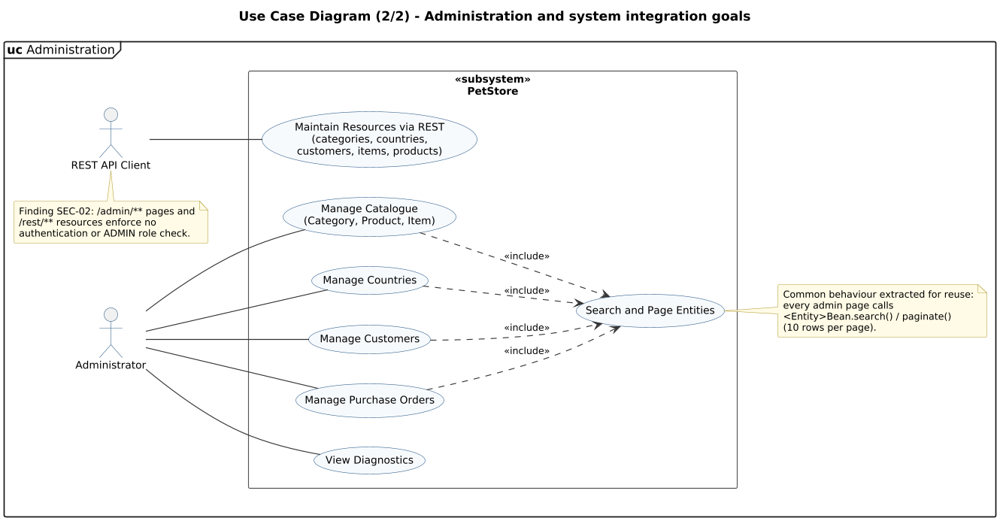

<!-- GENERATED by docs/uml/gen_markdown.py from the .puml source. Do not edit by hand. -->
# Use Case Diagram (2/2) - Administration and system integration goals

| Property | Value |
|---|---|
| UML 2.5.1 diagram kind | Use Case |
| Frame heading (Annex A) | `uc Administration` |
| Summary | Administration and REST integration goals with a shared included use case. |
| PlantUML source | [`src/behaviour/10b-use-case-administration.puml`](../../src/behaviour/10b-use-case-administration.puml) |
| Rendered | [PNG](../../rendered/behaviour/10b-use-case-administration.png) · [SVG](../../rendered/behaviour/10b-use-case-administration.svg) |
| References | none |
| Referenced by | none |

## Diagram



## PlantUML source

The block below is the exact content of `src/behaviour/10b-use-case-administration.puml`. It includes the shared
style file `../_style.iuml` (reproduced underneath) so it renders identically in any
PlantUML tool when saved next to that file.

```plantuml
@startuml 10b-use-case-administration
' @kind: Use Case
' @summary: Administration and REST integration goals with a shared included use case.
!include ../_style.iuml
left to right direction
mainframe **uc** Administration
title Use Case Diagram (2/2) - Administration and system integration goals

actor "Administrator" as admin
actor "REST API Client" as api

rectangle "<<subsystem>>\n**PetStore**" as sys {
  usecase UC15 as "Manage Catalogue\n(Category, Product, Item)"
  usecase UC16 as "Manage Countries"
  usecase UC17 as "Manage Customers"
  usecase UC18 as "Manage Purchase Orders"
  usecase UC19 as "Search and Page Entities"
  usecase UC20 as "View Diagnostics"
  usecase UC21 as "Maintain Resources via REST\n(categories, countries,\ncustomers, items, products)"
}

admin -- UC15
admin -- UC16
admin -- UC17
admin -- UC18
admin -- UC20
api -- UC21

' ----- Include: arrow points base -> addition (shared paging/search) -----
UC15 ..> UC19 : <<include>>
UC16 ..> UC19 : <<include>>
UC17 ..> UC19 : <<include>>
UC18 ..> UC19 : <<include>>

note right of UC19
  Common behaviour extracted for reuse:
  every admin page calls
  <Entity>Bean.search() / paginate()
  (10 rows per page).
end note
note bottom of api
  Finding SEC-02: /admin/** pages and
  /rest/** resources enforce no
  authentication or ADMIN role check.
end note
@enduml
```

<details>
<summary>Shared style: <code>src/_style.iuml</code></summary>

```plantuml
' =====================================================================
'  Shared PlantUML style for the PetStore EE7 UML 2.5.1 model
'  Source of truth : src/main/java/org/agoncal/application/petstore/**
'  Notation        : OMG UML 2.5.1 (formal/17-12-05), Annex A frames
'  Licence         : CC BY-SA 3.0 (derivative of agoncal/petstore-ee7)
' =====================================================================
!pragma useIntermediatePackages false
set separator none
skinparam dpi 110
skinparam shadowing false
skinparam roundCorner 4
skinparam defaultFontName "Helvetica"
skinparam defaultFontSize 12
skinparam titleFontSize 15
skinparam titleFontStyle bold
skinparam ArrowColor #333333
skinparam ArrowFontSize 11
skinparam BackgroundColor #FFFFFF
skinparam NoteBackgroundColor #FFFBE6
skinparam NoteBorderColor #B59F3B
skinparam NoteFontSize 11
skinparam packageStyle folder
skinparam ClassBackgroundColor #F7FAFD
skinparam ClassBorderColor #2F5D8A
skinparam ClassHeaderBackgroundColor #E3EEF8
skinparam ClassAttributeIconSize 0
skinparam ObjectBackgroundColor #F7FAFD
skinparam ObjectBorderColor #2F5D8A
skinparam ComponentBackgroundColor #F7FAFD
skinparam ComponentBorderColor #2F5D8A
skinparam NodeBackgroundColor #F2F2F2
skinparam NodeBorderColor #555555
skinparam ArtifactBackgroundColor #FFFFFF
skinparam ActorBorderColor #2F5D8A
skinparam UsecaseBackgroundColor #F7FAFD
skinparam UsecaseBorderColor #2F5D8A
skinparam ActivityBackgroundColor #F7FAFD
skinparam ActivityBorderColor #2F5D8A
skinparam ActivityDiamondBackgroundColor #FFFFFF
skinparam PartitionBorderColor #7A7A7A
skinparam StateBackgroundColor #F7FAFD
skinparam StateBorderColor #2F5D8A
skinparam SequenceLifeLineBorderColor #7A7A7A
skinparam SequenceGroupBorderColor #555555
skinparam SequenceGroupHeaderFontStyle bold
skinparam ParticipantBackgroundColor #F7FAFD
skinparam ParticipantBorderColor #2F5D8A
skinparam stereotypeCBackgroundColor #C9DDF0
skinparam legendBackgroundColor #FAFAFA
skinparam legendBorderColor #999999
skinparam legendFontSize 10
hide circle
```

</details>

[Back to index](../README.md)
