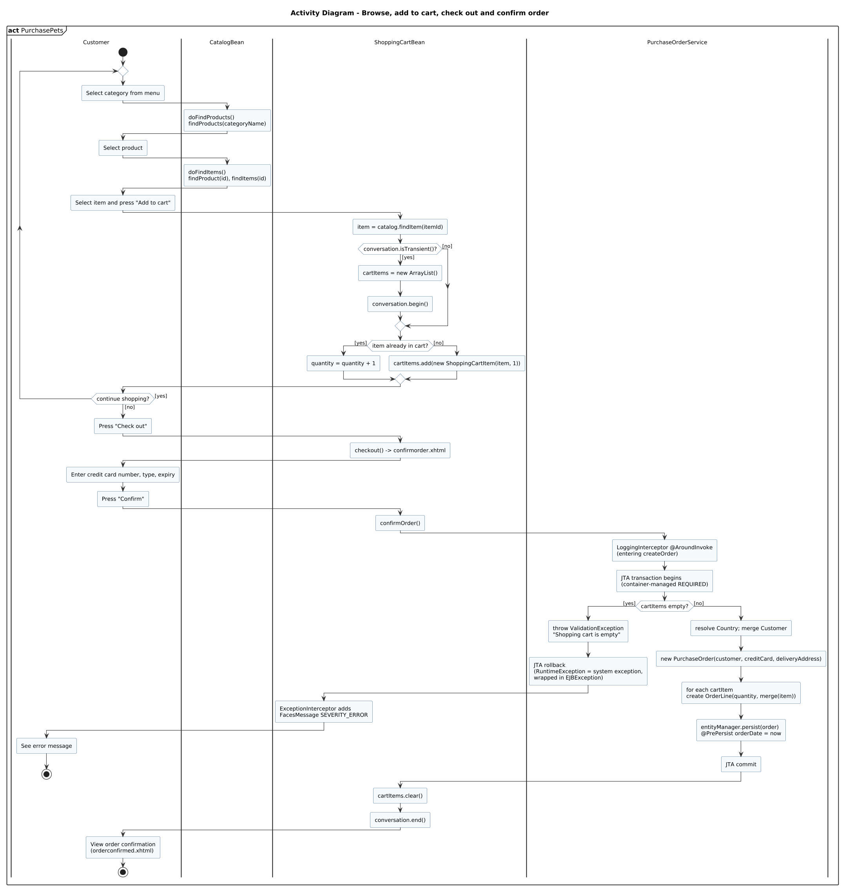

<!-- GENERATED by docs/uml/gen_markdown.py from the .puml source. Do not edit by hand. -->
# Activity Diagram - Browse, add to cart, check out and confirm order

| Property | Value |
|---|---|
| UML 2.5.1 diagram kind | Activity |
| Frame heading (Annex A) | `act PurchasePets` |
| Summary | Browse, add to cart, check out and confirm order with swimlanes, decisions and a loop. |
| PlantUML source | [`src/behaviour/11a-activity-checkout.puml`](../../src/behaviour/11a-activity-checkout.puml) |
| Rendered | [PNG](../../rendered/behaviour/11a-activity-checkout.png) · [SVG](../../rendered/behaviour/11a-activity-checkout.svg) |
| References | none |
| Referenced by | none |

## Diagram



## PlantUML source

The block below is the exact content of `src/behaviour/11a-activity-checkout.puml`. It includes the shared
style file `../_style.iuml` (reproduced underneath) so it renders identically in any
PlantUML tool when saved next to that file.

```plantuml
@startuml 11a-activity-checkout
' @kind: Activity
' @summary: Browse, add to cart, check out and confirm order with swimlanes, decisions and a loop.
!include ../_style.iuml
mainframe **act** PurchasePets
title Activity Diagram - Browse, add to cart, check out and confirm order

|Customer|
start
repeat
  :Select category from menu;
  |CatalogBean|
  :doFindProducts()\nfindProducts(categoryName);
  |Customer|
  :Select product;
  |CatalogBean|
  :doFindItems()\nfindProduct(id), findItems(id);
  |Customer|
  :Select item and press "Add to cart";
  |ShoppingCartBean|
  :item = catalog.findItem(itemId);
  if (conversation.isTransient()?) then ([yes])
    :cartItems = new ArrayList();
    :conversation.begin();
  else ([no])
  endif
  if (item already in cart?) then ([yes])
    :quantity = quantity + 1;
  else ([no])
    :cartItems.add(new ShoppingCartItem(item, 1));
  endif
  |Customer|
repeat while (continue shopping?) is ([yes]) not ([no])
:Press "Check out";
|ShoppingCartBean|
:checkout() -> confirmorder.xhtml;
|Customer|
:Enter credit card number, type, expiry;
:Press "Confirm";
|ShoppingCartBean|
:confirmOrder();
|PurchaseOrderService|
:LoggingInterceptor @AroundInvoke\n(entering createOrder);
:JTA transaction begins\n(container-managed REQUIRED);
if (cartItems empty?) then ([yes])
  :throw ValidationException\n"Shopping cart is empty";
  :JTA rollback\n(RuntimeException = system exception,\nwrapped in EJBException);
  |ShoppingCartBean|
  :ExceptionInterceptor adds\nFacesMessage SEVERITY_ERROR;
  |Customer|
  :See error message;
  stop
else ([no])
  |PurchaseOrderService|
  :resolve Country; merge Customer;
  :new PurchaseOrder(customer, creditCard, deliveryAddress);
  :for each cartItem\ncreate OrderLine(quantity, merge(item));
  :entityManager.persist(order)\n@PrePersist orderDate = now;
  :JTA commit;
endif
|ShoppingCartBean|
:cartItems.clear();
:conversation.end();
|Customer|
:View order confirmation\n(orderconfirmed.xhtml);
stop
@enduml
```

<details>
<summary>Shared style: <code>src/_style.iuml</code></summary>

```plantuml
' =====================================================================
'  Shared PlantUML style for the PetStore EE7 UML 2.5.1 model
'  Source of truth : src/main/java/org/agoncal/application/petstore/**
'  Notation        : OMG UML 2.5.1 (formal/17-12-05), Annex A frames
'  Licence         : CC BY-SA 3.0 (derivative of agoncal/petstore-ee7)
' =====================================================================
!pragma useIntermediatePackages false
set separator none
skinparam dpi 110
skinparam shadowing false
skinparam roundCorner 4
skinparam defaultFontName "Helvetica"
skinparam defaultFontSize 12
skinparam titleFontSize 15
skinparam titleFontStyle bold
skinparam ArrowColor #333333
skinparam ArrowFontSize 11
skinparam BackgroundColor #FFFFFF
skinparam NoteBackgroundColor #FFFBE6
skinparam NoteBorderColor #B59F3B
skinparam NoteFontSize 11
skinparam packageStyle folder
skinparam ClassBackgroundColor #F7FAFD
skinparam ClassBorderColor #2F5D8A
skinparam ClassHeaderBackgroundColor #E3EEF8
skinparam ClassAttributeIconSize 0
skinparam ObjectBackgroundColor #F7FAFD
skinparam ObjectBorderColor #2F5D8A
skinparam ComponentBackgroundColor #F7FAFD
skinparam ComponentBorderColor #2F5D8A
skinparam NodeBackgroundColor #F2F2F2
skinparam NodeBorderColor #555555
skinparam ArtifactBackgroundColor #FFFFFF
skinparam ActorBorderColor #2F5D8A
skinparam UsecaseBackgroundColor #F7FAFD
skinparam UsecaseBorderColor #2F5D8A
skinparam ActivityBackgroundColor #F7FAFD
skinparam ActivityBorderColor #2F5D8A
skinparam ActivityDiamondBackgroundColor #FFFFFF
skinparam PartitionBorderColor #7A7A7A
skinparam StateBackgroundColor #F7FAFD
skinparam StateBorderColor #2F5D8A
skinparam SequenceLifeLineBorderColor #7A7A7A
skinparam SequenceGroupBorderColor #555555
skinparam SequenceGroupHeaderFontStyle bold
skinparam ParticipantBackgroundColor #F7FAFD
skinparam ParticipantBorderColor #2F5D8A
skinparam stereotypeCBackgroundColor #C9DDF0
skinparam legendBackgroundColor #FAFAFA
skinparam legendBorderColor #999999
skinparam legendFontSize 10
hide circle
```

</details>

[Back to index](../README.md)
