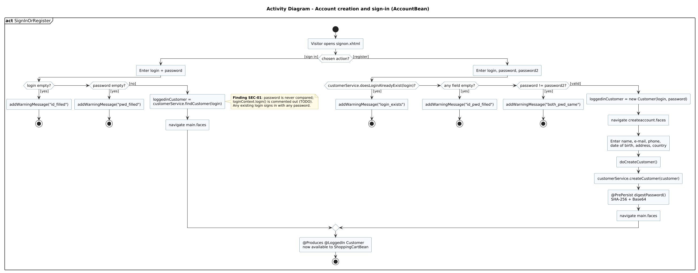

<!-- GENERATED by docs/uml/gen_markdown.py from the .puml source. Do not edit by hand. -->
# Activity Diagram - Account creation and sign-in (AccountBean)

| Property | Value |
|---|---|
| UML 2.5.1 diagram kind | Activity |
| Frame heading (Annex A) | `act SignInOrRegister` |
| Summary | Sign-in and account registration validation flows in AccountBean. |
| PlantUML source | [`src/behaviour/11b-activity-account.puml`](../../src/behaviour/11b-activity-account.puml) |
| Rendered | [PNG](../../rendered/behaviour/11b-activity-account.png) · [SVG](../../rendered/behaviour/11b-activity-account.svg) |
| References | none |
| Referenced by | none |

## Diagram



## PlantUML source

The block below is the exact content of `src/behaviour/11b-activity-account.puml`. It includes the shared
style file `../_style.iuml` (reproduced underneath) so it renders identically in any
PlantUML tool when saved next to that file.

```plantuml
@startuml 11b-activity-account
' @kind: Activity
' @summary: Sign-in and account registration validation flows in AccountBean.
!include ../_style.iuml
mainframe **act** SignInOrRegister
title Activity Diagram - Account creation and sign-in (AccountBean)

start
:Visitor opens signon.xhtml;
if (chosen action?) then ([sign in])
  :Enter login + password;
  if (login empty?) then ([yes])
    :addWarningMessage("id_filled");
    stop
  elseif (password empty?) then ([yes])
    :addWarningMessage("pwd_filled");
    stop
  else ([no])
    :loggedinCustomer =\ncustomerService.findCustomer(login);
    note right
      **Finding SEC-01**: password is never compared;
      loginContext.login() is commented out (TODO).
      Any existing login signs in with any password.
    end note
    :navigate main.faces;
  endif
else ([register])
  :Enter login, password, password2;
  if (customerService.doesLoginAlreadyExist(login)?) then ([yes])
    :addWarningMessage("login_exists");
    stop
  elseif (any field empty?) then ([yes])
    :addWarningMessage("id_pwd_filled");
    stop
  elseif (password != password2?) then ([yes])
    :addWarningMessage("both_pwd_same");
    stop
  else ([valid])
    :loggedinCustomer = new Customer(login, password);
    :navigate createaccount.faces;
    :Enter name, e-mail, phone,\ndate of birth, address, country;
    :doCreateCustomer();
    :customerService.createCustomer(customer);
    :@PrePersist digestPassword()\nSHA-256 + Base64;
    :navigate main.faces;
  endif
endif
:@Produces @LoggedIn Customer\nnow available to ShoppingCartBean;
stop
@enduml
```

<details>
<summary>Shared style: <code>src/_style.iuml</code></summary>

```plantuml
' =====================================================================
'  Shared PlantUML style for the PetStore EE7 UML 2.5.1 model
'  Source of truth : src/main/java/org/agoncal/application/petstore/**
'  Notation        : OMG UML 2.5.1 (formal/17-12-05), Annex A frames
'  Licence         : CC BY-SA 3.0 (derivative of agoncal/petstore-ee7)
' =====================================================================
!pragma useIntermediatePackages false
set separator none
skinparam dpi 110
skinparam shadowing false
skinparam roundCorner 4
skinparam defaultFontName "Helvetica"
skinparam defaultFontSize 12
skinparam titleFontSize 15
skinparam titleFontStyle bold
skinparam ArrowColor #333333
skinparam ArrowFontSize 11
skinparam BackgroundColor #FFFFFF
skinparam NoteBackgroundColor #FFFBE6
skinparam NoteBorderColor #B59F3B
skinparam NoteFontSize 11
skinparam packageStyle folder
skinparam ClassBackgroundColor #F7FAFD
skinparam ClassBorderColor #2F5D8A
skinparam ClassHeaderBackgroundColor #E3EEF8
skinparam ClassAttributeIconSize 0
skinparam ObjectBackgroundColor #F7FAFD
skinparam ObjectBorderColor #2F5D8A
skinparam ComponentBackgroundColor #F7FAFD
skinparam ComponentBorderColor #2F5D8A
skinparam NodeBackgroundColor #F2F2F2
skinparam NodeBorderColor #555555
skinparam ArtifactBackgroundColor #FFFFFF
skinparam ActorBorderColor #2F5D8A
skinparam UsecaseBackgroundColor #F7FAFD
skinparam UsecaseBorderColor #2F5D8A
skinparam ActivityBackgroundColor #F7FAFD
skinparam ActivityBorderColor #2F5D8A
skinparam ActivityDiamondBackgroundColor #FFFFFF
skinparam PartitionBorderColor #7A7A7A
skinparam StateBackgroundColor #F7FAFD
skinparam StateBorderColor #2F5D8A
skinparam SequenceLifeLineBorderColor #7A7A7A
skinparam SequenceGroupBorderColor #555555
skinparam SequenceGroupHeaderFontStyle bold
skinparam ParticipantBackgroundColor #F7FAFD
skinparam ParticipantBorderColor #2F5D8A
skinparam stereotypeCBackgroundColor #C9DDF0
skinparam legendBackgroundColor #FAFAFA
skinparam legendBorderColor #999999
skinparam legendFontSize 10
hide circle
```

</details>

[Back to index](../README.md)
