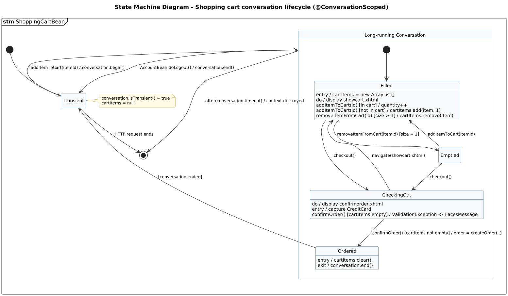

<!-- GENERATED by docs/uml/gen_markdown.py from the .puml source. Do not edit by hand. -->
# State Machine Diagram - Shopping cart conversation lifecycle (@ConversationScoped)

| Property | Value |
|---|---|
| UML 2.5.1 diagram kind | State Machine |
| Frame heading (Annex A) | `stm ShoppingCartBean` |
| Summary | Lifecycle of the @ConversationScoped shopping cart: composite state, entry/exit/do behaviours and internal transitions. |
| PlantUML source | [`src/behaviour/12a-state-machine-shopping-cart.puml`](../../src/behaviour/12a-state-machine-shopping-cart.puml) |
| Rendered | [PNG](../../rendered/behaviour/12a-state-machine-shopping-cart.png) · [SVG](../../rendered/behaviour/12a-state-machine-shopping-cart.svg) |
| References | none |
| Referenced by | [12b-state-machine-customer-session](../behaviour/12b-state-machine-customer-session.md) |

## Diagram



## PlantUML source

The block below is the exact content of `src/behaviour/12a-state-machine-shopping-cart.puml`. It includes the shared
style file `../_style.iuml` (reproduced underneath) so it renders identically in any
PlantUML tool when saved next to that file.

```plantuml
@startuml 12a-state-machine-shopping-cart
' @kind: State Machine
' @summary: Lifecycle of the @ConversationScoped shopping cart: composite state, entry/exit/do behaviours and internal transitions.
!include ../_style.iuml
hide empty description
mainframe **stm** ShoppingCartBean
title State Machine Diagram - Shopping cart conversation lifecycle (@ConversationScoped)

[*] --> Transient

note right of Transient
  conversation.isTransient() = true
  cartItems = null
end note

state "Long-running Conversation" as LR {
  [*] --> Filled
  state Filled : entry / cartItems = new ArrayList()
  state Filled : do / display showcart.xhtml
  state Filled : addItemToCart(id) [in cart] / quantity++
  state Filled : addItemToCart(id) [not in cart] / cartItems.add(item, 1)
  state Filled : removeItemFromCart(id) [size > 1] / cartItems.remove(item)
  Filled --> Emptied : removeItemFromCart(itemId) [size = 1]
  Emptied --> Filled : addItemToCart(itemId)
  Filled --> CheckingOut : checkout()
  Emptied --> CheckingOut : checkout()
  state CheckingOut : do / display confirmorder.xhtml
  state CheckingOut : entry / capture CreditCard
  CheckingOut --> Filled : navigate(showcart.xhtml)
  state CheckingOut : confirmOrder() [cartItems empty] / ValidationException -> FacesMessage
  CheckingOut --> Ordered : confirmOrder() [cartItems not empty] / order = createOrder(..)
  state Ordered : entry / cartItems.clear()
  state Ordered : exit / conversation.end()
}

Transient --> LR : addItemToCart(itemId) / conversation.begin()
Ordered --> Transient : [conversation ended]
LR --> Transient : AccountBean.doLogout() / conversation.end()
LR --> [*] : after(conversation timeout) / context destroyed
Transient --> [*] : HTTP request ends
@enduml
```

<details>
<summary>Shared style: <code>src/_style.iuml</code></summary>

```plantuml
' =====================================================================
'  Shared PlantUML style for the PetStore EE7 UML 2.5.1 model
'  Source of truth : src/main/java/org/agoncal/application/petstore/**
'  Notation        : OMG UML 2.5.1 (formal/17-12-05), Annex A frames
'  Licence         : CC BY-SA 3.0 (derivative of agoncal/petstore-ee7)
' =====================================================================
!pragma useIntermediatePackages false
set separator none
skinparam dpi 110
skinparam shadowing false
skinparam roundCorner 4
skinparam defaultFontName "Helvetica"
skinparam defaultFontSize 12
skinparam titleFontSize 15
skinparam titleFontStyle bold
skinparam ArrowColor #333333
skinparam ArrowFontSize 11
skinparam BackgroundColor #FFFFFF
skinparam NoteBackgroundColor #FFFBE6
skinparam NoteBorderColor #B59F3B
skinparam NoteFontSize 11
skinparam packageStyle folder
skinparam ClassBackgroundColor #F7FAFD
skinparam ClassBorderColor #2F5D8A
skinparam ClassHeaderBackgroundColor #E3EEF8
skinparam ClassAttributeIconSize 0
skinparam ObjectBackgroundColor #F7FAFD
skinparam ObjectBorderColor #2F5D8A
skinparam ComponentBackgroundColor #F7FAFD
skinparam ComponentBorderColor #2F5D8A
skinparam NodeBackgroundColor #F2F2F2
skinparam NodeBorderColor #555555
skinparam ArtifactBackgroundColor #FFFFFF
skinparam ActorBorderColor #2F5D8A
skinparam UsecaseBackgroundColor #F7FAFD
skinparam UsecaseBorderColor #2F5D8A
skinparam ActivityBackgroundColor #F7FAFD
skinparam ActivityBorderColor #2F5D8A
skinparam ActivityDiamondBackgroundColor #FFFFFF
skinparam PartitionBorderColor #7A7A7A
skinparam StateBackgroundColor #F7FAFD
skinparam StateBorderColor #2F5D8A
skinparam SequenceLifeLineBorderColor #7A7A7A
skinparam SequenceGroupBorderColor #555555
skinparam SequenceGroupHeaderFontStyle bold
skinparam ParticipantBackgroundColor #F7FAFD
skinparam ParticipantBorderColor #2F5D8A
skinparam stereotypeCBackgroundColor #C9DDF0
skinparam legendBackgroundColor #FAFAFA
skinparam legendBorderColor #999999
skinparam legendFontSize 10
hide circle
```

</details>

[Back to index](../README.md)
