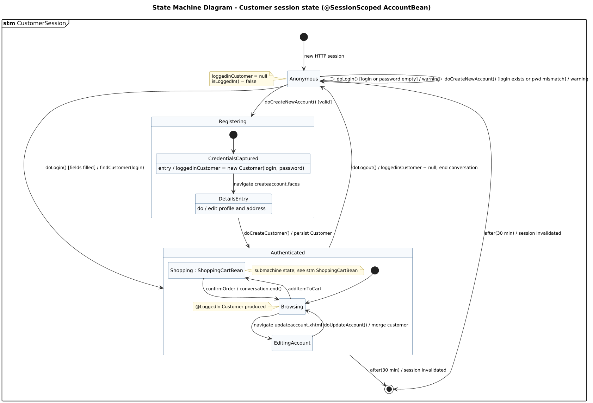

<!-- GENERATED by docs/uml/gen_markdown.py from the .puml source. Do not edit by hand. -->
# State Machine Diagram - Customer session state (@SessionScoped AccountBean)

| Property | Value |
|---|---|
| UML 2.5.1 diagram kind | State Machine |
| Frame heading (Annex A) | `stm CustomerSession` |
| Summary | Customer session states (Anonymous, Registering, Authenticated) with time events. |
| PlantUML source | [`src/behaviour/12b-state-machine-customer-session.puml`](../../src/behaviour/12b-state-machine-customer-session.puml) |
| Rendered | [PNG](../../rendered/behaviour/12b-state-machine-customer-session.png) · [SVG](../../rendered/behaviour/12b-state-machine-customer-session.svg) |
| References | [stm ShoppingCartBean](../behaviour/12a-state-machine-shopping-cart.md) |
| Referenced by | none |

## Diagram



## PlantUML source

The block below is the exact content of `src/behaviour/12b-state-machine-customer-session.puml`. It includes the shared
style file `../_style.iuml` (reproduced underneath) so it renders identically in any
PlantUML tool when saved next to that file.

```plantuml
@startuml 12b-state-machine-customer-session
' @kind: State Machine
' @summary: Customer session states (Anonymous, Registering, Authenticated) with time events.
!include ../_style.iuml
hide empty description
mainframe **stm** CustomerSession
title State Machine Diagram - Customer session state (@SessionScoped AccountBean)

[*] --> Anonymous : new HTTP session

note left of Anonymous
  loggedinCustomer = null
  isLoggedIn() = false
end note

state Registering {
  [*] --> CredentialsCaptured
  state CredentialsCaptured : entry / loggedinCustomer = new Customer(login, password)
  CredentialsCaptured --> DetailsEntry : navigate createaccount.faces
  state DetailsEntry : do / edit profile and address
}

state Authenticated {
  state "Shopping : ShoppingCartBean" as Shopping
  note right of Shopping : submachine state; see stm ShoppingCartBean
  [*] --> Browsing
  Browsing --> Shopping : addItemToCart
  Shopping --> Browsing : confirmOrder / conversation.end()
  Browsing --> EditingAccount : navigate updateaccount.xhtml
  EditingAccount --> Browsing : doUpdateAccount() / merge customer
  note left of Browsing : @LoggedIn Customer produced
}

Anonymous --> Anonymous : doLogin() [login or password empty] / warning
Anonymous --> Authenticated : doLogin() [fields filled] / findCustomer(login)
Anonymous --> Anonymous : doCreateNewAccount() [login exists or pwd mismatch] / warning
Anonymous --> Registering : doCreateNewAccount() [valid]
Registering --> Authenticated : doCreateCustomer() / persist Customer
Authenticated --> Anonymous : doLogout() / loggedinCustomer = null; end conversation
Anonymous --> [*] : after(30 min) / session invalidated
Authenticated --> [*] : after(30 min) / session invalidated
@enduml
```

<details>
<summary>Shared style: <code>src/_style.iuml</code></summary>

```plantuml
' =====================================================================
'  Shared PlantUML style for the PetStore EE7 UML 2.5.1 model
'  Source of truth : src/main/java/org/agoncal/application/petstore/**
'  Notation        : OMG UML 2.5.1 (formal/17-12-05), Annex A frames
'  Licence         : CC BY-SA 3.0 (derivative of agoncal/petstore-ee7)
' =====================================================================
!pragma useIntermediatePackages false
set separator none
skinparam dpi 110
skinparam shadowing false
skinparam roundCorner 4
skinparam defaultFontName "Helvetica"
skinparam defaultFontSize 12
skinparam titleFontSize 15
skinparam titleFontStyle bold
skinparam ArrowColor #333333
skinparam ArrowFontSize 11
skinparam BackgroundColor #FFFFFF
skinparam NoteBackgroundColor #FFFBE6
skinparam NoteBorderColor #B59F3B
skinparam NoteFontSize 11
skinparam packageStyle folder
skinparam ClassBackgroundColor #F7FAFD
skinparam ClassBorderColor #2F5D8A
skinparam ClassHeaderBackgroundColor #E3EEF8
skinparam ClassAttributeIconSize 0
skinparam ObjectBackgroundColor #F7FAFD
skinparam ObjectBorderColor #2F5D8A
skinparam ComponentBackgroundColor #F7FAFD
skinparam ComponentBorderColor #2F5D8A
skinparam NodeBackgroundColor #F2F2F2
skinparam NodeBorderColor #555555
skinparam ArtifactBackgroundColor #FFFFFF
skinparam ActorBorderColor #2F5D8A
skinparam UsecaseBackgroundColor #F7FAFD
skinparam UsecaseBorderColor #2F5D8A
skinparam ActivityBackgroundColor #F7FAFD
skinparam ActivityBorderColor #2F5D8A
skinparam ActivityDiamondBackgroundColor #FFFFFF
skinparam PartitionBorderColor #7A7A7A
skinparam StateBackgroundColor #F7FAFD
skinparam StateBorderColor #2F5D8A
skinparam SequenceLifeLineBorderColor #7A7A7A
skinparam SequenceGroupBorderColor #555555
skinparam SequenceGroupHeaderFontStyle bold
skinparam ParticipantBackgroundColor #F7FAFD
skinparam ParticipantBorderColor #2F5D8A
skinparam stereotypeCBackgroundColor #C9DDF0
skinparam legendBackgroundColor #FAFAFA
skinparam legendBorderColor #999999
skinparam legendFontSize 10
hide circle
```

</details>

[Back to index](../README.md)
