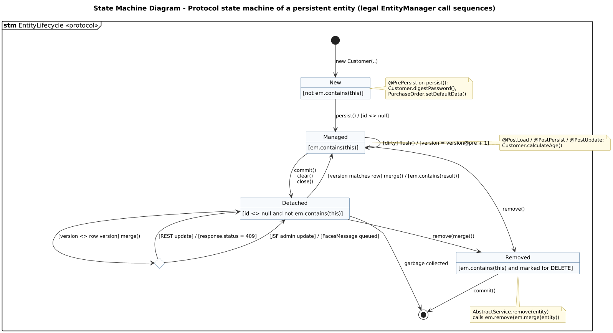

<!-- GENERATED by docs/uml/gen_markdown.py from the .puml source. Do not edit by hand. -->
# State Machine Diagram - Protocol state machine of a persistent entity (legal EntityManager call sequences)

| Property | Value |
|---|---|
| UML 2.5.1 diagram kind | State Machine (protocol) |
| Frame heading (Annex A) | `stm EntityLifecycle «protocol»` |
| Summary | Protocol state machine of a JPA entity: legal EntityManager call sequences, state invariants and post-conditions; lifecycle callbacks shown as notes. |
| PlantUML source | [`src/behaviour/12c-state-machine-entity-lifecycle.puml`](../../src/behaviour/12c-state-machine-entity-lifecycle.puml) |
| Rendered | [PNG](../../rendered/behaviour/12c-state-machine-entity-lifecycle.png) · [SVG](../../rendered/behaviour/12c-state-machine-entity-lifecycle.svg) |
| References | none |
| Referenced by | none |

## Diagram



## PlantUML source

The block below is the exact content of `src/behaviour/12c-state-machine-entity-lifecycle.puml`. It includes the shared
style file `../_style.iuml` (reproduced underneath) so it renders identically in any
PlantUML tool when saved next to that file.

```plantuml
@startuml 12c-state-machine-entity-lifecycle
' @kind: State Machine (protocol)
' @summary: Protocol state machine of a JPA entity: legal EntityManager call sequences, state invariants and post-conditions; lifecycle callbacks shown as notes.
!include ../_style.iuml
hide empty description
mainframe **stm** EntityLifecycle «protocol»
title State Machine Diagram - Protocol state machine of a persistent entity (legal EntityManager call sequences)

' UML 2.5.1 clause 14.4.4:
'  * keyword <<protocol>> close to the state machine name;
'  * state invariants in [square brackets] under the state name;
'  * ProtocolTransitions: [pre-condition] trigger / [post-condition]; no effect behaviours;
'  * states of a ProtocolStateMachine have no entry/exit/do behaviours (callbacks are notes).

[*] --> New : new Customer(..)

state New : [not em.contains(this)]
state Managed : [em.contains(this)]
state Detached : [id <> null and not em.contains(this)]
state Removed : [em.contains(this) and marked for DELETE]

New --> Managed : persist() / [id <> null]
Managed --> Managed : [dirty] flush() / [version = version@pre + 1]
Managed --> Detached : commit()\nclear()\nclose()
Detached --> Managed : [version matches row] merge() / [em.contains(result)]
Managed --> Removed : remove()
Detached --> Removed : remove(merge())
Removed --> [*] : commit()
Detached --> [*] : garbage collected

state StaleCheck <<choice>>
Detached --> StaleCheck : [version <> row version] merge()
StaleCheck --> Detached : [REST update] / [response.status = 409]
StaleCheck --> Detached : [JSF admin update] / [FacesMessage queued]

note right of New
  @PrePersist on persist():
  Customer.digestPassword(),
  PurchaseOrder.setDefaultData()
end note
note right of Managed
  @PostLoad / @PostPersist / @PostUpdate:
  Customer.calculateAge()
end note
note bottom of Removed
  AbstractService.remove(entity)
  calls em.remove(em.merge(entity))
end note
@enduml
```

<details>
<summary>Shared style: <code>src/_style.iuml</code></summary>

```plantuml
' =====================================================================
'  Shared PlantUML style for the PetStore EE7 UML 2.5.1 model
'  Source of truth : src/main/java/org/agoncal/application/petstore/**
'  Notation        : OMG UML 2.5.1 (formal/17-12-05), Annex A frames
'  Licence         : CC BY-SA 3.0 (derivative of agoncal/petstore-ee7)
' =====================================================================
!pragma useIntermediatePackages false
set separator none
skinparam dpi 110
skinparam shadowing false
skinparam roundCorner 4
skinparam defaultFontName "Helvetica"
skinparam defaultFontSize 12
skinparam titleFontSize 15
skinparam titleFontStyle bold
skinparam ArrowColor #333333
skinparam ArrowFontSize 11
skinparam BackgroundColor #FFFFFF
skinparam NoteBackgroundColor #FFFBE6
skinparam NoteBorderColor #B59F3B
skinparam NoteFontSize 11
skinparam packageStyle folder
skinparam ClassBackgroundColor #F7FAFD
skinparam ClassBorderColor #2F5D8A
skinparam ClassHeaderBackgroundColor #E3EEF8
skinparam ClassAttributeIconSize 0
skinparam ObjectBackgroundColor #F7FAFD
skinparam ObjectBorderColor #2F5D8A
skinparam ComponentBackgroundColor #F7FAFD
skinparam ComponentBorderColor #2F5D8A
skinparam NodeBackgroundColor #F2F2F2
skinparam NodeBorderColor #555555
skinparam ArtifactBackgroundColor #FFFFFF
skinparam ActorBorderColor #2F5D8A
skinparam UsecaseBackgroundColor #F7FAFD
skinparam UsecaseBorderColor #2F5D8A
skinparam ActivityBackgroundColor #F7FAFD
skinparam ActivityBorderColor #2F5D8A
skinparam ActivityDiamondBackgroundColor #FFFFFF
skinparam PartitionBorderColor #7A7A7A
skinparam StateBackgroundColor #F7FAFD
skinparam StateBorderColor #2F5D8A
skinparam SequenceLifeLineBorderColor #7A7A7A
skinparam SequenceGroupBorderColor #555555
skinparam SequenceGroupHeaderFontStyle bold
skinparam ParticipantBackgroundColor #F7FAFD
skinparam ParticipantBorderColor #2F5D8A
skinparam stereotypeCBackgroundColor #C9DDF0
skinparam legendBackgroundColor #FAFAFA
skinparam legendBorderColor #999999
skinparam legendFontSize 10
hide circle
```

</details>

[Back to index](../README.md)
