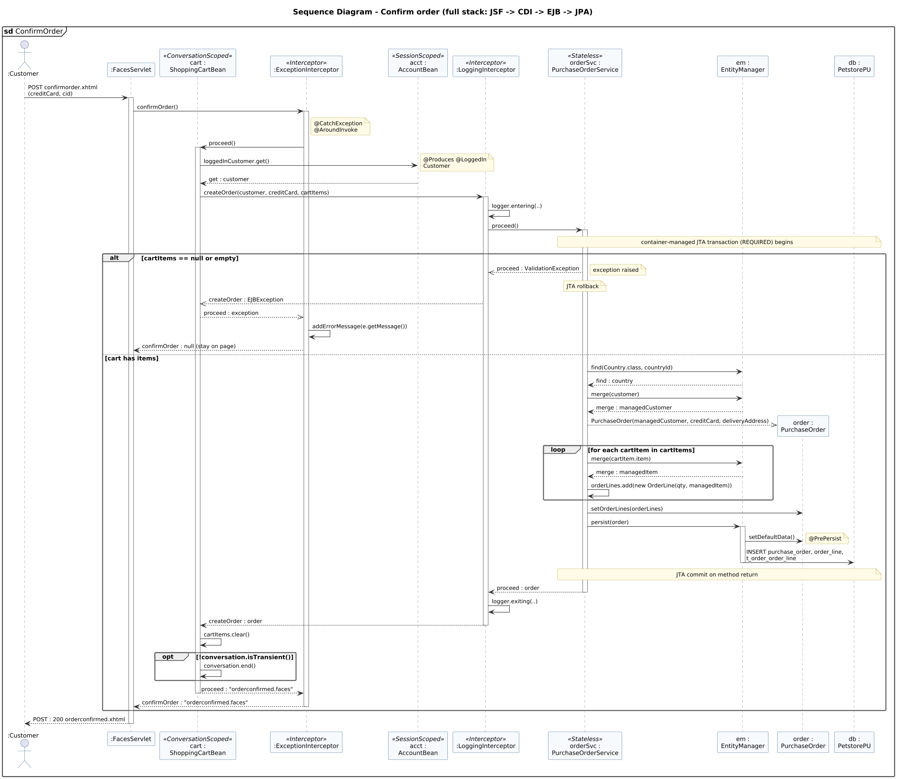

<!-- GENERATED by docs/uml/gen_markdown.py from the .puml source. Do not edit by hand. -->
# Sequence Diagram - Confirm order (full stack: JSF -> CDI -> EJB -> JPA)

| Property | Value |
|---|---|
| UML 2.5.1 diagram kind | Sequence |
| Frame heading (Annex A) | `sd ConfirmOrder` |
| Summary | Confirm order across JSF, CDI interceptors, EJB, JTA and JPA with alt/loop/opt fragments. |
| PlantUML source | [`src/behaviour/13a-sequence-confirm-order.puml`](../../src/behaviour/13a-sequence-confirm-order.puml) |
| Rendered | [PNG](../../rendered/behaviour/13a-sequence-confirm-order.png) · [SVG](../../rendered/behaviour/13a-sequence-confirm-order.svg) |
| References | none |
| Referenced by | [07b-composite-structure-checkout-collaboration](../structure/07b-composite-structure-checkout-collaboration.md), [15-interaction-overview-shopping](../behaviour/15-interaction-overview-shopping.md) |

## Diagram



## PlantUML source

The block below is the exact content of `src/behaviour/13a-sequence-confirm-order.puml`. It includes the shared
style file `../_style.iuml` (reproduced underneath) so it renders identically in any
PlantUML tool when saved next to that file.

```plantuml
@startuml 13a-sequence-confirm-order
' @kind: Sequence
' @summary: Confirm order across JSF, CDI interceptors, EJB, JTA and JPA with alt/loop/opt fragments.
!include ../_style.iuml
mainframe **sd** ConfirmOrder
title Sequence Diagram - Confirm order (full stack: JSF -> CDI -> EJB -> JPA)

actor ":Customer" as user
participant ":FacesServlet" as fs
participant "cart :\nShoppingCartBean" as cart <<ConversationScoped>>
participant ":ExceptionInterceptor" as exi <<Interceptor>>
participant "acct :\nAccountBean" as acct <<SessionScoped>>
participant ":LoggingInterceptor" as li <<Interceptor>>
participant "orderSvc :\nPurchaseOrderService" as os <<Stateless>>
participant "em :\nEntityManager" as em
participant "order :\nPurchaseOrder" as po
participant "db :\nPetstorePU" as db

user -> fs : POST confirmorder.xhtml\n(creditCard, cid)
activate fs
fs -> exi : confirmOrder()
activate exi
note right of exi: @CatchException\n@AroundInvoke
exi -> cart : proceed()
activate cart
cart -> acct : loggedInCustomer.get()
note right: @Produces @LoggedIn\nCustomer
acct --> cart : get : customer
cart -> li : createOrder(customer, creditCard, cartItems)
activate li
li -> li : logger.entering(..)
li -> os : proceed()
activate os
note over os, db: container-managed JTA transaction (REQUIRED) begins

alt cartItems == null or empty
  os -->> li : proceed : ValidationException
  note right: exception raised
  note over os: JTA rollback
  li -->> cart : createOrder : EJBException
  cart -->> exi : proceed : exception
  exi -> exi : addErrorMessage(e.getMessage())
  exi --> fs : confirmOrder : null (stay on page)
else cart has items
  os -> em : find(Country.class, countryId)
  em --> os : find : country
  os -> em : merge(customer)
  em --> os : merge : managedCustomer
  create po
  os -->> po : PurchaseOrder(managedCustomer, creditCard, deliveryAddress)
  loop for each cartItem in cartItems
    os -> em : merge(cartItem.item)
    em --> os : merge : managedItem
    os -> os : orderLines.add(new OrderLine(qty, managedItem))
  end
  os -> po : setOrderLines(orderLines)
  os -> em : persist(order)
  activate em
  em -> po : setDefaultData()
  note right: @PrePersist
  em -> db : INSERT purchase_order, order_line,\nt_order_order_line
  deactivate em
  note over os, db: JTA commit on method return
  os --> li : proceed : order
  deactivate os
  li -> li : logger.exiting(..)
  li --> cart : createOrder : order
  deactivate li
  cart -> cart : cartItems.clear()
  opt !conversation.isTransient()
    cart -> cart : conversation.end()
  end
  cart --> exi : proceed : "orderconfirmed.faces"
  deactivate cart
  exi --> fs : confirmOrder : "orderconfirmed.faces"
  deactivate exi
end
fs --> user : POST : 200 orderconfirmed.xhtml
deactivate fs
@enduml
```

<details>
<summary>Shared style: <code>src/_style.iuml</code></summary>

```plantuml
' =====================================================================
'  Shared PlantUML style for the PetStore EE7 UML 2.5.1 model
'  Source of truth : src/main/java/org/agoncal/application/petstore/**
'  Notation        : OMG UML 2.5.1 (formal/17-12-05), Annex A frames
'  Licence         : CC BY-SA 3.0 (derivative of agoncal/petstore-ee7)
' =====================================================================
!pragma useIntermediatePackages false
set separator none
skinparam dpi 110
skinparam shadowing false
skinparam roundCorner 4
skinparam defaultFontName "Helvetica"
skinparam defaultFontSize 12
skinparam titleFontSize 15
skinparam titleFontStyle bold
skinparam ArrowColor #333333
skinparam ArrowFontSize 11
skinparam BackgroundColor #FFFFFF
skinparam NoteBackgroundColor #FFFBE6
skinparam NoteBorderColor #B59F3B
skinparam NoteFontSize 11
skinparam packageStyle folder
skinparam ClassBackgroundColor #F7FAFD
skinparam ClassBorderColor #2F5D8A
skinparam ClassHeaderBackgroundColor #E3EEF8
skinparam ClassAttributeIconSize 0
skinparam ObjectBackgroundColor #F7FAFD
skinparam ObjectBorderColor #2F5D8A
skinparam ComponentBackgroundColor #F7FAFD
skinparam ComponentBorderColor #2F5D8A
skinparam NodeBackgroundColor #F2F2F2
skinparam NodeBorderColor #555555
skinparam ArtifactBackgroundColor #FFFFFF
skinparam ActorBorderColor #2F5D8A
skinparam UsecaseBackgroundColor #F7FAFD
skinparam UsecaseBorderColor #2F5D8A
skinparam ActivityBackgroundColor #F7FAFD
skinparam ActivityBorderColor #2F5D8A
skinparam ActivityDiamondBackgroundColor #FFFFFF
skinparam PartitionBorderColor #7A7A7A
skinparam StateBackgroundColor #F7FAFD
skinparam StateBorderColor #2F5D8A
skinparam SequenceLifeLineBorderColor #7A7A7A
skinparam SequenceGroupBorderColor #555555
skinparam SequenceGroupHeaderFontStyle bold
skinparam ParticipantBackgroundColor #F7FAFD
skinparam ParticipantBorderColor #2F5D8A
skinparam stereotypeCBackgroundColor #C9DDF0
skinparam legendBackgroundColor #FAFAFA
skinparam legendBorderColor #999999
skinparam legendFontSize 10
hide circle
```

</details>

[Back to index](../README.md)
