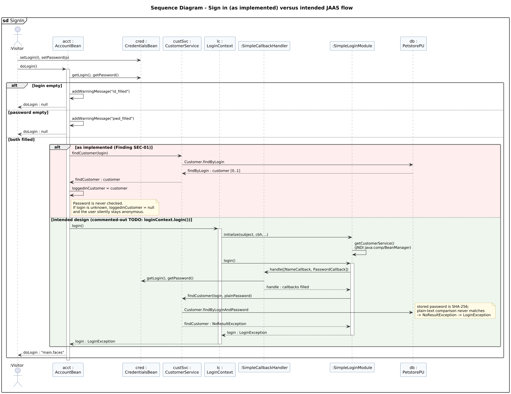

<!-- GENERATED by docs/uml/gen_markdown.py from the .puml source. Do not edit by hand. -->
# Sequence Diagram - Sign in (as implemented) versus intended JAAS flow

| Property | Value |
|---|---|
| UML 2.5.1 diagram kind | Sequence |
| Frame heading (Annex A) | `sd SignIn` |
| Summary | Sign-in as implemented versus the intended JAAS flow; exposes finding SEC-01. |
| PlantUML source | [`src/behaviour/13b-sequence-sign-in.puml`](../../src/behaviour/13b-sequence-sign-in.puml) |
| Rendered | [PNG](../../rendered/behaviour/13b-sequence-sign-in.png) · [SVG](../../rendered/behaviour/13b-sequence-sign-in.svg) |
| References | none |
| Referenced by | [10a-use-case-shopping](../behaviour/10a-use-case-shopping.md), [15-interaction-overview-shopping](../behaviour/15-interaction-overview-shopping.md) |

## Diagram



## PlantUML source

The block below is the exact content of `src/behaviour/13b-sequence-sign-in.puml`. It includes the shared
style file `../_style.iuml` (reproduced underneath) so it renders identically in any
PlantUML tool when saved next to that file.

```plantuml
@startuml 13b-sequence-sign-in
' @kind: Sequence
' @summary: Sign-in as implemented versus the intended JAAS flow; exposes finding SEC-01.
!include ../_style.iuml
mainframe **sd** SignIn
title Sequence Diagram - Sign in (as implemented) versus intended JAAS flow

actor ":Visitor" as user
participant "acct :\nAccountBean" as acct
participant "cred :\nCredentialsBean" as cred
participant "custSvc :\nCustomerService" as cs
participant "lc :\nLoginContext" as lc
participant ":SimpleCallbackHandler" as cbh
participant ":SimpleLoginModule" as lm
participant "db :\nPetstorePU" as db

user -> cred : setLogin(l), setPassword(p)
user -> acct : doLogin()
activate acct
acct -> cred : getLogin(), getPassword()
alt login empty
  acct -> acct : addWarningMessage("id_filled")
  acct --> user : doLogin : null
else password empty
  acct -> acct : addWarningMessage("pwd_filled")
  acct --> user : doLogin : null
else both filled
  alt #FFEEEE as implemented (Finding SEC-01)
    acct -> cs : findCustomer(login)
    cs -> db : Customer.findByLogin
    db --> cs : findByLogin : customer [0..1]
    cs --> acct : findCustomer : customer
    acct -> acct : loggedinCustomer = customer
    note right of acct
      Password is never checked.
      If login is unknown, loggedinCustomer = null
      and the user silently stays anonymous.
    end note
  else #EEF6EE intended design (commented-out TODO: loginContext.login())
    acct -> lc : login()
    activate lc
    lc -> lm : initialize(subject, cbh, ..)
    lm -> lm : getCustomerService()\n(JNDI java:comp/BeanManager)
    lc -> lm : login()
    activate lm
    lm -> cbh : handle([NameCallback, PasswordCallback])
    cbh -> cred : getLogin(), getPassword()
    cbh --> lm : handle : callbacks filled
    lm -> cs : findCustomer(login, plainPassword)
    cs -> db : Customer.findByLoginAndPassword
    note right: stored password is SHA-256;\nplain-text comparison never matches\n-> NoResultException -> LoginException
    cs --> lm : findCustomer : NoResultException
    lm --> lc : login : LoginException
    deactivate lm
    lc --> acct : login : LoginException
    deactivate lc
  end
  acct --> user : doLogin : "main.faces"
end
deactivate acct
@enduml
```

<details>
<summary>Shared style: <code>src/_style.iuml</code></summary>

```plantuml
' =====================================================================
'  Shared PlantUML style for the PetStore EE7 UML 2.5.1 model
'  Source of truth : src/main/java/org/agoncal/application/petstore/**
'  Notation        : OMG UML 2.5.1 (formal/17-12-05), Annex A frames
'  Licence         : CC BY-SA 3.0 (derivative of agoncal/petstore-ee7)
' =====================================================================
!pragma useIntermediatePackages false
set separator none
skinparam dpi 110
skinparam shadowing false
skinparam roundCorner 4
skinparam defaultFontName "Helvetica"
skinparam defaultFontSize 12
skinparam titleFontSize 15
skinparam titleFontStyle bold
skinparam ArrowColor #333333
skinparam ArrowFontSize 11
skinparam BackgroundColor #FFFFFF
skinparam NoteBackgroundColor #FFFBE6
skinparam NoteBorderColor #B59F3B
skinparam NoteFontSize 11
skinparam packageStyle folder
skinparam ClassBackgroundColor #F7FAFD
skinparam ClassBorderColor #2F5D8A
skinparam ClassHeaderBackgroundColor #E3EEF8
skinparam ClassAttributeIconSize 0
skinparam ObjectBackgroundColor #F7FAFD
skinparam ObjectBorderColor #2F5D8A
skinparam ComponentBackgroundColor #F7FAFD
skinparam ComponentBorderColor #2F5D8A
skinparam NodeBackgroundColor #F2F2F2
skinparam NodeBorderColor #555555
skinparam ArtifactBackgroundColor #FFFFFF
skinparam ActorBorderColor #2F5D8A
skinparam UsecaseBackgroundColor #F7FAFD
skinparam UsecaseBorderColor #2F5D8A
skinparam ActivityBackgroundColor #F7FAFD
skinparam ActivityBorderColor #2F5D8A
skinparam ActivityDiamondBackgroundColor #FFFFFF
skinparam PartitionBorderColor #7A7A7A
skinparam StateBackgroundColor #F7FAFD
skinparam StateBorderColor #2F5D8A
skinparam SequenceLifeLineBorderColor #7A7A7A
skinparam SequenceGroupBorderColor #555555
skinparam SequenceGroupHeaderFontStyle bold
skinparam ParticipantBackgroundColor #F7FAFD
skinparam ParticipantBorderColor #2F5D8A
skinparam stereotypeCBackgroundColor #C9DDF0
skinparam legendBackgroundColor #FAFAFA
skinparam legendBorderColor #999999
skinparam legendFontSize 10
hide circle
```

</details>

[Back to index](../README.md)
