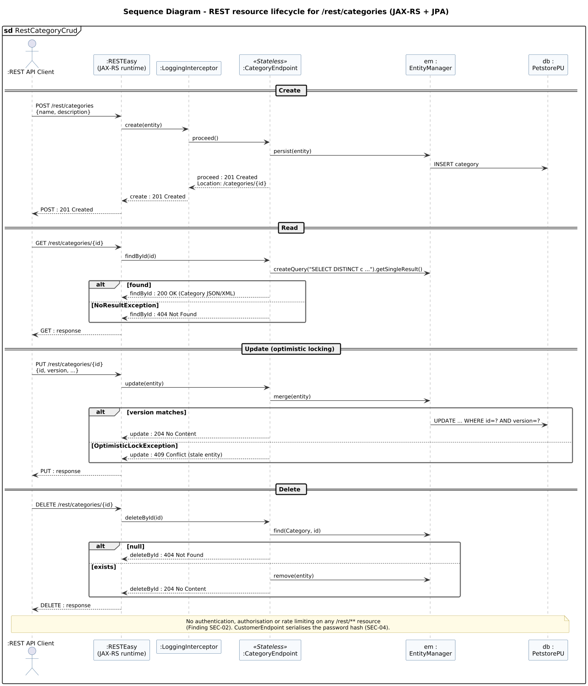

<!-- GENERATED by docs/uml/gen_markdown.py from the .puml source. Do not edit by hand. -->
# Sequence Diagram - REST resource lifecycle for /rest/categories (JAX-RS + JPA)

| Property | Value |
|---|---|
| UML 2.5.1 diagram kind | Sequence |
| Frame heading (Annex A) | `sd RestCategoryCrud` |
| Summary | REST create/read/update/delete of categories including 201/404/409 responses. |
| PlantUML source | [`src/behaviour/13c-sequence-rest-category.puml`](../../src/behaviour/13c-sequence-rest-category.puml) |
| Rendered | [PNG](../../rendered/behaviour/13c-sequence-rest-category.png) · [SVG](../../rendered/behaviour/13c-sequence-rest-category.svg) |
| References | none |
| Referenced by | none |

## Diagram



## PlantUML source

The block below is the exact content of `src/behaviour/13c-sequence-rest-category.puml`. It includes the shared
style file `../_style.iuml` (reproduced underneath) so it renders identically in any
PlantUML tool when saved next to that file.

```plantuml
@startuml 13c-sequence-rest-category
' @kind: Sequence
' @summary: REST create/read/update/delete of categories including 201/404/409 responses.
!include ../_style.iuml
mainframe **sd** RestCategoryCrud
title Sequence Diagram - REST resource lifecycle for /rest/categories (JAX-RS + JPA)

actor ":REST API Client" as c
participant ":RESTEasy\n(JAX-RS runtime)" as rt
participant ":LoggingInterceptor" as li
participant ":CategoryEndpoint" as ep <<Stateless>>
participant "em :\nEntityManager" as em
participant "db :\nPetstorePU" as db

== Create ==
c -> rt : POST /rest/categories\n{name, description}
rt -> li : create(entity)
li -> ep : proceed()
ep -> em : persist(entity)
em -> db : INSERT category
ep --> li : proceed : 201 Created\nLocation: /categories/{id}
li --> rt : create : 201 Created
rt --> c : POST : 201 Created

== Read ==
c -> rt : GET /rest/categories/{id}
rt -> ep : findById(id)
ep -> em : createQuery("SELECT DISTINCT c ...").getSingleResult()
alt found
  ep --> rt : findById : 200 OK (Category JSON/XML)
else NoResultException
  ep --> rt : findById : 404 Not Found
end
rt --> c : GET : response

== Update (optimistic locking) ==
c -> rt : PUT /rest/categories/{id}\n{id, version, ...}
rt -> ep : update(entity)
ep -> em : merge(entity)
alt version matches
  em -> db : UPDATE ... WHERE id=? AND version=?
  ep --> rt : update : 204 No Content
else OptimisticLockException
  ep --> rt : update : 409 Conflict (stale entity)
end
rt --> c : PUT : response

== Delete ==
c -> rt : DELETE /rest/categories/{id}
rt -> ep : deleteById(id)
ep -> em : find(Category, id)
alt null
  ep --> rt : deleteById : 404 Not Found
else exists
  ep -> em : remove(entity)
  ep --> rt : deleteById : 204 No Content
end
rt --> c : DELETE : response

note over c, db
  No authentication, authorisation or rate limiting on any /rest/** resource
  (Finding SEC-02). CustomerEndpoint serialises the password hash (SEC-04).
end note
@enduml
```

<details>
<summary>Shared style: <code>src/_style.iuml</code></summary>

```plantuml
' =====================================================================
'  Shared PlantUML style for the PetStore EE7 UML 2.5.1 model
'  Source of truth : src/main/java/org/agoncal/application/petstore/**
'  Notation        : OMG UML 2.5.1 (formal/17-12-05), Annex A frames
'  Licence         : CC BY-SA 3.0 (derivative of agoncal/petstore-ee7)
' =====================================================================
!pragma useIntermediatePackages false
set separator none
skinparam dpi 110
skinparam shadowing false
skinparam roundCorner 4
skinparam defaultFontName "Helvetica"
skinparam defaultFontSize 12
skinparam titleFontSize 15
skinparam titleFontStyle bold
skinparam ArrowColor #333333
skinparam ArrowFontSize 11
skinparam BackgroundColor #FFFFFF
skinparam NoteBackgroundColor #FFFBE6
skinparam NoteBorderColor #B59F3B
skinparam NoteFontSize 11
skinparam packageStyle folder
skinparam ClassBackgroundColor #F7FAFD
skinparam ClassBorderColor #2F5D8A
skinparam ClassHeaderBackgroundColor #E3EEF8
skinparam ClassAttributeIconSize 0
skinparam ObjectBackgroundColor #F7FAFD
skinparam ObjectBorderColor #2F5D8A
skinparam ComponentBackgroundColor #F7FAFD
skinparam ComponentBorderColor #2F5D8A
skinparam NodeBackgroundColor #F2F2F2
skinparam NodeBorderColor #555555
skinparam ArtifactBackgroundColor #FFFFFF
skinparam ActorBorderColor #2F5D8A
skinparam UsecaseBackgroundColor #F7FAFD
skinparam UsecaseBorderColor #2F5D8A
skinparam ActivityBackgroundColor #F7FAFD
skinparam ActivityBorderColor #2F5D8A
skinparam ActivityDiamondBackgroundColor #FFFFFF
skinparam PartitionBorderColor #7A7A7A
skinparam StateBackgroundColor #F7FAFD
skinparam StateBorderColor #2F5D8A
skinparam SequenceLifeLineBorderColor #7A7A7A
skinparam SequenceGroupBorderColor #555555
skinparam SequenceGroupHeaderFontStyle bold
skinparam ParticipantBackgroundColor #F7FAFD
skinparam ParticipantBorderColor #2F5D8A
skinparam stereotypeCBackgroundColor #C9DDF0
skinparam legendBackgroundColor #FAFAFA
skinparam legendBorderColor #999999
skinparam legendFontSize 10
hide circle
```

</details>

[Back to index](../README.md)
