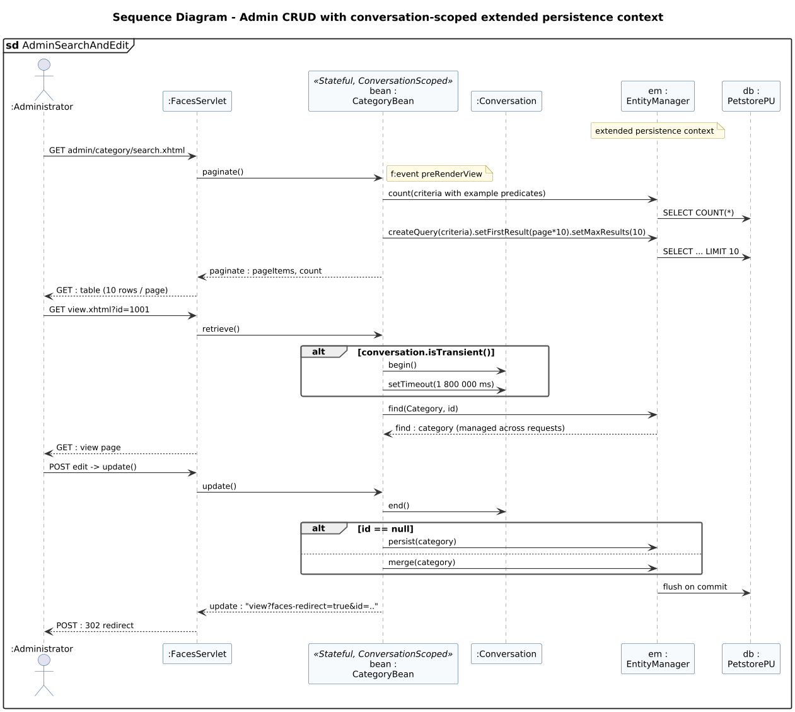

<!-- GENERATED by docs/uml/gen_markdown.py from the .puml source. Do not edit by hand. -->
# Sequence Diagram - Admin CRUD with conversation-scoped extended persistence context

| Property | Value |
|---|---|
| UML 2.5.1 diagram kind | Sequence |
| Frame heading (Annex A) | `sd AdminSearchAndEdit` |
| Summary | Admin CRUD with a CDI conversation and an EXTENDED persistence context. |
| PlantUML source | [`src/behaviour/13d-sequence-admin-search.puml`](../../src/behaviour/13d-sequence-admin-search.puml) |
| Rendered | [PNG](../../rendered/behaviour/13d-sequence-admin-search.png) · [SVG](../../rendered/behaviour/13d-sequence-admin-search.svg) |
| References | none |
| Referenced by | none |

## Diagram



## PlantUML source

The block below is the exact content of `src/behaviour/13d-sequence-admin-search.puml`. It includes the shared
style file `../_style.iuml` (reproduced underneath) so it renders identically in any
PlantUML tool when saved next to that file.

```plantuml
@startuml 13d-sequence-admin-search
' @kind: Sequence
' @summary: Admin CRUD with a CDI conversation and an EXTENDED persistence context.
!include ../_style.iuml
mainframe **sd** AdminSearchAndEdit
title Sequence Diagram - Admin CRUD with conversation-scoped extended persistence context

actor ":Administrator" as a
participant ":FacesServlet" as fs
participant "bean :\nCategoryBean" as b <<Stateful, ConversationScoped>>
participant ":Conversation" as conv
participant "em :\nEntityManager" as em
participant "db :\nPetstorePU" as db
note over em : extended persistence context

a -> fs : GET admin/category/search.xhtml
fs -> b : paginate()
note right: f:event preRenderView
b -> em : count(criteria with example predicates)
em -> db : SELECT COUNT(*)
b -> em : createQuery(criteria).setFirstResult(page*10).setMaxResults(10)
em -> db : SELECT ... LIMIT 10
b --> fs : paginate : pageItems, count
fs --> a : GET : table (10 rows / page)

a -> fs : GET view.xhtml?id=1001
fs -> b : retrieve()
alt conversation.isTransient()
  b -> conv : begin()
  b -> conv : setTimeout(1 800 000 ms)
end
b -> em : find(Category, id)
em --> b : find : category (managed across requests)
fs --> a : GET : view page

a -> fs : POST edit -> update()
fs -> b : update()
b -> conv : end()
alt id == null
  b -> em : persist(category)
else
  b -> em : merge(category)
end
em -> db : flush on commit
b --> fs : update : "view?faces-redirect=true&id=.."
fs --> a : POST : 302 redirect
@enduml
```

<details>
<summary>Shared style: <code>src/_style.iuml</code></summary>

```plantuml
' =====================================================================
'  Shared PlantUML style for the PetStore EE7 UML 2.5.1 model
'  Source of truth : src/main/java/org/agoncal/application/petstore/**
'  Notation        : OMG UML 2.5.1 (formal/17-12-05), Annex A frames
'  Licence         : CC BY-SA 3.0 (derivative of agoncal/petstore-ee7)
' =====================================================================
!pragma useIntermediatePackages false
set separator none
skinparam dpi 110
skinparam shadowing false
skinparam roundCorner 4
skinparam defaultFontName "Helvetica"
skinparam defaultFontSize 12
skinparam titleFontSize 15
skinparam titleFontStyle bold
skinparam ArrowColor #333333
skinparam ArrowFontSize 11
skinparam BackgroundColor #FFFFFF
skinparam NoteBackgroundColor #FFFBE6
skinparam NoteBorderColor #B59F3B
skinparam NoteFontSize 11
skinparam packageStyle folder
skinparam ClassBackgroundColor #F7FAFD
skinparam ClassBorderColor #2F5D8A
skinparam ClassHeaderBackgroundColor #E3EEF8
skinparam ClassAttributeIconSize 0
skinparam ObjectBackgroundColor #F7FAFD
skinparam ObjectBorderColor #2F5D8A
skinparam ComponentBackgroundColor #F7FAFD
skinparam ComponentBorderColor #2F5D8A
skinparam NodeBackgroundColor #F2F2F2
skinparam NodeBorderColor #555555
skinparam ArtifactBackgroundColor #FFFFFF
skinparam ActorBorderColor #2F5D8A
skinparam UsecaseBackgroundColor #F7FAFD
skinparam UsecaseBorderColor #2F5D8A
skinparam ActivityBackgroundColor #F7FAFD
skinparam ActivityBorderColor #2F5D8A
skinparam ActivityDiamondBackgroundColor #FFFFFF
skinparam PartitionBorderColor #7A7A7A
skinparam StateBackgroundColor #F7FAFD
skinparam StateBorderColor #2F5D8A
skinparam SequenceLifeLineBorderColor #7A7A7A
skinparam SequenceGroupBorderColor #555555
skinparam SequenceGroupHeaderFontStyle bold
skinparam ParticipantBackgroundColor #F7FAFD
skinparam ParticipantBorderColor #2F5D8A
skinparam stereotypeCBackgroundColor #C9DDF0
skinparam legendBackgroundColor #FAFAFA
skinparam legendBorderColor #999999
skinparam legendFontSize 10
hide circle
```

</details>

[Back to index](../README.md)
