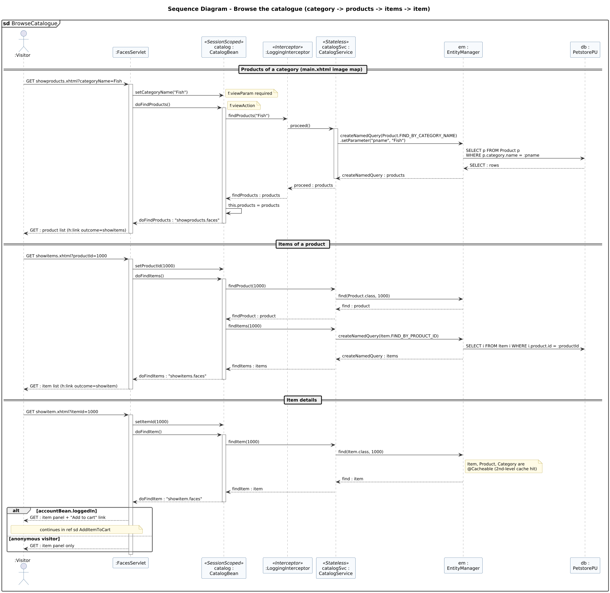

<!-- GENERATED by docs/uml/gen_markdown.py from the .puml source. Do not edit by hand. -->
# Sequence Diagram - Browse the catalogue (category -> products -> items -> item)

| Property | Value |
|---|---|
| UML 2.5.1 diagram kind | Sequence |
| Frame heading (Annex A) | `sd BrowseCatalogue` |
| Summary | Browse category > product > item through bookmarkable GET views (f:viewParam + f:viewAction) and CatalogService named queries. |
| PlantUML source | [`src/behaviour/13e-sequence-browse-catalogue.puml`](../../src/behaviour/13e-sequence-browse-catalogue.puml) |
| Rendered | [PNG](../../rendered/behaviour/13e-sequence-browse-catalogue.png) · [SVG](../../rendered/behaviour/13e-sequence-browse-catalogue.svg) |
| References | [sd AddItemToCart](../behaviour/14-communication-add-to-cart.md) |
| Referenced by | [15-interaction-overview-shopping](../behaviour/15-interaction-overview-shopping.md) |

## Diagram



## PlantUML source

The block below is the exact content of `src/behaviour/13e-sequence-browse-catalogue.puml`. It includes the shared
style file `../_style.iuml` (reproduced underneath) so it renders identically in any
PlantUML tool when saved next to that file.

```plantuml
@startuml 13e-sequence-browse-catalogue
' @kind: Sequence
' @summary: Browse category > product > item through bookmarkable GET views (f:viewParam + f:viewAction) and CatalogService named queries.
!include ../_style.iuml
mainframe **sd** BrowseCatalogue
title Sequence Diagram - Browse the catalogue (category -> products -> items -> item)

actor ":Visitor" as user
participant ":FacesServlet" as fs
participant "catalog :\nCatalogBean" as cb <<SessionScoped>>
participant ":LoggingInterceptor" as li <<Interceptor>>
participant "catalogSvc :\nCatalogService" as cs <<Stateless>>
participant "em :\nEntityManager" as em
participant "db :\nPetstorePU" as db

== Products of a category (main.xhtml image map) ==
user -> fs : GET showproducts.xhtml?categoryName=Fish
activate fs
fs -> cb : setCategoryName("Fish")
note right: f:viewParam required
fs -> cb : doFindProducts()
note right: f:viewAction
activate cb
cb -> li : findProducts("Fish")
li -> cs : proceed()
activate cs
cs -> em : createNamedQuery(Product.FIND_BY_CATEGORY_NAME)\n.setParameter("pname", "Fish")
em -> db : SELECT p FROM Product p\nWHERE p.category.name = :pname
db --> em : SELECT : rows
em --> cs : createNamedQuery : products
deactivate cs
cs --> li : proceed : products
li --> cb : findProducts : products
cb -> cb : this.products = products
cb --> fs : doFindProducts : "showproducts.faces"
deactivate cb
fs --> user : GET : product list (h:link outcome=showitems)
deactivate fs

== Items of a product ==
user -> fs : GET showitems.xhtml?productId=1000
activate fs
fs -> cb : setProductId(1000)
fs -> cb : doFindItems()
activate cb
cb -> cs : findProduct(1000)
cs -> em : find(Product.class, 1000)
em --> cs : find : product
cs --> cb : findProduct : product
cb -> cs : findItems(1000)
cs -> em : createNamedQuery(Item.FIND_BY_PRODUCT_ID)
em -> db : SELECT i FROM Item i WHERE i.product.id = :productId
em --> cs : createNamedQuery : items
cs --> cb : findItems : items
cb --> fs : doFindItems : "showitems.faces"
deactivate cb
fs --> user : GET : item list (h:link outcome=showitem)
deactivate fs

== Item details ==
user -> fs : GET showitem.xhtml?itemId=1000
activate fs
fs -> cb : setItemId(1000)
fs -> cb : doFindItem()
activate cb
cb -> cs : findItem(1000)
cs -> em : find(Item.class, 1000)
note right of em : Item, Product, Category are\n@Cacheable (2nd-level cache hit)
em --> cs : find : item
cs --> cb : findItem : item
cb --> fs : doFindItem : "showitem.faces"
deactivate cb
alt accountBean.loggedIn
  fs --> user : GET : item panel + "Add to cart" link
  note over user, fs : continues in ref sd AddItemToCart
else anonymous visitor
  fs --> user : GET : item panel only
end
deactivate fs
@enduml
```

<details>
<summary>Shared style: <code>src/_style.iuml</code></summary>

```plantuml
' =====================================================================
'  Shared PlantUML style for the PetStore EE7 UML 2.5.1 model
'  Source of truth : src/main/java/org/agoncal/application/petstore/**
'  Notation        : OMG UML 2.5.1 (formal/17-12-05), Annex A frames
'  Licence         : CC BY-SA 3.0 (derivative of agoncal/petstore-ee7)
' =====================================================================
!pragma useIntermediatePackages false
set separator none
skinparam dpi 110
skinparam shadowing false
skinparam roundCorner 4
skinparam defaultFontName "Helvetica"
skinparam defaultFontSize 12
skinparam titleFontSize 15
skinparam titleFontStyle bold
skinparam ArrowColor #333333
skinparam ArrowFontSize 11
skinparam BackgroundColor #FFFFFF
skinparam NoteBackgroundColor #FFFBE6
skinparam NoteBorderColor #B59F3B
skinparam NoteFontSize 11
skinparam packageStyle folder
skinparam ClassBackgroundColor #F7FAFD
skinparam ClassBorderColor #2F5D8A
skinparam ClassHeaderBackgroundColor #E3EEF8
skinparam ClassAttributeIconSize 0
skinparam ObjectBackgroundColor #F7FAFD
skinparam ObjectBorderColor #2F5D8A
skinparam ComponentBackgroundColor #F7FAFD
skinparam ComponentBorderColor #2F5D8A
skinparam NodeBackgroundColor #F2F2F2
skinparam NodeBorderColor #555555
skinparam ArtifactBackgroundColor #FFFFFF
skinparam ActorBorderColor #2F5D8A
skinparam UsecaseBackgroundColor #F7FAFD
skinparam UsecaseBorderColor #2F5D8A
skinparam ActivityBackgroundColor #F7FAFD
skinparam ActivityBorderColor #2F5D8A
skinparam ActivityDiamondBackgroundColor #FFFFFF
skinparam PartitionBorderColor #7A7A7A
skinparam StateBackgroundColor #F7FAFD
skinparam StateBorderColor #2F5D8A
skinparam SequenceLifeLineBorderColor #7A7A7A
skinparam SequenceGroupBorderColor #555555
skinparam SequenceGroupHeaderFontStyle bold
skinparam ParticipantBackgroundColor #F7FAFD
skinparam ParticipantBorderColor #2F5D8A
skinparam stereotypeCBackgroundColor #C9DDF0
skinparam legendBackgroundColor #FAFAFA
skinparam legendBorderColor #999999
skinparam legendFontSize 10
hide circle
```

</details>

[Back to index](../README.md)
