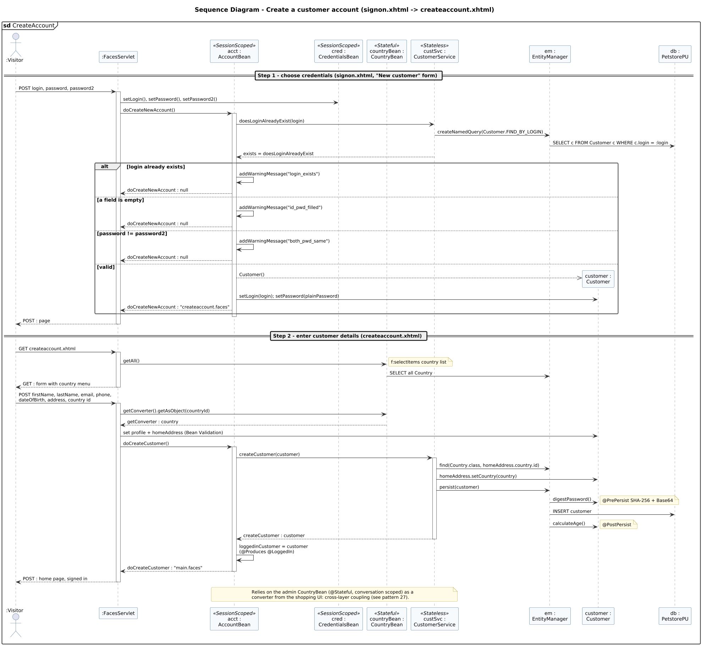

<!-- GENERATED by docs/uml/gen_markdown.py from the .puml source. Do not edit by hand. -->
# Sequence Diagram - Create a customer account (signon.xhtml -> createaccount.xhtml)

| Property | Value |
|---|---|
| UML 2.5.1 diagram kind | Sequence |
| Frame heading (Annex A) | `sd CreateAccount` |
| Summary | Two-step registration: credential validation in AccountBean, profile capture with the Country converter, then persist with @PrePersist password digest. |
| PlantUML source | [`src/behaviour/13f-sequence-create-account.puml`](../../src/behaviour/13f-sequence-create-account.puml) |
| Rendered | [PNG](../../rendered/behaviour/13f-sequence-create-account.png) · [SVG](../../rendered/behaviour/13f-sequence-create-account.svg) |
| References | none |
| Referenced by | [15-interaction-overview-shopping](../behaviour/15-interaction-overview-shopping.md) |

## Diagram



## PlantUML source

The block below is the exact content of `src/behaviour/13f-sequence-create-account.puml`. It includes the shared
style file `../_style.iuml` (reproduced underneath) so it renders identically in any
PlantUML tool when saved next to that file.

```plantuml
@startuml 13f-sequence-create-account
' @kind: Sequence
' @summary: Two-step registration: credential validation in AccountBean, profile capture with the Country converter, then persist with @PrePersist password digest.
!include ../_style.iuml
mainframe **sd** CreateAccount
title Sequence Diagram - Create a customer account (signon.xhtml -> createaccount.xhtml)

actor ":Visitor" as user
participant ":FacesServlet" as fs
participant "acct :\nAccountBean" as acct <<SessionScoped>>
participant "cred :\nCredentialsBean" as cred <<SessionScoped>>
participant "countryBean :\nCountryBean" as ctb <<Stateful>>
participant "custSvc :\nCustomerService" as cs <<Stateless>>
participant "em :\nEntityManager" as em
participant "customer :\nCustomer" as c
participant "db :\nPetstorePU" as db

== Step 1 - choose credentials (signon.xhtml, "New customer" form) ==
user -> fs : POST login, password, password2
activate fs
fs -> cred : setLogin(), setPassword(), setPassword2()
fs -> acct : doCreateNewAccount()
activate acct
acct -> cs : doesLoginAlreadyExist(login)
cs -> em : createNamedQuery(Customer.FIND_BY_LOGIN)
em -> db : SELECT c FROM Customer c WHERE c.login = :login
cs --> acct : exists = doesLoginAlreadyExist
alt login already exists
  acct -> acct : addWarningMessage("login_exists")
  acct --> fs : doCreateNewAccount : null
else a field is empty
  acct -> acct : addWarningMessage("id_pwd_filled")
  acct --> fs : doCreateNewAccount : null
else password != password2
  acct -> acct : addWarningMessage("both_pwd_same")
  acct --> fs : doCreateNewAccount : null
else valid
  create c
  acct -->> c : Customer()
  acct -> c : setLogin(login); setPassword(plainPassword)
  acct --> fs : doCreateNewAccount : "createaccount.faces"
end
deactivate acct
fs --> user : POST : page
deactivate fs

== Step 2 - enter customer details (createaccount.xhtml) ==
user -> fs : GET createaccount.xhtml
activate fs
fs -> ctb : getAll()
note right: f:selectItems country list
ctb -> em : SELECT all Country
fs --> user : GET : form with country menu
deactivate fs

user -> fs : POST firstName, lastName, email, phone,\ndateOfBirth, address, country id
activate fs
fs -> ctb : getConverter().getAsObject(countryId)
ctb --> fs : getConverter : country
fs -> c : set profile + homeAddress (Bean Validation)
fs -> acct : doCreateCustomer()
activate acct
acct -> cs : createCustomer(customer)
activate cs
cs -> em : find(Country.class, homeAddress.country.id)
cs -> c : homeAddress.setCountry(country)
cs -> em : persist(customer)
em -> c : digestPassword()
note right: @PrePersist SHA-256 + Base64
em -> db : INSERT customer
em -> c : calculateAge()
note right: @PostPersist
cs --> acct : createCustomer : customer
deactivate cs
acct -> acct : loggedinCustomer = customer\n(@Produces @LoggedIn)
acct --> fs : doCreateCustomer : "main.faces"
deactivate acct
fs --> user : POST : home page, signed in
deactivate fs

note over acct, cs
  Relies on the admin CountryBean (@Stateful, conversation scoped) as a
  converter from the shopping UI: cross-layer coupling (see pattern 27).
end note
@enduml
```

<details>
<summary>Shared style: <code>src/_style.iuml</code></summary>

```plantuml
' =====================================================================
'  Shared PlantUML style for the PetStore EE7 UML 2.5.1 model
'  Source of truth : src/main/java/org/agoncal/application/petstore/**
'  Notation        : OMG UML 2.5.1 (formal/17-12-05), Annex A frames
'  Licence         : CC BY-SA 3.0 (derivative of agoncal/petstore-ee7)
' =====================================================================
!pragma useIntermediatePackages false
set separator none
skinparam dpi 110
skinparam shadowing false
skinparam roundCorner 4
skinparam defaultFontName "Helvetica"
skinparam defaultFontSize 12
skinparam titleFontSize 15
skinparam titleFontStyle bold
skinparam ArrowColor #333333
skinparam ArrowFontSize 11
skinparam BackgroundColor #FFFFFF
skinparam NoteBackgroundColor #FFFBE6
skinparam NoteBorderColor #B59F3B
skinparam NoteFontSize 11
skinparam packageStyle folder
skinparam ClassBackgroundColor #F7FAFD
skinparam ClassBorderColor #2F5D8A
skinparam ClassHeaderBackgroundColor #E3EEF8
skinparam ClassAttributeIconSize 0
skinparam ObjectBackgroundColor #F7FAFD
skinparam ObjectBorderColor #2F5D8A
skinparam ComponentBackgroundColor #F7FAFD
skinparam ComponentBorderColor #2F5D8A
skinparam NodeBackgroundColor #F2F2F2
skinparam NodeBorderColor #555555
skinparam ArtifactBackgroundColor #FFFFFF
skinparam ActorBorderColor #2F5D8A
skinparam UsecaseBackgroundColor #F7FAFD
skinparam UsecaseBorderColor #2F5D8A
skinparam ActivityBackgroundColor #F7FAFD
skinparam ActivityBorderColor #2F5D8A
skinparam ActivityDiamondBackgroundColor #FFFFFF
skinparam PartitionBorderColor #7A7A7A
skinparam StateBackgroundColor #F7FAFD
skinparam StateBorderColor #2F5D8A
skinparam SequenceLifeLineBorderColor #7A7A7A
skinparam SequenceGroupBorderColor #555555
skinparam SequenceGroupHeaderFontStyle bold
skinparam ParticipantBackgroundColor #F7FAFD
skinparam ParticipantBorderColor #2F5D8A
skinparam stereotypeCBackgroundColor #C9DDF0
skinparam legendBackgroundColor #FAFAFA
skinparam legendBorderColor #999999
skinparam legendFontSize 10
hide circle
```

</details>

[Back to index](../README.md)
