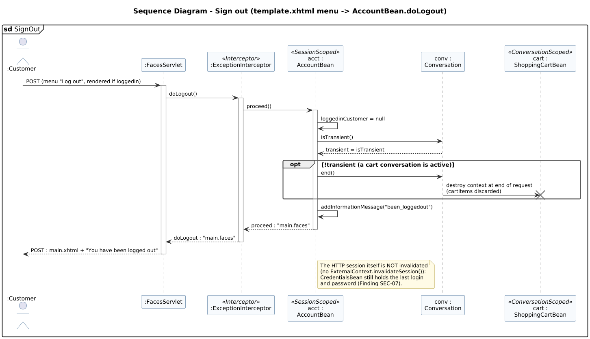

<!-- GENERATED by docs/uml/gen_markdown.py from the .puml source. Do not edit by hand. -->
# Sequence Diagram - Sign out (template.xhtml menu -> AccountBean.doLogout)

| Property | Value |
|---|---|
| UML 2.5.1 diagram kind | Sequence |
| Frame heading (Annex A) | `sd SignOut` |
| Summary | Sign out: clears the logged-in customer, ends the long-running conversation that holds the cart, and shows a confirmation message. |
| PlantUML source | [`src/behaviour/13g-sequence-sign-out.puml`](../../src/behaviour/13g-sequence-sign-out.puml) |
| Rendered | [PNG](../../rendered/behaviour/13g-sequence-sign-out.png) · [SVG](../../rendered/behaviour/13g-sequence-sign-out.svg) |
| References | none |
| Referenced by | [15-interaction-overview-shopping](../behaviour/15-interaction-overview-shopping.md) |

## Diagram



## PlantUML source

The block below is the exact content of `src/behaviour/13g-sequence-sign-out.puml`. It includes the shared
style file `../_style.iuml` (reproduced underneath) so it renders identically in any
PlantUML tool when saved next to that file.

```plantuml
@startuml 13g-sequence-sign-out
' @kind: Sequence
' @summary: Sign out: clears the logged-in customer, ends the long-running conversation that holds the cart, and shows a confirmation message.
!include ../_style.iuml
mainframe **sd** SignOut
title Sequence Diagram - Sign out (template.xhtml menu -> AccountBean.doLogout)

actor ":Customer" as user
participant ":FacesServlet" as fs
participant ":ExceptionInterceptor" as exi <<Interceptor>>
participant "acct :\nAccountBean" as acct <<SessionScoped>>
participant "conv :\nConversation" as conv
participant "cart :\nShoppingCartBean" as cart <<ConversationScoped>>

user -> fs : POST (menu "Log out", rendered if loggedIn)
activate fs
fs -> exi : doLogout()
activate exi
exi -> acct : proceed()
activate acct
acct -> acct : loggedinCustomer = null
acct -> conv : isTransient()
conv --> acct : transient = isTransient
opt !transient (a cart conversation is active)
  acct -> conv : end()
  conv -> cart : destroy context at end of request\n(cartItems discarded)
  destroy cart
end
acct -> acct : addInformationMessage("been_loggedout")
acct --> exi : proceed : "main.faces"
deactivate acct
exi --> fs : doLogout : "main.faces"
deactivate exi
fs --> user : POST : main.xhtml + "You have been logged out"
deactivate fs

note right of acct
  The HTTP session itself is NOT invalidated
  (no ExternalContext.invalidateSession()):
  CredentialsBean still holds the last login
  and password (Finding SEC-07).
end note
@enduml
```

<details>
<summary>Shared style: <code>src/_style.iuml</code></summary>

```plantuml
' =====================================================================
'  Shared PlantUML style for the PetStore EE7 UML 2.5.1 model
'  Source of truth : src/main/java/org/agoncal/application/petstore/**
'  Notation        : OMG UML 2.5.1 (formal/17-12-05), Annex A frames
'  Licence         : CC BY-SA 3.0 (derivative of agoncal/petstore-ee7)
' =====================================================================
!pragma useIntermediatePackages false
set separator none
skinparam dpi 110
skinparam shadowing false
skinparam roundCorner 4
skinparam defaultFontName "Helvetica"
skinparam defaultFontSize 12
skinparam titleFontSize 15
skinparam titleFontStyle bold
skinparam ArrowColor #333333
skinparam ArrowFontSize 11
skinparam BackgroundColor #FFFFFF
skinparam NoteBackgroundColor #FFFBE6
skinparam NoteBorderColor #B59F3B
skinparam NoteFontSize 11
skinparam packageStyle folder
skinparam ClassBackgroundColor #F7FAFD
skinparam ClassBorderColor #2F5D8A
skinparam ClassHeaderBackgroundColor #E3EEF8
skinparam ClassAttributeIconSize 0
skinparam ObjectBackgroundColor #F7FAFD
skinparam ObjectBorderColor #2F5D8A
skinparam ComponentBackgroundColor #F7FAFD
skinparam ComponentBorderColor #2F5D8A
skinparam NodeBackgroundColor #F2F2F2
skinparam NodeBorderColor #555555
skinparam ArtifactBackgroundColor #FFFFFF
skinparam ActorBorderColor #2F5D8A
skinparam UsecaseBackgroundColor #F7FAFD
skinparam UsecaseBorderColor #2F5D8A
skinparam ActivityBackgroundColor #F7FAFD
skinparam ActivityBorderColor #2F5D8A
skinparam ActivityDiamondBackgroundColor #FFFFFF
skinparam PartitionBorderColor #7A7A7A
skinparam StateBackgroundColor #F7FAFD
skinparam StateBorderColor #2F5D8A
skinparam SequenceLifeLineBorderColor #7A7A7A
skinparam SequenceGroupBorderColor #555555
skinparam SequenceGroupHeaderFontStyle bold
skinparam ParticipantBackgroundColor #F7FAFD
skinparam ParticipantBorderColor #2F5D8A
skinparam stereotypeCBackgroundColor #C9DDF0
skinparam legendBackgroundColor #FAFAFA
skinparam legendBorderColor #999999
skinparam legendFontSize 10
hide circle
```

</details>

[Back to index](../README.md)
