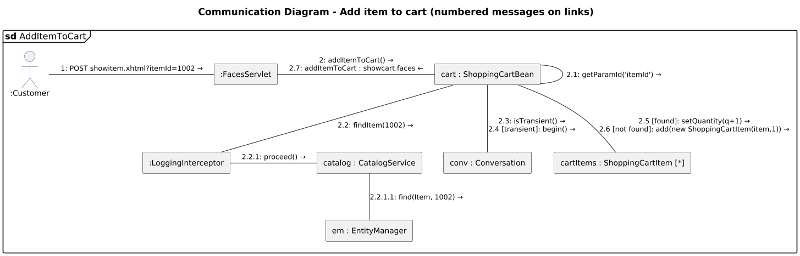

<!-- GENERATED by docs/uml/gen_markdown.py from the .puml source. Do not edit by hand. -->
# Communication Diagram - Add item to cart (numbered messages on links)

| Property | Value |
|---|---|
| UML 2.5.1 diagram kind | Communication |
| Frame heading (Annex A) | `sd AddItemToCart` |
| Summary | Add item to cart with decimal message numbering and guards on links. |
| PlantUML source | [`src/behaviour/14-communication-add-to-cart.puml`](../../src/behaviour/14-communication-add-to-cart.puml) |
| Rendered | [PNG](../../rendered/behaviour/14-communication-add-to-cart.png) · [SVG](../../rendered/behaviour/14-communication-add-to-cart.svg) |
| References | none |
| Referenced by | [07b-composite-structure-checkout-collaboration](../structure/07b-composite-structure-checkout-collaboration.md), [13e-sequence-browse-catalogue](../behaviour/13e-sequence-browse-catalogue.md), [15-interaction-overview-shopping](../behaviour/15-interaction-overview-shopping.md) |

## Diagram



## PlantUML source

The block below is the exact content of `src/behaviour/14-communication-add-to-cart.puml`. It includes the shared
style file `../_style.iuml` (reproduced underneath) so it renders identically in any
PlantUML tool when saved next to that file.

```plantuml
@startuml 14-communication-add-to-cart
' @kind: Communication
' @summary: Add item to cart with decimal message numbering and guards on links.
!include ../_style.iuml
mainframe **sd** AddItemToCart
title Communication Diagram - Add item to cart (numbered messages on links)

' UML 2.5.1 clause 17.9: lifelines are rectangles, messages are sequence-numbered
' labels with direction arrows placed on the connecting links. Alternatives use guards
' (<integer> [guard]); letter suffixes (2.5a/2.5b) would denote concurrent threads (17.9.1.3).
actor ":Customer" as user
rectangle ":FacesServlet" as fs
rectangle "cart : ShoppingCartBean" as cart
rectangle ":LoggingInterceptor" as li
rectangle "catalog : CatalogService" as cs
rectangle "em : EntityManager" as em
rectangle "conv : Conversation" as conv
rectangle "cartItems : ShoppingCartItem [*]" as items

user -right- fs : "1: POST showitem.xhtml?itemId=1002 →"
fs -right- cart : "2: addItemToCart() →\n2.7: addItemToCart : showcart.faces ←"
cart -up- cart : "2.1: getParamId('itemId') →"
cart -down- li : "2.2: findItem(1002) →"
li -right- cs : "2.2.1: proceed() →"
cs -down- em : "2.2.1.1: find(Item, 1002) →"
cart -down- conv : "2.3: isTransient() →\n2.4 [transient]: begin() →"
cart -down- items : "2.5 [found]: setQuantity(q+1) →\n2.6 [not found]: add(new ShoppingCartItem(item,1)) →"
@enduml
```

<details>
<summary>Shared style: <code>src/_style.iuml</code></summary>

```plantuml
' =====================================================================
'  Shared PlantUML style for the PetStore EE7 UML 2.5.1 model
'  Source of truth : src/main/java/org/agoncal/application/petstore/**
'  Notation        : OMG UML 2.5.1 (formal/17-12-05), Annex A frames
'  Licence         : CC BY-SA 3.0 (derivative of agoncal/petstore-ee7)
' =====================================================================
!pragma useIntermediatePackages false
set separator none
skinparam dpi 110
skinparam shadowing false
skinparam roundCorner 4
skinparam defaultFontName "Helvetica"
skinparam defaultFontSize 12
skinparam titleFontSize 15
skinparam titleFontStyle bold
skinparam ArrowColor #333333
skinparam ArrowFontSize 11
skinparam BackgroundColor #FFFFFF
skinparam NoteBackgroundColor #FFFBE6
skinparam NoteBorderColor #B59F3B
skinparam NoteFontSize 11
skinparam packageStyle folder
skinparam ClassBackgroundColor #F7FAFD
skinparam ClassBorderColor #2F5D8A
skinparam ClassHeaderBackgroundColor #E3EEF8
skinparam ClassAttributeIconSize 0
skinparam ObjectBackgroundColor #F7FAFD
skinparam ObjectBorderColor #2F5D8A
skinparam ComponentBackgroundColor #F7FAFD
skinparam ComponentBorderColor #2F5D8A
skinparam NodeBackgroundColor #F2F2F2
skinparam NodeBorderColor #555555
skinparam ArtifactBackgroundColor #FFFFFF
skinparam ActorBorderColor #2F5D8A
skinparam UsecaseBackgroundColor #F7FAFD
skinparam UsecaseBorderColor #2F5D8A
skinparam ActivityBackgroundColor #F7FAFD
skinparam ActivityBorderColor #2F5D8A
skinparam ActivityDiamondBackgroundColor #FFFFFF
skinparam PartitionBorderColor #7A7A7A
skinparam StateBackgroundColor #F7FAFD
skinparam StateBorderColor #2F5D8A
skinparam SequenceLifeLineBorderColor #7A7A7A
skinparam SequenceGroupBorderColor #555555
skinparam SequenceGroupHeaderFontStyle bold
skinparam ParticipantBackgroundColor #F7FAFD
skinparam ParticipantBorderColor #2F5D8A
skinparam stereotypeCBackgroundColor #C9DDF0
skinparam legendBackgroundColor #FAFAFA
skinparam legendBorderColor #999999
skinparam legendFontSize 10
hide circle
```

</details>

[Back to index](../README.md)
