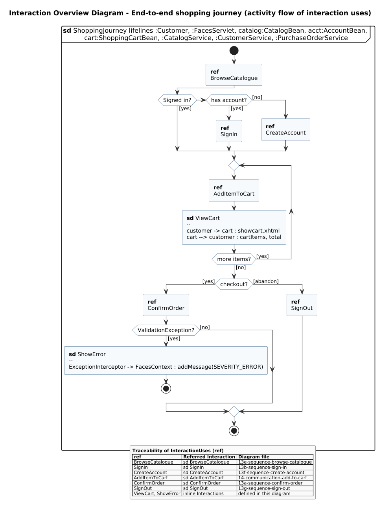

<!-- GENERATED by docs/uml/gen_markdown.py from the .puml source. Do not edit by hand. -->
# Interaction Overview Diagram - End-to-end shopping journey (activity flow of interaction uses)

| Property | Value |
|---|---|
| UML 2.5.1 diagram kind | Interaction Overview |
| Frame heading (Annex A) | `sd ShoppingJourney lifelines :Customer, :FacesServlet, catalog:CatalogBean, acct:AccountBean,\n cart:ShoppingCartBean, :CatalogService, :CustomerService, :PurchaseOrderService` |
| Summary | End-to-end shopping journey as an activity flow of interaction uses (ref) and inline interactions. |
| PlantUML source | [`src/behaviour/15-interaction-overview-shopping.puml`](../../src/behaviour/15-interaction-overview-shopping.puml) |
| Rendered | [PNG](../../rendered/behaviour/15-interaction-overview-shopping.png) · [SVG](../../rendered/behaviour/15-interaction-overview-shopping.svg) |
| References | [sd BrowseCatalogue](../behaviour/13e-sequence-browse-catalogue.md), [sd SignIn](../behaviour/13b-sequence-sign-in.md), [sd CreateAccount](../behaviour/13f-sequence-create-account.md), [sd AddItemToCart](../behaviour/14-communication-add-to-cart.md), [sd ConfirmOrder](../behaviour/13a-sequence-confirm-order.md), [sd SignOut](../behaviour/13g-sequence-sign-out.md), [file 13e-sequence-browse-catalogue](../behaviour/13e-sequence-browse-catalogue.md), [file 13b-sequence-sign-in](../behaviour/13b-sequence-sign-in.md), [file 13f-sequence-create-account](../behaviour/13f-sequence-create-account.md), [file 14-communication-add-to-cart](../behaviour/14-communication-add-to-cart.md), [file 13a-sequence-confirm-order](../behaviour/13a-sequence-confirm-order.md), [file 13g-sequence-sign-out](../behaviour/13g-sequence-sign-out.md) |
| Referenced by | none |

## Diagram



## PlantUML source

The block below is the exact content of `src/behaviour/15-interaction-overview-shopping.puml`. It includes the shared
style file `../_style.iuml` (reproduced underneath) so it renders identically in any
PlantUML tool when saved next to that file.

```plantuml
@startuml 15-interaction-overview-shopping
' @kind: Interaction Overview
' @summary: End-to-end shopping journey as an activity flow of interaction uses (ref) and inline interactions.
!include ../_style.iuml
mainframe **sd** ShoppingJourney lifelines :Customer, :FacesServlet, catalog:CatalogBean, acct:AccountBean,\n cart:ShoppingCartBean, :CatalogService, :CustomerService, :PurchaseOrderService
title Interaction Overview Diagram - End-to-end shopping journey (activity flow of interaction uses)

start
:**ref**
BrowseCatalogue;
if (Signed in?) then ([yes])
elseif (has account?) then ([yes])
  :**ref**
SignIn;
else ([no])
  :**ref**
  CreateAccount;
endif
repeat
  :**ref**
AddItemToCart;
  :**sd** ViewCart
  --
  customer -> cart : showcart.xhtml
  cart --> customer : cartItems, total;
repeat while (more items?) is ([yes]) not ([no])
if (checkout?) then ([yes])
  :**ref**
ConfirmOrder;
  if (ValidationException?) then ([yes])
    :**sd** ShowError
    --
    ExceptionInterceptor -> FacesContext : addMessage(SEVERITY_ERROR);
    stop
  else ([no])
  endif
else ([abandon])
  :**ref**
  SignOut;
endif
stop

legend right
  **Traceability of InteractionUses (ref)**
  |= ref |= Referred Interaction |= Diagram file |
  | BrowseCatalogue | sd BrowseCatalogue | 13e-sequence-browse-catalogue |
  | SignIn | sd SignIn | 13b-sequence-sign-in |
  | CreateAccount | sd CreateAccount | 13f-sequence-create-account |
  | AddItemToCart | sd AddItemToCart | 14-communication-add-to-cart |
  | ConfirmOrder | sd ConfirmOrder | 13a-sequence-confirm-order |
  | SignOut | sd SignOut | 13g-sequence-sign-out |
  | ViewCart, ShowError | inline Interactions | defined in this diagram |
endlegend
@enduml
```

<details>
<summary>Shared style: <code>src/_style.iuml</code></summary>

```plantuml
' =====================================================================
'  Shared PlantUML style for the PetStore EE7 UML 2.5.1 model
'  Source of truth : src/main/java/org/agoncal/application/petstore/**
'  Notation        : OMG UML 2.5.1 (formal/17-12-05), Annex A frames
'  Licence         : CC BY-SA 3.0 (derivative of agoncal/petstore-ee7)
' =====================================================================
!pragma useIntermediatePackages false
set separator none
skinparam dpi 110
skinparam shadowing false
skinparam roundCorner 4
skinparam defaultFontName "Helvetica"
skinparam defaultFontSize 12
skinparam titleFontSize 15
skinparam titleFontStyle bold
skinparam ArrowColor #333333
skinparam ArrowFontSize 11
skinparam BackgroundColor #FFFFFF
skinparam NoteBackgroundColor #FFFBE6
skinparam NoteBorderColor #B59F3B
skinparam NoteFontSize 11
skinparam packageStyle folder
skinparam ClassBackgroundColor #F7FAFD
skinparam ClassBorderColor #2F5D8A
skinparam ClassHeaderBackgroundColor #E3EEF8
skinparam ClassAttributeIconSize 0
skinparam ObjectBackgroundColor #F7FAFD
skinparam ObjectBorderColor #2F5D8A
skinparam ComponentBackgroundColor #F7FAFD
skinparam ComponentBorderColor #2F5D8A
skinparam NodeBackgroundColor #F2F2F2
skinparam NodeBorderColor #555555
skinparam ArtifactBackgroundColor #FFFFFF
skinparam ActorBorderColor #2F5D8A
skinparam UsecaseBackgroundColor #F7FAFD
skinparam UsecaseBorderColor #2F5D8A
skinparam ActivityBackgroundColor #F7FAFD
skinparam ActivityBorderColor #2F5D8A
skinparam ActivityDiamondBackgroundColor #FFFFFF
skinparam PartitionBorderColor #7A7A7A
skinparam StateBackgroundColor #F7FAFD
skinparam StateBorderColor #2F5D8A
skinparam SequenceLifeLineBorderColor #7A7A7A
skinparam SequenceGroupBorderColor #555555
skinparam SequenceGroupHeaderFontStyle bold
skinparam ParticipantBackgroundColor #F7FAFD
skinparam ParticipantBorderColor #2F5D8A
skinparam stereotypeCBackgroundColor #C9DDF0
skinparam legendBackgroundColor #FAFAFA
skinparam legendBorderColor #999999
skinparam legendFontSize 10
hide circle
```

</details>

[Back to index](../README.md)
