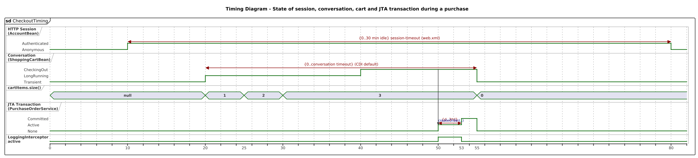

<!-- GENERATED by docs/uml/gen_markdown.py from the .puml source. Do not edit by hand. -->
# Timing Diagram - State of session, conversation, cart and JTA transaction during a purchase

| Property | Value |
|---|---|
| UML 2.5.1 diagram kind | Timing |
| Frame heading (Annex A) | `sd CheckoutTiming` |
| Summary | State timelines of session, conversation, cart size, JTA transaction and interceptor with duration constraints. |
| PlantUML source | [`src/behaviour/16-timing-checkout.puml`](../../src/behaviour/16-timing-checkout.puml) |
| Rendered | [PNG](../../rendered/behaviour/16-timing-checkout.png) · [SVG](../../rendered/behaviour/16-timing-checkout.svg) |
| References | none |
| Referenced by | [07b-composite-structure-checkout-collaboration](../structure/07b-composite-structure-checkout-collaboration.md) |

## Diagram



## PlantUML source

The block below is the exact content of `src/behaviour/16-timing-checkout.puml`. It includes the shared
style file `../_style.iuml` (reproduced underneath) so it renders identically in any
PlantUML tool when saved next to that file.

```plantuml
@startuml 16-timing-checkout
' @kind: Timing
' @summary: State timelines of session, conversation, cart size, JTA transaction and interceptor with duration constraints.
!include ../_style.iuml
mainframe **sd** CheckoutTiming
title Timing Diagram - State of session, conversation, cart and JTA transaction during a purchase

robust "HTTP Session\n(AccountBean)" as S
robust "Conversation\n(ShoppingCartBean)" as C
concise "cartItems.size()" as N
robust "JTA Transaction\n(PurchaseOrderService)" as T
binary "LoggingInterceptor\nactive" as L

@0
S is Anonymous
C is Transient
N is "null"
T is None
L is low

@10
S is Authenticated
@20
C is LongRunning
N is 1
@25
N is 2
@30
N is 3
@40
C is CheckingOut
@50
C -> T : createOrder(..)
T is Active
L is high
@53
T is Committed
L is low
@55
C is Transient
N is 0
T is None
@80
S is Anonymous

S@10 <-> @80 : {0..30 min idle} session-timeout (web.xml)
C@20 <-> @55 : {0..conversation timeout} (CDI default)
T@50 <-> @53 : {d..3*d}

note bottom of T : d = observed duration of persist(order) + commit
@enduml
```

<details>
<summary>Shared style: <code>src/_style.iuml</code></summary>

```plantuml
' =====================================================================
'  Shared PlantUML style for the PetStore EE7 UML 2.5.1 model
'  Source of truth : src/main/java/org/agoncal/application/petstore/**
'  Notation        : OMG UML 2.5.1 (formal/17-12-05), Annex A frames
'  Licence         : CC BY-SA 3.0 (derivative of agoncal/petstore-ee7)
' =====================================================================
!pragma useIntermediatePackages false
set separator none
skinparam dpi 110
skinparam shadowing false
skinparam roundCorner 4
skinparam defaultFontName "Helvetica"
skinparam defaultFontSize 12
skinparam titleFontSize 15
skinparam titleFontStyle bold
skinparam ArrowColor #333333
skinparam ArrowFontSize 11
skinparam BackgroundColor #FFFFFF
skinparam NoteBackgroundColor #FFFBE6
skinparam NoteBorderColor #B59F3B
skinparam NoteFontSize 11
skinparam packageStyle folder
skinparam ClassBackgroundColor #F7FAFD
skinparam ClassBorderColor #2F5D8A
skinparam ClassHeaderBackgroundColor #E3EEF8
skinparam ClassAttributeIconSize 0
skinparam ObjectBackgroundColor #F7FAFD
skinparam ObjectBorderColor #2F5D8A
skinparam ComponentBackgroundColor #F7FAFD
skinparam ComponentBorderColor #2F5D8A
skinparam NodeBackgroundColor #F2F2F2
skinparam NodeBorderColor #555555
skinparam ArtifactBackgroundColor #FFFFFF
skinparam ActorBorderColor #2F5D8A
skinparam UsecaseBackgroundColor #F7FAFD
skinparam UsecaseBorderColor #2F5D8A
skinparam ActivityBackgroundColor #F7FAFD
skinparam ActivityBorderColor #2F5D8A
skinparam ActivityDiamondBackgroundColor #FFFFFF
skinparam PartitionBorderColor #7A7A7A
skinparam StateBackgroundColor #F7FAFD
skinparam StateBorderColor #2F5D8A
skinparam SequenceLifeLineBorderColor #7A7A7A
skinparam SequenceGroupBorderColor #555555
skinparam SequenceGroupHeaderFontStyle bold
skinparam ParticipantBackgroundColor #F7FAFD
skinparam ParticipantBorderColor #2F5D8A
skinparam stereotypeCBackgroundColor #C9DDF0
skinparam legendBackgroundColor #FAFAFA
skinparam legendBorderColor #999999
skinparam legendFontSize 10
hide circle
```

</details>

[Back to index](../README.md)
