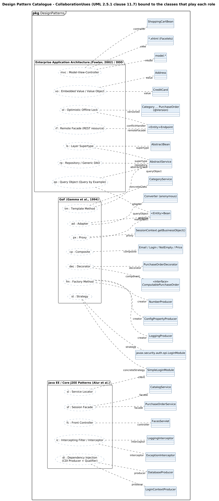

<!-- GENERATED by docs/uml/gen_markdown.py from the .puml source. Do not edit by hand. -->
# Design Pattern Catalogue - CollaborationUses (UML 2.5.1 clause 11.7) bound to the classes that play each role

| Property | Value |
|---|---|
| UML 2.5.1 diagram kind | Class (design patterns) |
| Frame heading (Annex A) | `pkg DesignPatterns` |
| Summary | Catalogue of 19 patterns as CollaborationUses bound to the participating classes. |
| PlantUML source | [`src/patterns/20-pattern-catalogue.puml`](../../src/patterns/20-pattern-catalogue.puml) |
| Rendered | [PNG](../../rendered/patterns/20-pattern-catalogue.png) · [SVG](../../rendered/patterns/20-pattern-catalogue.svg) |
| References | none |
| Referenced by | none |

## Diagram



## PlantUML source

The block below is the exact content of `src/patterns/20-pattern-catalogue.puml`. It includes the shared
style file `../_style.iuml` (reproduced underneath) so it renders identically in any
PlantUML tool when saved next to that file.

```plantuml
@startuml 20-pattern-catalogue
' @kind: Class (design patterns)
' @summary: Catalogue of 19 patterns as CollaborationUses bound to the participating classes.
!include ../_style.iuml
allowmixing
skinparam usecaseBorderStyle dashed
skinparam usecaseBackgroundColor #FFFFFF
left to right direction
mainframe **pkg** DesignPatterns
title Design Pattern Catalogue - CollaborationUses (UML 2.5.1 clause 11.7) bound to the classes that play each role

package "GoF (Gamma et al., 1994)" as gof {
  usecase "tm : Template Method" as TM
  usecase "dec : Decorator" as DEC
  usecase "fm : Factory Method" as FM
  usecase "ad : Adapter" as AD
  usecase "st : Strategy" as ST
  usecase "px : Proxy" as PX
  usecase "cp : Composite" as CP
}
package "Java EE / Core J2EE Patterns (Alur et al.)" as jee {
  usecase "sf : Session Facade" as SF
  usecase "fc : Front Controller" as FC
  usecase "ic : Intercepting Filter / Interceptor" as IC
  usecase "sl : Service Locator" as SL
  usecase "di : Dependency Injection\n(CDI Producer + Qualifier)" as DI
}
package "Enterprise Application Architecture (Fowler, 2002) / DDD" as poeaa {
  usecase "ls : Layer Supertype" as LS
  usecase "rp : Repository / Generic DAO" as RP
  usecase "vo : Embedded Value / Value Object" as VO
  usecase "ol : Optimistic Offline Lock" as OL
  usecase "qo : Query Object (Query by Example)" as QO
  usecase "rf : Remote Facade (REST resource)" as RF
  usecase "mvc : Model-View-Controller" as MVC
}

class AbstractService
class CategoryService
class CatalogService
class PurchaseOrderService
class PurchaseOrderDecorator
interface ComputablePurchaseOrder <<interface>>
class LoggingProducer
class DatabaseProducer
class NumberProducer
class ConfigPropertyProducer
class LoginContextProducer
class "<Entity>Bean" as EntityBean
class "Converter (anonymous)" as Conv
class SimpleLoginModule
class "javax.security.auth.spi.LoginModule" as LM
class LoggingInterceptor
class ExceptionInterceptor
class "Email / Login / NotEmpty / Price" as Constr
class FacesServlet
class AbstractBean
class Address
class CreditCard
class "<Entity>Endpoint" as Endpoint
class "SessionContext.getBusinessObject()" as SC
class "Category ... PurchaseOrder\n(@Version)" as Versioned
class ShoppingCartBean
class "*.xhtml (Facelets)" as Facelets
class "model.*" as Model

TM .. "abstractClass" AbstractService
TM .. "concreteClass" CategoryService
DEC .. "decorator" PurchaseOrderDecorator
DEC .. "component" ComputablePurchaseOrder
FM .. "creator" LoggingProducer
FM .. "creator" NumberProducer
FM .. "creator" ConfigPropertyProducer
AD .. "adapter" Conv
AD .. "adaptee" EntityBean
ST .. "strategy" LM
ST .. "concreteStrategy" SimpleLoginModule
PX .. "proxy" SC
PX .. "realSubject" EntityBean
CP .. "composite" Constr

SF .. "facade" CatalogService
SF .. "facade" PurchaseOrderService
FC .. "controller" FacesServlet
IC .. "interceptor" LoggingInterceptor
IC .. "interceptor" ExceptionInterceptor
SL .. "client" SimpleLoginModule
DI .. "producer" DatabaseProducer
DI .. "producer" LoginContextProducer

LS .. "supertype" AbstractService
LS .. "supertype" AbstractBean
RP .. "repository" AbstractService
VO .. "value" Address
VO .. "value" CreditCard
OL .. "versioned" Versioned
OL .. "conflictHandler" Endpoint
QO .. "queryObject" AbstractService
QO .. "queryObject" EntityBean
RF .. "remoteFacade" Endpoint
MVC .. "view" Facelets
MVC .. "controller" ShoppingCartBean
MVC .. "model" Model
@enduml
```

<details>
<summary>Shared style: <code>src/_style.iuml</code></summary>

```plantuml
' =====================================================================
'  Shared PlantUML style for the PetStore EE7 UML 2.5.1 model
'  Source of truth : src/main/java/org/agoncal/application/petstore/**
'  Notation        : OMG UML 2.5.1 (formal/17-12-05), Annex A frames
'  Licence         : CC BY-SA 3.0 (derivative of agoncal/petstore-ee7)
' =====================================================================
!pragma useIntermediatePackages false
set separator none
skinparam dpi 110
skinparam shadowing false
skinparam roundCorner 4
skinparam defaultFontName "Helvetica"
skinparam defaultFontSize 12
skinparam titleFontSize 15
skinparam titleFontStyle bold
skinparam ArrowColor #333333
skinparam ArrowFontSize 11
skinparam BackgroundColor #FFFFFF
skinparam NoteBackgroundColor #FFFBE6
skinparam NoteBorderColor #B59F3B
skinparam NoteFontSize 11
skinparam packageStyle folder
skinparam ClassBackgroundColor #F7FAFD
skinparam ClassBorderColor #2F5D8A
skinparam ClassHeaderBackgroundColor #E3EEF8
skinparam ClassAttributeIconSize 0
skinparam ObjectBackgroundColor #F7FAFD
skinparam ObjectBorderColor #2F5D8A
skinparam ComponentBackgroundColor #F7FAFD
skinparam ComponentBorderColor #2F5D8A
skinparam NodeBackgroundColor #F2F2F2
skinparam NodeBorderColor #555555
skinparam ArtifactBackgroundColor #FFFFFF
skinparam ActorBorderColor #2F5D8A
skinparam UsecaseBackgroundColor #F7FAFD
skinparam UsecaseBorderColor #2F5D8A
skinparam ActivityBackgroundColor #F7FAFD
skinparam ActivityBorderColor #2F5D8A
skinparam ActivityDiamondBackgroundColor #FFFFFF
skinparam PartitionBorderColor #7A7A7A
skinparam StateBackgroundColor #F7FAFD
skinparam StateBorderColor #2F5D8A
skinparam SequenceLifeLineBorderColor #7A7A7A
skinparam SequenceGroupBorderColor #555555
skinparam SequenceGroupHeaderFontStyle bold
skinparam ParticipantBackgroundColor #F7FAFD
skinparam ParticipantBorderColor #2F5D8A
skinparam stereotypeCBackgroundColor #C9DDF0
skinparam legendBackgroundColor #FAFAFA
skinparam legendBorderColor #999999
skinparam legendFontSize 10
hide circle
```

</details>

[Back to index](../README.md)
