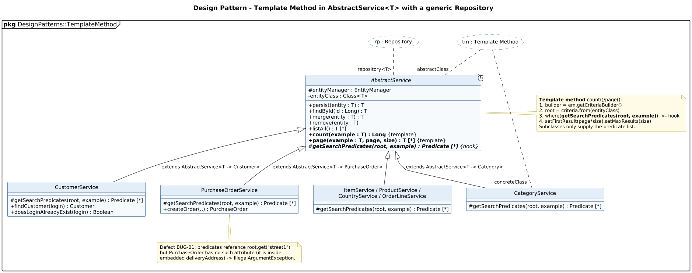

<!-- GENERATED by docs/uml/gen_markdown.py from the .puml source. Do not edit by hand. -->
# Design Pattern - Template Method in AbstractService<T> with a generic Repository

| Property | Value |
|---|---|
| UML 2.5.1 diagram kind | Class (design pattern) |
| Frame heading (Annex A) | `pkg DesignPatterns::TemplateMethod` |
| Summary | Template Method, Layer Supertype and Repository/Generic DAO in AbstractService<T>. |
| PlantUML source | [`src/patterns/21-template-method-generic-dao.puml`](../../src/patterns/21-template-method-generic-dao.puml) |
| Rendered | [PNG](../../rendered/patterns/21-template-method-generic-dao.png) · [SVG](../../rendered/patterns/21-template-method-generic-dao.svg) |
| References | none |
| Referenced by | none |

## Diagram



## PlantUML source

The block below is the exact content of `src/patterns/21-template-method-generic-dao.puml`. It includes the shared
style file `../_style.iuml` (reproduced underneath) so it renders identically in any
PlantUML tool when saved next to that file.

```plantuml
@startuml 21-template-method-generic-dao
' @kind: Class (design pattern)
' @summary: Template Method, Layer Supertype and Repository/Generic DAO in AbstractService<T>.
!include ../_style.iuml
allowmixing
skinparam usecaseBorderStyle dashed
skinparam usecaseBackgroundColor #FFFFFF
mainframe **pkg** DesignPatterns::TemplateMethod
title Design Pattern - Template Method in AbstractService<T> with a generic Repository

usecase "tm : Template Method" as TM
usecase "rp : Repository" as RP

abstract class "AbstractService<T>" as AS {
  # entityManager : EntityManager
  - entityClass : Class<T>
  + persist(entity : T) : T
  + findById(id : Long) : T
  + merge(entity : T) : T
  + remove(entity : T)
  + listAll() : T [*]
  + **count(example : T) : Long** {template}
  + **page(example : T, page, size) : T [*]** {template}
  # {abstract} **getSearchPredicates(root, example) : Predicate [*]** {hook}
}
class CategoryService {
  # getSearchPredicates(root, example) : Predicate [*]
}
class CustomerService {
  # getSearchPredicates(root, example) : Predicate [*]
  + findCustomer(login) : Customer
  + doesLoginAlreadyExist(login) : Boolean
}
class PurchaseOrderService {
  # getSearchPredicates(root, example) : Predicate [*]
  + createOrder(..) : PurchaseOrder
}
class "ItemService / ProductService /\nCountryService / OrderLineService" as Others {
  # getSearchPredicates(root, example) : Predicate [*]
}

AS <|-- CategoryService : extends AbstractService<T -> Category>
AS <|-- CustomerService : extends AbstractService<T -> Customer>
AS <|-- PurchaseOrderService : extends AbstractService<T -> PurchaseOrder>
AS <|-- Others

TM .. "abstractClass" AS
TM .. "concreteClass" CategoryService
RP .. "repository<T>" AS

note right of AS
  **Template method** count()/page():
  1. builder = em.getCriteriaBuilder()
  2. root = criteria.from(entityClass)
  3. where(**getSearchPredicates(root, example)**)  <- hook
  4. setFirstResult(page*size).setMaxResults(size)
  Subclasses only supply the predicate list.
end note

note bottom of PurchaseOrderService
  Defect BUG-01: predicates reference root.get("street1")
  but PurchaseOrder has no such attribute (it is inside
  embedded deliveryAddress) -> IllegalArgumentException.
end note
@enduml
```

<details>
<summary>Shared style: <code>src/_style.iuml</code></summary>

```plantuml
' =====================================================================
'  Shared PlantUML style for the PetStore EE7 UML 2.5.1 model
'  Source of truth : src/main/java/org/agoncal/application/petstore/**
'  Notation        : OMG UML 2.5.1 (formal/17-12-05), Annex A frames
'  Licence         : CC BY-SA 3.0 (derivative of agoncal/petstore-ee7)
' =====================================================================
!pragma useIntermediatePackages false
set separator none
skinparam dpi 110
skinparam shadowing false
skinparam roundCorner 4
skinparam defaultFontName "Helvetica"
skinparam defaultFontSize 12
skinparam titleFontSize 15
skinparam titleFontStyle bold
skinparam ArrowColor #333333
skinparam ArrowFontSize 11
skinparam BackgroundColor #FFFFFF
skinparam NoteBackgroundColor #FFFBE6
skinparam NoteBorderColor #B59F3B
skinparam NoteFontSize 11
skinparam packageStyle folder
skinparam ClassBackgroundColor #F7FAFD
skinparam ClassBorderColor #2F5D8A
skinparam ClassHeaderBackgroundColor #E3EEF8
skinparam ClassAttributeIconSize 0
skinparam ObjectBackgroundColor #F7FAFD
skinparam ObjectBorderColor #2F5D8A
skinparam ComponentBackgroundColor #F7FAFD
skinparam ComponentBorderColor #2F5D8A
skinparam NodeBackgroundColor #F2F2F2
skinparam NodeBorderColor #555555
skinparam ArtifactBackgroundColor #FFFFFF
skinparam ActorBorderColor #2F5D8A
skinparam UsecaseBackgroundColor #F7FAFD
skinparam UsecaseBorderColor #2F5D8A
skinparam ActivityBackgroundColor #F7FAFD
skinparam ActivityBorderColor #2F5D8A
skinparam ActivityDiamondBackgroundColor #FFFFFF
skinparam PartitionBorderColor #7A7A7A
skinparam StateBackgroundColor #F7FAFD
skinparam StateBorderColor #2F5D8A
skinparam SequenceLifeLineBorderColor #7A7A7A
skinparam SequenceGroupBorderColor #555555
skinparam SequenceGroupHeaderFontStyle bold
skinparam ParticipantBackgroundColor #F7FAFD
skinparam ParticipantBorderColor #2F5D8A
skinparam stereotypeCBackgroundColor #C9DDF0
skinparam legendBackgroundColor #FAFAFA
skinparam legendBorderColor #999999
skinparam legendFontSize 10
hide circle
```

</details>

[Back to index](../README.md)
