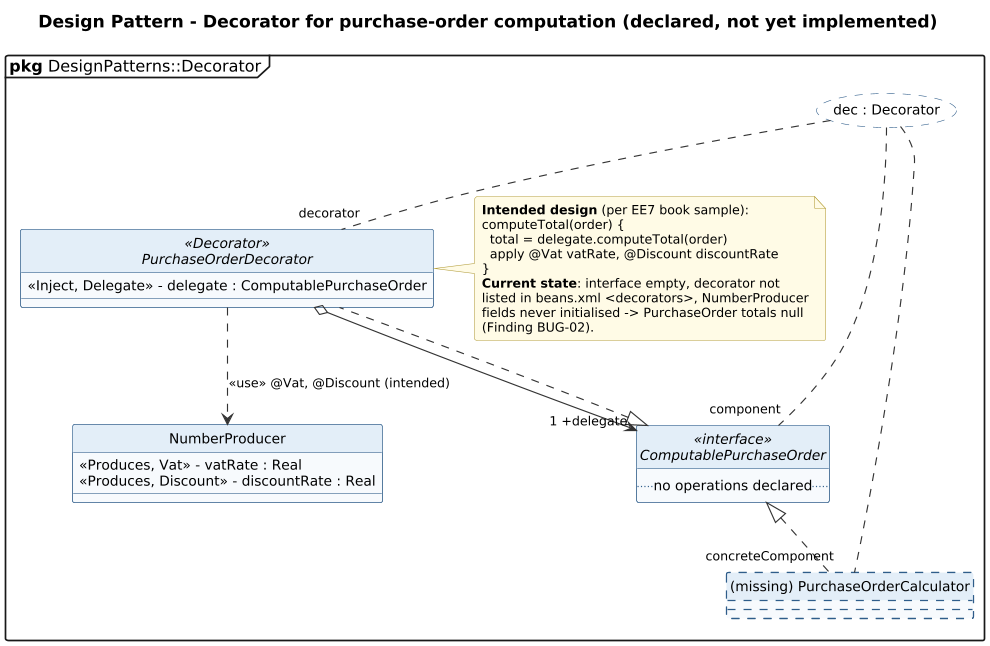

<!-- GENERATED by docs/uml/gen_markdown.py from the .puml source. Do not edit by hand. -->
# Design Pattern - Decorator for purchase-order computation (declared, not yet implemented)

| Property | Value |
|---|---|
| UML 2.5.1 diagram kind | Class (design pattern) |
| Frame heading (Annex A) | `pkg DesignPatterns::Decorator` |
| Summary | CDI Decorator for purchase-order computation (declared, not yet implemented). |
| PlantUML source | [`src/patterns/23-decorator.puml`](../../src/patterns/23-decorator.puml) |
| Rendered | [PNG](../../rendered/patterns/23-decorator.png) · [SVG](../../rendered/patterns/23-decorator.svg) |
| References | none |
| Referenced by | none |

## Diagram



## PlantUML source

The block below is the exact content of `src/patterns/23-decorator.puml`. It includes the shared
style file `../_style.iuml` (reproduced underneath) so it renders identically in any
PlantUML tool when saved next to that file.

```plantuml
@startuml 23-decorator
' @kind: Class (design pattern)
' @summary: CDI Decorator for purchase-order computation (declared, not yet implemented).
!include ../_style.iuml
allowmixing
skinparam usecaseBorderStyle dashed
skinparam usecaseBackgroundColor #FFFFFF
mainframe **pkg** DesignPatterns::Decorator
title Design Pattern - Decorator for purchase-order computation (declared, not yet implemented)

usecase "dec : Decorator" as P

interface ComputablePurchaseOrder <<interface>> {
  .. no operations declared ..
}
class "(missing) PurchaseOrderCalculator" as Concrete #line.dashed
abstract class PurchaseOrderDecorator <<Decorator>> {
  <<Inject, Delegate>> - delegate : ComputablePurchaseOrder
}
class NumberProducer {
  <<Produces, Vat>> - vatRate : Real
  <<Produces, Discount>> - discountRate : Real
}

ComputablePurchaseOrder <|.. Concrete
ComputablePurchaseOrder <|.. PurchaseOrderDecorator
PurchaseOrderDecorator o--> "1 +delegate" ComputablePurchaseOrder
PurchaseOrderDecorator ..> NumberProducer : <<use>> @Vat, @Discount (intended)

P .. "component" ComputablePurchaseOrder
P .. "decorator" PurchaseOrderDecorator
P .. "concreteComponent" Concrete

note right of PurchaseOrderDecorator
  **Intended design** (per EE7 book sample):
  computeTotal(order) {
    total = delegate.computeTotal(order)
    apply @Vat vatRate, @Discount discountRate
  }
  **Current state**: interface empty, decorator not
  listed in beans.xml <decorators>, NumberProducer
  fields never initialised -> PurchaseOrder totals null
  (Finding BUG-02).
end note
@enduml
```

<details>
<summary>Shared style: <code>src/_style.iuml</code></summary>

```plantuml
' =====================================================================
'  Shared PlantUML style for the PetStore EE7 UML 2.5.1 model
'  Source of truth : src/main/java/org/agoncal/application/petstore/**
'  Notation        : OMG UML 2.5.1 (formal/17-12-05), Annex A frames
'  Licence         : CC BY-SA 3.0 (derivative of agoncal/petstore-ee7)
' =====================================================================
!pragma useIntermediatePackages false
set separator none
skinparam dpi 110
skinparam shadowing false
skinparam roundCorner 4
skinparam defaultFontName "Helvetica"
skinparam defaultFontSize 12
skinparam titleFontSize 15
skinparam titleFontStyle bold
skinparam ArrowColor #333333
skinparam ArrowFontSize 11
skinparam BackgroundColor #FFFFFF
skinparam NoteBackgroundColor #FFFBE6
skinparam NoteBorderColor #B59F3B
skinparam NoteFontSize 11
skinparam packageStyle folder
skinparam ClassBackgroundColor #F7FAFD
skinparam ClassBorderColor #2F5D8A
skinparam ClassHeaderBackgroundColor #E3EEF8
skinparam ClassAttributeIconSize 0
skinparam ObjectBackgroundColor #F7FAFD
skinparam ObjectBorderColor #2F5D8A
skinparam ComponentBackgroundColor #F7FAFD
skinparam ComponentBorderColor #2F5D8A
skinparam NodeBackgroundColor #F2F2F2
skinparam NodeBorderColor #555555
skinparam ArtifactBackgroundColor #FFFFFF
skinparam ActorBorderColor #2F5D8A
skinparam UsecaseBackgroundColor #F7FAFD
skinparam UsecaseBorderColor #2F5D8A
skinparam ActivityBackgroundColor #F7FAFD
skinparam ActivityBorderColor #2F5D8A
skinparam ActivityDiamondBackgroundColor #FFFFFF
skinparam PartitionBorderColor #7A7A7A
skinparam StateBackgroundColor #F7FAFD
skinparam StateBorderColor #2F5D8A
skinparam SequenceLifeLineBorderColor #7A7A7A
skinparam SequenceGroupBorderColor #555555
skinparam SequenceGroupHeaderFontStyle bold
skinparam ParticipantBackgroundColor #F7FAFD
skinparam ParticipantBorderColor #2F5D8A
skinparam stereotypeCBackgroundColor #C9DDF0
skinparam legendBackgroundColor #FAFAFA
skinparam legendBorderColor #999999
skinparam legendFontSize 10
hide circle
```

</details>

[Back to index](../README.md)
