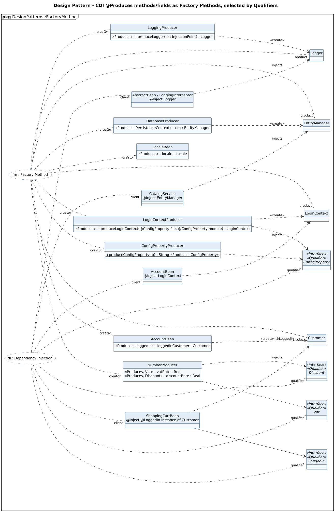

<!-- GENERATED by docs/uml/gen_markdown.py from the .puml source. Do not edit by hand. -->
# Design Pattern - CDI @Produces methods/fields as Factory Methods, selected by Qualifiers

| Property | Value |
|---|---|
| UML 2.5.1 diagram kind | Class (design pattern) |
| Frame heading (Annex A) | `pkg DesignPatterns::FactoryMethod` |
| Summary | Factory Method through CDI @Produces with Qualifier-based dependency injection. |
| PlantUML source | [`src/patterns/24-producer-factory-qualifier.puml`](../../src/patterns/24-producer-factory-qualifier.puml) |
| Rendered | [PNG](../../rendered/patterns/24-producer-factory-qualifier.png) · [SVG](../../rendered/patterns/24-producer-factory-qualifier.svg) |
| References | none |
| Referenced by | none |

## Diagram



## PlantUML source

The block below is the exact content of `src/patterns/24-producer-factory-qualifier.puml`. It includes the shared
style file `../_style.iuml` (reproduced underneath) so it renders identically in any
PlantUML tool when saved next to that file.

```plantuml
@startuml 24-producer-factory-qualifier
' @kind: Class (design pattern)
' @summary: Factory Method through CDI @Produces with Qualifier-based dependency injection.
!include ../_style.iuml
allowmixing
skinparam usecaseBorderStyle dashed
skinparam usecaseBackgroundColor #FFFFFF
mainframe **pkg** DesignPatterns::FactoryMethod
left to right direction
title Design Pattern - CDI @Produces methods/fields as Factory Methods, selected by Qualifiers

usecase "fm : Factory Method" as FM
usecase "di : Dependency Injection" as DI

class LoggingProducer {
  <<Produces>> + produceLogger(ip : InjectionPoint) : Logger
}
class DatabaseProducer {
  <<Produces, PersistenceContext>> - em : EntityManager
}
class ConfigPropertyProducer {
  + {static} produceConfigProperty(ip) : String <<Produces, ConfigProperty>>
}
class NumberProducer {
  <<Produces, Vat>> - vatRate : Real
  <<Produces, Discount>> - discountRate : Real
}
class LoginContextProducer {
  <<Produces>> + produceLoginContext(@ConfigProperty file, @ConfigProperty module) : LoginContext
}
class AccountBean {
  <<Produces, LoggedIn>> - loggedinCustomer : Customer
}
class LocaleBean {
  <<Produces>> - locale : Locale
}

class Logger
class EntityManager
class LoginContext
class Customer

class "AbstractBean / LoggingInterceptor\n@Inject Logger" as C1
class "CatalogService\n@Inject EntityManager" as C2
class "AccountBean\n@Inject LoginContext" as C3
class "ShoppingCartBean\n@Inject @LoggedIn Instance of Customer" as C4

interface Vat <<interface>> <<Qualifier>>
interface Discount <<interface>> <<Qualifier>>
interface ConfigProperty <<interface>> <<Qualifier>>
interface LoggedIn <<interface>> <<Qualifier>>

LoggingProducer ..> Logger : <<create>>
DatabaseProducer ..> EntityManager : <<create>>
LoginContextProducer ..> LoginContext : <<create>>
AccountBean ..> Customer : <<create>> @LoggedIn
C1 ..> Logger : injects
C2 ..> EntityManager : injects
C3 ..> LoginContext : injects
C4 ..> Customer : injects
NumberProducer ..> Vat
NumberProducer ..> Discount
ConfigPropertyProducer ..> ConfigProperty
LoginContextProducer ..> ConfigProperty
C4 ..> LoggedIn

FM .. "creator" LoggingProducer
FM .. "creator" DatabaseProducer
FM .. "creator" ConfigPropertyProducer
FM .. "creator" NumberProducer
FM .. "creator" LoginContextProducer
FM .. "creator" AccountBean
FM .. "creator" LocaleBean
FM .. "product" Logger
FM .. "product" EntityManager
FM .. "product" LoginContext
FM .. "product" Customer
DI .. "client" C1
DI .. "client" C2
DI .. "client" C3
DI .. "client" C4
DI .. "qualifier" Vat
DI .. "qualifier" Discount
DI .. "qualifier" ConfigProperty
DI .. "qualifier" LoggedIn
@enduml
```

<details>
<summary>Shared style: <code>src/_style.iuml</code></summary>

```plantuml
' =====================================================================
'  Shared PlantUML style for the PetStore EE7 UML 2.5.1 model
'  Source of truth : src/main/java/org/agoncal/application/petstore/**
'  Notation        : OMG UML 2.5.1 (formal/17-12-05), Annex A frames
'  Licence         : CC BY-SA 3.0 (derivative of agoncal/petstore-ee7)
' =====================================================================
!pragma useIntermediatePackages false
set separator none
skinparam dpi 110
skinparam shadowing false
skinparam roundCorner 4
skinparam defaultFontName "Helvetica"
skinparam defaultFontSize 12
skinparam titleFontSize 15
skinparam titleFontStyle bold
skinparam ArrowColor #333333
skinparam ArrowFontSize 11
skinparam BackgroundColor #FFFFFF
skinparam NoteBackgroundColor #FFFBE6
skinparam NoteBorderColor #B59F3B
skinparam NoteFontSize 11
skinparam packageStyle folder
skinparam ClassBackgroundColor #F7FAFD
skinparam ClassBorderColor #2F5D8A
skinparam ClassHeaderBackgroundColor #E3EEF8
skinparam ClassAttributeIconSize 0
skinparam ObjectBackgroundColor #F7FAFD
skinparam ObjectBorderColor #2F5D8A
skinparam ComponentBackgroundColor #F7FAFD
skinparam ComponentBorderColor #2F5D8A
skinparam NodeBackgroundColor #F2F2F2
skinparam NodeBorderColor #555555
skinparam ArtifactBackgroundColor #FFFFFF
skinparam ActorBorderColor #2F5D8A
skinparam UsecaseBackgroundColor #F7FAFD
skinparam UsecaseBorderColor #2F5D8A
skinparam ActivityBackgroundColor #F7FAFD
skinparam ActivityBorderColor #2F5D8A
skinparam ActivityDiamondBackgroundColor #FFFFFF
skinparam PartitionBorderColor #7A7A7A
skinparam StateBackgroundColor #F7FAFD
skinparam StateBorderColor #2F5D8A
skinparam SequenceLifeLineBorderColor #7A7A7A
skinparam SequenceGroupBorderColor #555555
skinparam SequenceGroupHeaderFontStyle bold
skinparam ParticipantBackgroundColor #F7FAFD
skinparam ParticipantBorderColor #2F5D8A
skinparam stereotypeCBackgroundColor #C9DDF0
skinparam legendBackgroundColor #FAFAFA
skinparam legendBorderColor #999999
skinparam legendFontSize 10
hide circle
```

</details>

[Back to index](../README.md)
