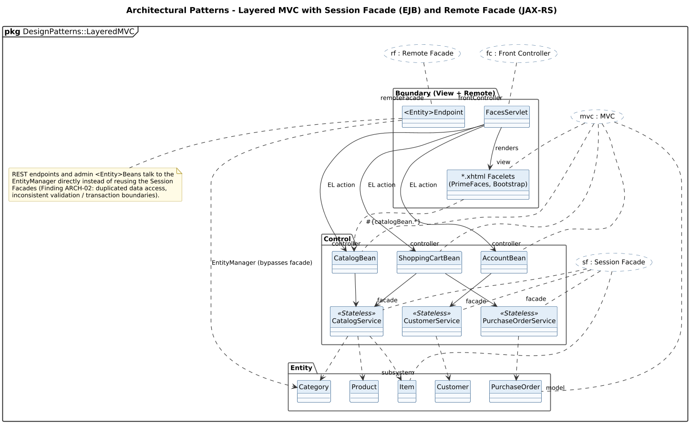

<!-- GENERATED by docs/uml/gen_markdown.py from the .puml source. Do not edit by hand. -->
# Architectural Patterns - Layered MVC with Session Facade (EJB) and Remote Facade (JAX-RS)

| Property | Value |
|---|---|
| UML 2.5.1 diagram kind | Class (architectural patterns) |
| Frame heading (Annex A) | `pkg DesignPatterns::LayeredMVC` |
| Summary | MVC, Front Controller, Session Facade and Remote Facade in a Boundary-Control-Entity layering. |
| PlantUML source | [`src/patterns/25-session-facade-mvc-bce.puml`](../../src/patterns/25-session-facade-mvc-bce.puml) |
| Rendered | [PNG](../../rendered/patterns/25-session-facade-mvc-bce.png) · [SVG](../../rendered/patterns/25-session-facade-mvc-bce.svg) |
| References | none |
| Referenced by | none |

## Diagram



## PlantUML source

The block below is the exact content of `src/patterns/25-session-facade-mvc-bce.puml`. It includes the shared
style file `../_style.iuml` (reproduced underneath) so it renders identically in any
PlantUML tool when saved next to that file.

```plantuml
@startuml 25-session-facade-mvc-bce
' @kind: Class (architectural patterns)
' @summary: MVC, Front Controller, Session Facade and Remote Facade in a Boundary-Control-Entity layering.
!include ../_style.iuml
allowmixing
skinparam usecaseBorderStyle dashed
skinparam usecaseBackgroundColor #FFFFFF
mainframe **pkg** DesignPatterns::LayeredMVC
title Architectural Patterns - Layered MVC with Session Facade (EJB) and Remote Facade (JAX-RS)

usecase "mvc : MVC" as MVC
usecase "fc : Front Controller" as FC
usecase "sf : Session Facade" as SF
usecase "rf : Remote Facade" as RF

package "Boundary (View + Remote)" as B {
  class "*.xhtml Facelets\n(PrimeFaces, Bootstrap)" as V
  class FacesServlet
  class "<Entity>Endpoint" as EP
}
package "Control" as C {
  class CatalogBean
  class ShoppingCartBean
  class AccountBean
  class CatalogService <<Stateless>>
  class PurchaseOrderService <<Stateless>>
  class CustomerService <<Stateless>>
}
package "Entity" as E {
  class Category
  class Product
  class Item
  class Customer
  class PurchaseOrder
}

FacesServlet --> V : renders
FacesServlet --> CatalogBean : EL action
FacesServlet --> ShoppingCartBean : EL action
FacesServlet --> AccountBean : EL action
CatalogBean --> CatalogService
ShoppingCartBean --> CatalogService
ShoppingCartBean --> PurchaseOrderService
AccountBean --> CustomerService
CatalogService ..> Category
CatalogService ..> Product
CatalogService ..> Item
PurchaseOrderService ..> PurchaseOrder
CustomerService ..> Customer
EP ..> Category : EntityManager (bypasses facade)
V ..> CatalogBean : #{catalogBean.*}

MVC .. "view" V
MVC .. "controller" ShoppingCartBean
MVC .. "controller" CatalogBean
MVC .. "controller" AccountBean
MVC .. "model" PurchaseOrder
FC .. "frontController" FacesServlet
SF .. "facade" CatalogService
SF .. "facade" PurchaseOrderService
SF .. "facade" CustomerService
SF .. "subsystem" Item
RF .. "remoteFacade" EP

note bottom of EP
  REST endpoints and admin <Entity>Beans talk to the
  EntityManager directly instead of reusing the Session
  Facades (Finding ARCH-02: duplicated data access,
  inconsistent validation / transaction boundaries).
end note
@enduml
```

<details>
<summary>Shared style: <code>src/_style.iuml</code></summary>

```plantuml
' =====================================================================
'  Shared PlantUML style for the PetStore EE7 UML 2.5.1 model
'  Source of truth : src/main/java/org/agoncal/application/petstore/**
'  Notation        : OMG UML 2.5.1 (formal/17-12-05), Annex A frames
'  Licence         : CC BY-SA 3.0 (derivative of agoncal/petstore-ee7)
' =====================================================================
!pragma useIntermediatePackages false
set separator none
skinparam dpi 110
skinparam shadowing false
skinparam roundCorner 4
skinparam defaultFontName "Helvetica"
skinparam defaultFontSize 12
skinparam titleFontSize 15
skinparam titleFontStyle bold
skinparam ArrowColor #333333
skinparam ArrowFontSize 11
skinparam BackgroundColor #FFFFFF
skinparam NoteBackgroundColor #FFFBE6
skinparam NoteBorderColor #B59F3B
skinparam NoteFontSize 11
skinparam packageStyle folder
skinparam ClassBackgroundColor #F7FAFD
skinparam ClassBorderColor #2F5D8A
skinparam ClassHeaderBackgroundColor #E3EEF8
skinparam ClassAttributeIconSize 0
skinparam ObjectBackgroundColor #F7FAFD
skinparam ObjectBorderColor #2F5D8A
skinparam ComponentBackgroundColor #F7FAFD
skinparam ComponentBorderColor #2F5D8A
skinparam NodeBackgroundColor #F2F2F2
skinparam NodeBorderColor #555555
skinparam ArtifactBackgroundColor #FFFFFF
skinparam ActorBorderColor #2F5D8A
skinparam UsecaseBackgroundColor #F7FAFD
skinparam UsecaseBorderColor #2F5D8A
skinparam ActivityBackgroundColor #F7FAFD
skinparam ActivityBorderColor #2F5D8A
skinparam ActivityDiamondBackgroundColor #FFFFFF
skinparam PartitionBorderColor #7A7A7A
skinparam StateBackgroundColor #F7FAFD
skinparam StateBorderColor #2F5D8A
skinparam SequenceLifeLineBorderColor #7A7A7A
skinparam SequenceGroupBorderColor #555555
skinparam SequenceGroupHeaderFontStyle bold
skinparam ParticipantBackgroundColor #F7FAFD
skinparam ParticipantBorderColor #2F5D8A
skinparam stereotypeCBackgroundColor #C9DDF0
skinparam legendBackgroundColor #FAFAFA
skinparam legendBorderColor #999999
skinparam legendFontSize 10
hide circle
```

</details>

[Back to index](../README.md)
