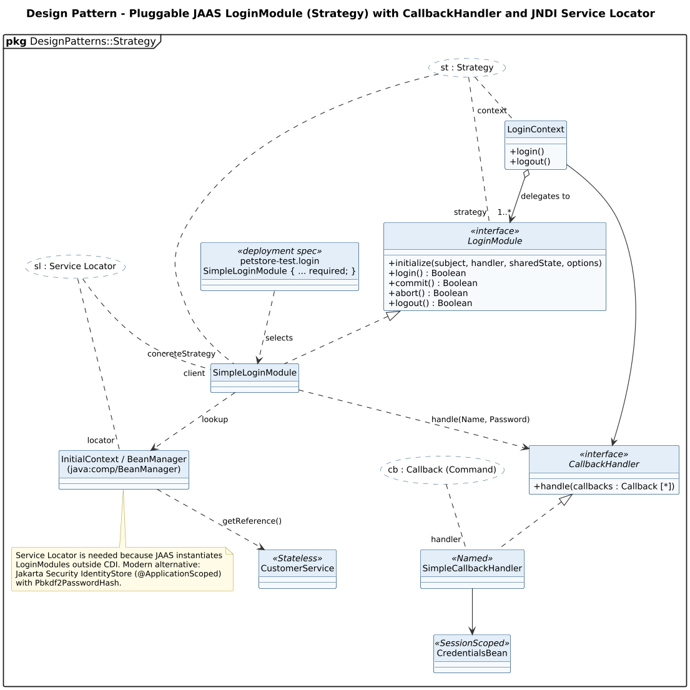

<!-- GENERATED by docs/uml/gen_markdown.py from the .puml source. Do not edit by hand. -->
# Design Pattern - Pluggable JAAS LoginModule (Strategy) with CallbackHandler and JNDI Service Locator

| Property | Value |
|---|---|
| UML 2.5.1 diagram kind | Class (design pattern) |
| Frame heading (Annex A) | `pkg DesignPatterns::Strategy` |
| Summary | Strategy (pluggable JAAS LoginModule), Callback and Service Locator. |
| PlantUML source | [`src/patterns/26-strategy-service-locator-jaas.puml`](../../src/patterns/26-strategy-service-locator-jaas.puml) |
| Rendered | [PNG](../../rendered/patterns/26-strategy-service-locator-jaas.png) · [SVG](../../rendered/patterns/26-strategy-service-locator-jaas.svg) |
| References | none |
| Referenced by | none |

## Diagram



## PlantUML source

The block below is the exact content of `src/patterns/26-strategy-service-locator-jaas.puml`. It includes the shared
style file `../_style.iuml` (reproduced underneath) so it renders identically in any
PlantUML tool when saved next to that file.

```plantuml
@startuml 26-strategy-service-locator-jaas
' @kind: Class (design pattern)
' @summary: Strategy (pluggable JAAS LoginModule), Callback and Service Locator.
!include ../_style.iuml
allowmixing
skinparam usecaseBorderStyle dashed
skinparam usecaseBackgroundColor #FFFFFF
mainframe **pkg** DesignPatterns::Strategy
title Design Pattern - Pluggable JAAS LoginModule (Strategy) with CallbackHandler and JNDI Service Locator

usecase "st : Strategy" as ST
usecase "cb : Callback (Command)" as CB
usecase "sl : Service Locator" as SL

class LoginContext {
  + login()
  + logout()
}
interface LoginModule <<interface>> {
  + initialize(subject, handler, sharedState, options)
  + login() : Boolean
  + commit() : Boolean
  + abort() : Boolean
  + logout() : Boolean
}
class SimpleLoginModule
class "petstore-test.login\nSimpleLoginModule { ... required; }" as CFG <<deployment spec>>
interface CallbackHandler <<interface>> {
  + handle(callbacks : Callback [*])
}
class SimpleCallbackHandler <<Named>>
class CredentialsBean <<SessionScoped>>
class "InitialContext / BeanManager\n(java:comp/BeanManager)" as JNDI
class CustomerService <<Stateless>>

LoginContext o--> "1..*" LoginModule : delegates to
LoginModule <|.. SimpleLoginModule
CFG ..> SimpleLoginModule : selects
LoginContext --> CallbackHandler
CallbackHandler <|.. SimpleCallbackHandler
SimpleCallbackHandler --> CredentialsBean
SimpleLoginModule ..> CallbackHandler : handle(Name, Password)
SimpleLoginModule ..> JNDI : lookup
JNDI ..> CustomerService : getReference()

ST .. "context" LoginContext
ST .. "strategy" LoginModule
ST .. "concreteStrategy" SimpleLoginModule
CB .. "handler" SimpleCallbackHandler
SL .. "locator" JNDI
SL .. "client" SimpleLoginModule

note bottom of JNDI
  Service Locator is needed because JAAS instantiates
  LoginModules outside CDI. Modern alternative:
  Jakarta Security IdentityStore (@ApplicationScoped)
  with Pbkdf2PasswordHash.
end note
@enduml
```

<details>
<summary>Shared style: <code>src/_style.iuml</code></summary>

```plantuml
' =====================================================================
'  Shared PlantUML style for the PetStore EE7 UML 2.5.1 model
'  Source of truth : src/main/java/org/agoncal/application/petstore/**
'  Notation        : OMG UML 2.5.1 (formal/17-12-05), Annex A frames
'  Licence         : CC BY-SA 3.0 (derivative of agoncal/petstore-ee7)
' =====================================================================
!pragma useIntermediatePackages false
set separator none
skinparam dpi 110
skinparam shadowing false
skinparam roundCorner 4
skinparam defaultFontName "Helvetica"
skinparam defaultFontSize 12
skinparam titleFontSize 15
skinparam titleFontStyle bold
skinparam ArrowColor #333333
skinparam ArrowFontSize 11
skinparam BackgroundColor #FFFFFF
skinparam NoteBackgroundColor #FFFBE6
skinparam NoteBorderColor #B59F3B
skinparam NoteFontSize 11
skinparam packageStyle folder
skinparam ClassBackgroundColor #F7FAFD
skinparam ClassBorderColor #2F5D8A
skinparam ClassHeaderBackgroundColor #E3EEF8
skinparam ClassAttributeIconSize 0
skinparam ObjectBackgroundColor #F7FAFD
skinparam ObjectBorderColor #2F5D8A
skinparam ComponentBackgroundColor #F7FAFD
skinparam ComponentBorderColor #2F5D8A
skinparam NodeBackgroundColor #F2F2F2
skinparam NodeBorderColor #555555
skinparam ArtifactBackgroundColor #FFFFFF
skinparam ActorBorderColor #2F5D8A
skinparam UsecaseBackgroundColor #F7FAFD
skinparam UsecaseBorderColor #2F5D8A
skinparam ActivityBackgroundColor #F7FAFD
skinparam ActivityBorderColor #2F5D8A
skinparam ActivityDiamondBackgroundColor #FFFFFF
skinparam PartitionBorderColor #7A7A7A
skinparam StateBackgroundColor #F7FAFD
skinparam StateBorderColor #2F5D8A
skinparam SequenceLifeLineBorderColor #7A7A7A
skinparam SequenceGroupBorderColor #555555
skinparam SequenceGroupHeaderFontStyle bold
skinparam ParticipantBackgroundColor #F7FAFD
skinparam ParticipantBorderColor #2F5D8A
skinparam stereotypeCBackgroundColor #C9DDF0
skinparam legendBackgroundColor #FAFAFA
skinparam legendBorderColor #999999
skinparam legendFontSize 10
hide circle
```

</details>

[Back to index](../README.md)
