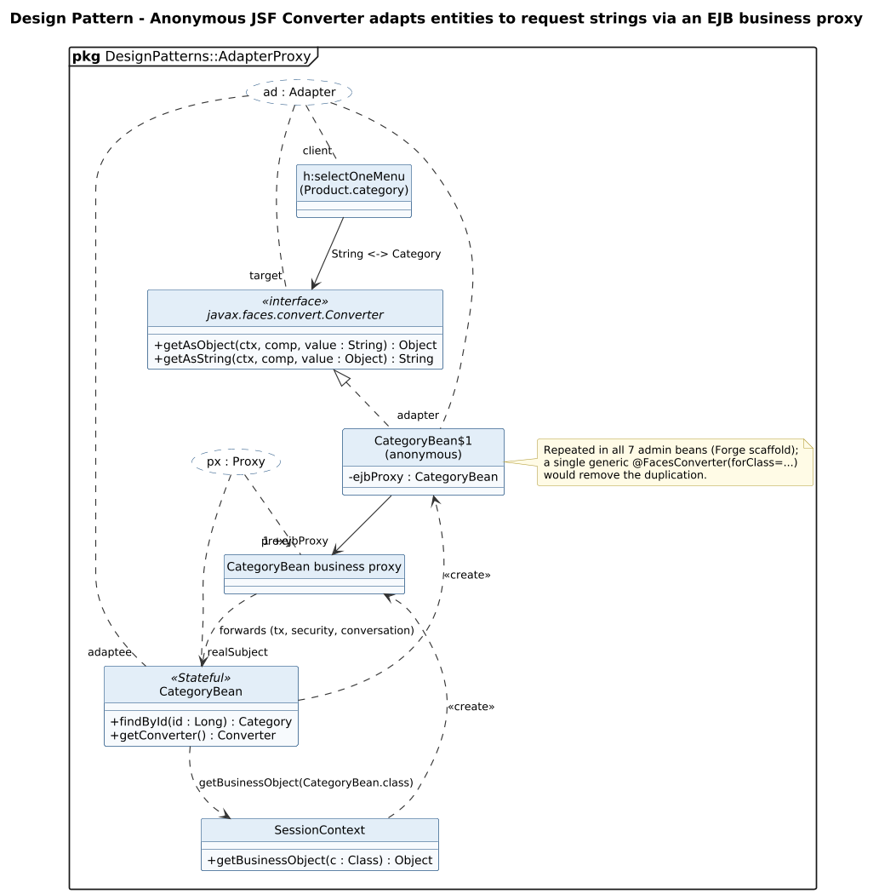

<!-- GENERATED by docs/uml/gen_markdown.py from the .puml source. Do not edit by hand. -->
# Design Pattern - Anonymous JSF Converter adapts entities to request strings via an EJB business proxy

| Property | Value |
|---|---|
| UML 2.5.1 diagram kind | Class (design pattern) |
| Frame heading (Annex A) | `pkg DesignPatterns::AdapterProxy` |
| Summary | Adapter (anonymous JSF Converter) and Proxy (EJB business object). |
| PlantUML source | [`src/patterns/27-adapter-proxy-converter.puml`](../../src/patterns/27-adapter-proxy-converter.puml) |
| Rendered | [PNG](../../rendered/patterns/27-adapter-proxy-converter.png) · [SVG](../../rendered/patterns/27-adapter-proxy-converter.svg) |
| References | none |
| Referenced by | none |

## Diagram



## PlantUML source

The block below is the exact content of `src/patterns/27-adapter-proxy-converter.puml`. It includes the shared
style file `../_style.iuml` (reproduced underneath) so it renders identically in any
PlantUML tool when saved next to that file.

```plantuml
@startuml 27-adapter-proxy-converter
' @kind: Class (design pattern)
' @summary: Adapter (anonymous JSF Converter) and Proxy (EJB business object).
!include ../_style.iuml
allowmixing
skinparam usecaseBorderStyle dashed
skinparam usecaseBackgroundColor #FFFFFF
mainframe **pkg** DesignPatterns::AdapterProxy
title Design Pattern - Anonymous JSF Converter adapts entities to request strings via an EJB business proxy

usecase "ad : Adapter" as AD
usecase "px : Proxy" as PX

interface "javax.faces.convert.Converter" as Converter <<interface>> {
  + getAsObject(ctx, comp, value : String) : Object
  + getAsString(ctx, comp, value : Object) : String
}
class "CategoryBean$1\n(anonymous)" as Anon {
  - ejbProxy : CategoryBean
}
class CategoryBean <<Stateful>> {
  + findById(id : Long) : Category
  + getConverter() : Converter
}
class SessionContext {
  + getBusinessObject(c : Class) : Object
}
class "CategoryBean business proxy" as BP
class "h:selectOneMenu\n(Product.category)" as UI

Converter <|.. Anon
Anon --> "1 +ejbProxy" BP
BP ..> CategoryBean : forwards (tx, security, conversation)
CategoryBean ..> SessionContext : getBusinessObject(CategoryBean.class)
SessionContext ..> BP : <<create>>
CategoryBean ..> Anon : <<create>>
UI --> Converter : String <-> Category

AD .. "client" UI
AD .. "target" Converter
AD .. "adapter" Anon
AD .. "adaptee" CategoryBean
PX .. "proxy" BP
PX .. "realSubject" CategoryBean

note right of Anon
  Repeated in all 7 admin beans (Forge scaffold);
  a single generic @FacesConverter(forClass=...)
  would remove the duplication.
end note
@enduml
```

<details>
<summary>Shared style: <code>src/_style.iuml</code></summary>

```plantuml
' =====================================================================
'  Shared PlantUML style for the PetStore EE7 UML 2.5.1 model
'  Source of truth : src/main/java/org/agoncal/application/petstore/**
'  Notation        : OMG UML 2.5.1 (formal/17-12-05), Annex A frames
'  Licence         : CC BY-SA 3.0 (derivative of agoncal/petstore-ee7)
' =====================================================================
!pragma useIntermediatePackages false
set separator none
skinparam dpi 110
skinparam shadowing false
skinparam roundCorner 4
skinparam defaultFontName "Helvetica"
skinparam defaultFontSize 12
skinparam titleFontSize 15
skinparam titleFontStyle bold
skinparam ArrowColor #333333
skinparam ArrowFontSize 11
skinparam BackgroundColor #FFFFFF
skinparam NoteBackgroundColor #FFFBE6
skinparam NoteBorderColor #B59F3B
skinparam NoteFontSize 11
skinparam packageStyle folder
skinparam ClassBackgroundColor #F7FAFD
skinparam ClassBorderColor #2F5D8A
skinparam ClassHeaderBackgroundColor #E3EEF8
skinparam ClassAttributeIconSize 0
skinparam ObjectBackgroundColor #F7FAFD
skinparam ObjectBorderColor #2F5D8A
skinparam ComponentBackgroundColor #F7FAFD
skinparam ComponentBorderColor #2F5D8A
skinparam NodeBackgroundColor #F2F2F2
skinparam NodeBorderColor #555555
skinparam ArtifactBackgroundColor #FFFFFF
skinparam ActorBorderColor #2F5D8A
skinparam UsecaseBackgroundColor #F7FAFD
skinparam UsecaseBorderColor #2F5D8A
skinparam ActivityBackgroundColor #F7FAFD
skinparam ActivityBorderColor #2F5D8A
skinparam ActivityDiamondBackgroundColor #FFFFFF
skinparam PartitionBorderColor #7A7A7A
skinparam StateBackgroundColor #F7FAFD
skinparam StateBorderColor #2F5D8A
skinparam SequenceLifeLineBorderColor #7A7A7A
skinparam SequenceGroupBorderColor #555555
skinparam SequenceGroupHeaderFontStyle bold
skinparam ParticipantBackgroundColor #F7FAFD
skinparam ParticipantBorderColor #2F5D8A
skinparam stereotypeCBackgroundColor #C9DDF0
skinparam legendBackgroundColor #FAFAFA
skinparam legendBorderColor #999999
skinparam legendFontSize 10
hide circle
```

</details>

[Back to index](../README.md)
