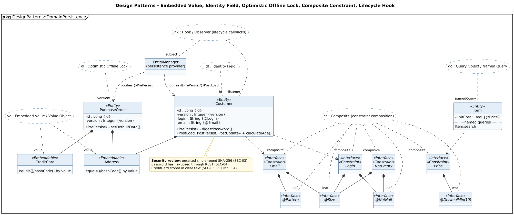

<!-- GENERATED by docs/uml/gen_markdown.py from the .puml source. Do not edit by hand. -->
# Design Patterns - Embedded Value, Identity Field, Optimistic Offline Lock, Composite Constraint, Lifecycle Hook

| Property | Value |
|---|---|
| UML 2.5.1 diagram kind | Class (design patterns) |
| Frame heading (Annex A) | `pkg DesignPatterns::DomainPersistence` |
| Summary | Embedded Value, Identity Field, Optimistic Offline Lock, Composite constraints, lifecycle Hook and Query Object. |
| PlantUML source | [`src/patterns/28-domain-persistence-patterns.puml`](../../src/patterns/28-domain-persistence-patterns.puml) |
| Rendered | [PNG](../../rendered/patterns/28-domain-persistence-patterns.png) · [SVG](../../rendered/patterns/28-domain-persistence-patterns.svg) |
| References | none |
| Referenced by | none |

## Diagram



## PlantUML source

The block below is the exact content of `src/patterns/28-domain-persistence-patterns.puml`. It includes the shared
style file `../_style.iuml` (reproduced underneath) so it renders identically in any
PlantUML tool when saved next to that file.

```plantuml
@startuml 28-domain-persistence-patterns
' @kind: Class (design patterns)
' @summary: Embedded Value, Identity Field, Optimistic Offline Lock, Composite constraints, lifecycle Hook and Query Object.
!include ../_style.iuml
allowmixing
skinparam usecaseBorderStyle dashed
skinparam usecaseBackgroundColor #FFFFFF
mainframe **pkg** DesignPatterns::DomainPersistence
title Design Patterns - Embedded Value, Identity Field, Optimistic Offline Lock, Composite Constraint, Lifecycle Hook

usecase "vo : Embedded Value / Value Object" as VO
usecase "idf : Identity Field" as IDF
usecase "ol : Optimistic Offline Lock" as OL
usecase "cc : Composite (constraint composition)" as CC
usecase "hk : Hook / Observer (lifecycle callbacks)" as HK
usecase "qo : Query Object / Named Query" as QO

class Customer <<Entity>> {
  - id : Long {id}
  - version : Integer {version}
  - login : String {@Login}
  - email : String {@Email}
  <<PrePersist>> - digestPassword()
  <<PostLoad, PostPersist, PostUpdate>> + calculateAge()
}
class PurchaseOrder <<Entity>> {
  - id : Long {id}
  - version : Integer {version}
  <<PrePersist>> - setDefaultData()
}
class Address <<Embeddable>> {
  equals()/hashCode() by value
}
class CreditCard <<Embeddable>> {
  equals()/hashCode() by value
}
class Item <<Entity>> {
  - unitCost : Real {@Price}
  .. named queries ..
  Item.search
}
interface Email <<interface>> <<Constraint>>
interface Login <<interface>> <<Constraint>>
interface Price <<interface>> <<Constraint>>
interface NotEmpty <<interface>> <<Constraint>>
interface "@Size" as Size <<interface>>
interface "@Pattern" as Pattern <<interface>>
interface "@NotNull" as NotNull <<interface>>
interface "@DecimalMin(10)" as DecMin <<interface>>
class "EntityManager\n(persistence provider)" as EM

Customer *-- Address
PurchaseOrder *-- Address
PurchaseOrder *-- CreditCard
Email *-- Size
Email *-- Pattern
Login *-- NotNull
Login *-- Size
NotEmpty *-- NotNull
NotEmpty *-- Size
Price *-- DecMin
Customer ..> Email
Customer ..> Login
Item ..> Price
EM ..> Customer : notifies @PrePersist/@PostLoad
EM ..> PurchaseOrder : notifies @PrePersist

VO .. "value" Address
VO .. "value" CreditCard
IDF .. "id" Customer
OL .. "version" PurchaseOrder
CC .. "composite" Email
CC .. "composite" Login
CC .. "composite" Price
CC .. "composite" NotEmpty
CC .. "leaf" Size
CC .. "leaf" Pattern
CC .. "leaf" NotNull
CC .. "leaf" DecMin
HK .. "subject" EM
HK .. "listener" Customer
QO .. "namedQuery" Item

note bottom of Customer
  **Security review**: unsalted single-round SHA-256 (SEC-03);
  password hash exposed through REST (SEC-04);
  CreditCard stored in clear text (SEC-05, PCI DSS 3.4).
end note
@enduml
```

<details>
<summary>Shared style: <code>src/_style.iuml</code></summary>

```plantuml
' =====================================================================
'  Shared PlantUML style for the PetStore EE7 UML 2.5.1 model
'  Source of truth : src/main/java/org/agoncal/application/petstore/**
'  Notation        : OMG UML 2.5.1 (formal/17-12-05), Annex A frames
'  Licence         : CC BY-SA 3.0 (derivative of agoncal/petstore-ee7)
' =====================================================================
!pragma useIntermediatePackages false
set separator none
skinparam dpi 110
skinparam shadowing false
skinparam roundCorner 4
skinparam defaultFontName "Helvetica"
skinparam defaultFontSize 12
skinparam titleFontSize 15
skinparam titleFontStyle bold
skinparam ArrowColor #333333
skinparam ArrowFontSize 11
skinparam BackgroundColor #FFFFFF
skinparam NoteBackgroundColor #FFFBE6
skinparam NoteBorderColor #B59F3B
skinparam NoteFontSize 11
skinparam packageStyle folder
skinparam ClassBackgroundColor #F7FAFD
skinparam ClassBorderColor #2F5D8A
skinparam ClassHeaderBackgroundColor #E3EEF8
skinparam ClassAttributeIconSize 0
skinparam ObjectBackgroundColor #F7FAFD
skinparam ObjectBorderColor #2F5D8A
skinparam ComponentBackgroundColor #F7FAFD
skinparam ComponentBorderColor #2F5D8A
skinparam NodeBackgroundColor #F2F2F2
skinparam NodeBorderColor #555555
skinparam ArtifactBackgroundColor #FFFFFF
skinparam ActorBorderColor #2F5D8A
skinparam UsecaseBackgroundColor #F7FAFD
skinparam UsecaseBorderColor #2F5D8A
skinparam ActivityBackgroundColor #F7FAFD
skinparam ActivityBorderColor #2F5D8A
skinparam ActivityDiamondBackgroundColor #FFFFFF
skinparam PartitionBorderColor #7A7A7A
skinparam StateBackgroundColor #F7FAFD
skinparam StateBorderColor #2F5D8A
skinparam SequenceLifeLineBorderColor #7A7A7A
skinparam SequenceGroupBorderColor #555555
skinparam SequenceGroupHeaderFontStyle bold
skinparam ParticipantBackgroundColor #F7FAFD
skinparam ParticipantBorderColor #2F5D8A
skinparam stereotypeCBackgroundColor #C9DDF0
skinparam legendBackgroundColor #FAFAFA
skinparam legendBorderColor #999999
skinparam legendFontSize 10
hide circle
```

</details>

[Back to index](../README.md)
