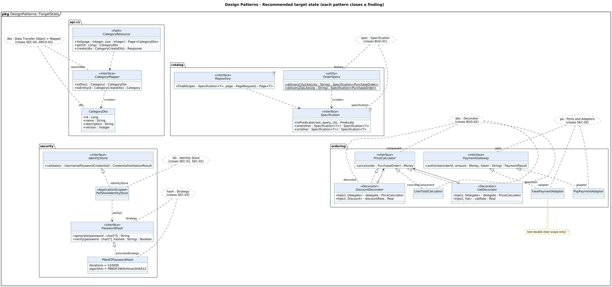

<!-- GENERATED by docs/uml/gen_markdown.py from the .puml source. Do not edit by hand. -->
# Design Patterns - Recommended target state (each pattern closes a finding)

| Property | Value |
|---|---|
| UML 2.5.1 diagram kind | Class (design patterns) |
| Frame heading (Annex A) | `pkg DesignPatterns::TargetState` |
| Summary | Recommended target-state patterns that resolve the findings: DTO/Mapper, Specification, Strategy (PasswordHash), IdentityStore, Decorator pricing chain, Ports and Adapters for payment. |
| PlantUML source | [`src/patterns/29-target-state-patterns.puml`](../../src/patterns/29-target-state-patterns.puml) |
| Rendered | [PNG](../../rendered/patterns/29-target-state-patterns.png) · [SVG](../../rendered/patterns/29-target-state-patterns.svg) |
| References | none |
| Referenced by | none |

## Diagram



## PlantUML source

The block below is the exact content of `src/patterns/29-target-state-patterns.puml`. It includes the shared
style file `../_style.iuml` (reproduced underneath) so it renders identically in any
PlantUML tool when saved next to that file.

```plantuml
@startuml 29-target-state-patterns
' @kind: Class (design patterns)
' @summary: Recommended target-state patterns that resolve the findings: DTO/Mapper, Specification, Strategy (PasswordHash), IdentityStore, Decorator pricing chain, Ports and Adapters for payment.
!include ../_style.iuml
allowmixing
skinparam usecaseBorderStyle dashed
skinparam usecaseBackgroundColor #FFFFFF
mainframe **pkg** DesignPatterns::TargetState
title Design Patterns - Recommended target state (each pattern closes a finding)

usecase "dto : Data Transfer Object + Mapper\n(closes SEC-04, ARCH-02)" as DTO
usecase "spec : Specification\n(closes BUG-01)" as SPEC
usecase "hash : Strategy\n(closes SEC-03)" as STR
usecase "ids : Identity Store\n(closes SEC-01, SEC-02)" as IDS
usecase "dec : Decorator\n(closes BUG-02)" as DEC
usecase "pa : Ports and Adapters\n(closes SEC-05)" as PA

package "api.v1" as apiv1 {
  class CategoryResource <<Path>> {
    + list(page : Integer, size : Integer) : Page<CategoryDto>
    + get(id : Long) : CategoryDto
    + create(dto : CategoryCreateDto) : Response
  }
  class CategoryDto {
    + id : Long
    + name : String
    + description : String
    + version : Integer
  }
  interface CategoryMapper <<interface>> {
    + toDto(c : Category) : CategoryDto
    + toEntity(d : CategoryCreateDto) : Category
  }
}

package "catalog" as cat {
  interface "Specification<T>" as Spec <<interface>> {
    + toPredicate(root, query, cb) : Predicate
    + and(other : Specification<T>) : Specification<T>
    + or(other : Specification<T>) : Specification<T>
  }
  class OrderSpecs <<utility>> {
    + {static} deliveryCityLike(city : String) : Specification<PurchaseOrder>
    + {static} deliveryZipLike(zip : String) : Specification<PurchaseOrder>
  }
  interface "Repository<T>" as Repo <<interface>> {
    + findAll(spec : Specification<T>, page : PageRequest) : Page<T>
  }
}

package "security" as sec {
  interface IdentityStore <<interface>> {
    + validate(c : UsernamePasswordCredential) : CredentialValidationResult
  }
  class PetStoreIdentityStore <<ApplicationScoped>>
  interface PasswordHash <<interface>> {
    + generate(password : char[*]) : String
    + verify(password : char[*], hashed : String) : Boolean
  }
  class Pbkdf2PasswordHash {
    iterations = 210000
    algorithm = PBKDF2WithHmacSHA512
  }
}

package "ordering" as ord {
  interface PriceCalculator <<interface>> {
    + price(order : PurchaseOrder) : Money
  }
  class LineTotalCalculator
  abstract class VatDecorator <<Decorator>> {
    <<Inject, Delegate>> - delegate : PriceCalculator
    <<Inject, Vat>> - vatRate : Real
  }
  abstract class DiscountDecorator <<Decorator>> {
    <<Inject, Delegate>> - delegate : PriceCalculator
    <<Inject, Discount>> - discountRate : Real
  }
  interface PaymentGateway <<interface>> {
    + authorise(orderId, amount : Money, token : String) : PaymentResult
  }
  class PspPaymentAdapter
  class FakePaymentAdapter 
}

CategoryResource ..> CategoryMapper
CategoryMapper ..> CategoryDto : <<create>>
Repo ..> Spec
OrderSpecs ..> Spec : <<create>>
IdentityStore <|.. PetStoreIdentityStore
PetStoreIdentityStore ..> PasswordHash : verify()
PasswordHash <|.. Pbkdf2PasswordHash
PriceCalculator <|.. LineTotalCalculator
PriceCalculator <|.. VatDecorator
PriceCalculator <|.. DiscountDecorator
VatDecorator o--> PriceCalculator
DiscountDecorator o--> PriceCalculator
PaymentGateway <|.. PspPaymentAdapter
PaymentGateway <|.. FakePaymentAdapter

DTO .. "dto" CategoryDto
DTO .. "assembler" CategoryMapper
SPEC .. "specification" Spec
SPEC .. "factory" OrderSpecs
STR .. "strategy" PasswordHash
STR .. "concreteStrategy" Pbkdf2PasswordHash
IDS .. "identityStore" PetStoreIdentityStore
DEC .. "component" PriceCalculator
DEC .. "concreteComponent" LineTotalCalculator
DEC .. "decorator" VatDecorator
DEC .. "decorator" DiscountDecorator
PA .. "port" PaymentGateway
PA .. "adapter" PspPaymentAdapter
PA .. "adapter" FakePaymentAdapter
note bottom of FakePaymentAdapter : test double (test scope only)
CategoryDto -[hidden]down- IdentityStore
Spec -[hidden]down- PriceCalculator
@enduml
```

<details>
<summary>Shared style: <code>src/_style.iuml</code></summary>

```plantuml
' =====================================================================
'  Shared PlantUML style for the PetStore EE7 UML 2.5.1 model
'  Source of truth : src/main/java/org/agoncal/application/petstore/**
'  Notation        : OMG UML 2.5.1 (formal/17-12-05), Annex A frames
'  Licence         : CC BY-SA 3.0 (derivative of agoncal/petstore-ee7)
' =====================================================================
!pragma useIntermediatePackages false
set separator none
skinparam dpi 110
skinparam shadowing false
skinparam roundCorner 4
skinparam defaultFontName "Helvetica"
skinparam defaultFontSize 12
skinparam titleFontSize 15
skinparam titleFontStyle bold
skinparam ArrowColor #333333
skinparam ArrowFontSize 11
skinparam BackgroundColor #FFFFFF
skinparam NoteBackgroundColor #FFFBE6
skinparam NoteBorderColor #B59F3B
skinparam NoteFontSize 11
skinparam packageStyle folder
skinparam ClassBackgroundColor #F7FAFD
skinparam ClassBorderColor #2F5D8A
skinparam ClassHeaderBackgroundColor #E3EEF8
skinparam ClassAttributeIconSize 0
skinparam ObjectBackgroundColor #F7FAFD
skinparam ObjectBorderColor #2F5D8A
skinparam ComponentBackgroundColor #F7FAFD
skinparam ComponentBorderColor #2F5D8A
skinparam NodeBackgroundColor #F2F2F2
skinparam NodeBorderColor #555555
skinparam ArtifactBackgroundColor #FFFFFF
skinparam ActorBorderColor #2F5D8A
skinparam UsecaseBackgroundColor #F7FAFD
skinparam UsecaseBorderColor #2F5D8A
skinparam ActivityBackgroundColor #F7FAFD
skinparam ActivityBorderColor #2F5D8A
skinparam ActivityDiamondBackgroundColor #FFFFFF
skinparam PartitionBorderColor #7A7A7A
skinparam StateBackgroundColor #F7FAFD
skinparam StateBorderColor #2F5D8A
skinparam SequenceLifeLineBorderColor #7A7A7A
skinparam SequenceGroupBorderColor #555555
skinparam SequenceGroupHeaderFontStyle bold
skinparam ParticipantBackgroundColor #F7FAFD
skinparam ParticipantBorderColor #2F5D8A
skinparam stereotypeCBackgroundColor #C9DDF0
skinparam legendBackgroundColor #FAFAFA
skinparam legendBorderColor #999999
skinparam legendFontSize 10
hide circle
```

</details>

[Back to index](../README.md)
