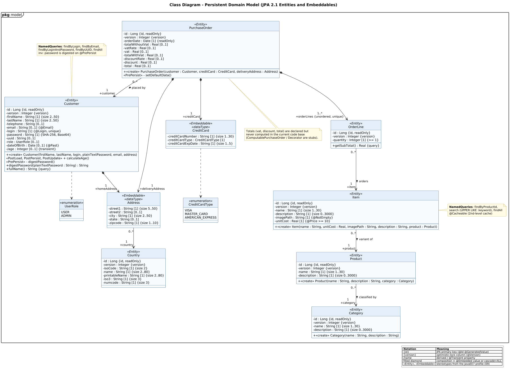

<!-- GENERATED by docs/uml/gen_markdown.py from the .puml source. Do not edit by hand. -->
# Class Diagram - Persistent Domain Model (JPA 2.1 Entities and Embeddables)

| Property | Value |
|---|---|
| UML 2.5.1 diagram kind | Class |
| Frame heading (Annex A) | `pkg model` |
| Summary | Persistent domain model: JPA entities, embeddables (DataTypes), enumerations, associations with multiplicities, composition, derived attributes and constraints. |
| PlantUML source | [`src/structure/01-class-domain-model.puml`](../../src/structure/01-class-domain-model.puml) |
| Rendered | [PNG](../../rendered/structure/01-class-domain-model.png) · [SVG](../../rendered/structure/01-class-domain-model.svg) |
| References | none |
| Referenced by | none |

## Diagram



## PlantUML source

The block below is the exact content of `src/structure/01-class-domain-model.puml`. It includes the shared
style file `../_style.iuml` (reproduced underneath) so it renders identically in any
PlantUML tool when saved next to that file.

```plantuml
@startuml 01-class-domain-model
' @kind: Class
' @summary: Persistent domain model: JPA entities, embeddables (DataTypes), enumerations, associations with multiplicities, composition, derived attributes and constraints.
!include ../_style.iuml
mainframe **pkg** model
title Class Diagram - Persistent Domain Model (JPA 2.1 Entities and Embeddables)

' ---------------- Catalogue aggregate ----------------
class Category <<Entity>> {
  - id : Long {id, readOnly}
  - version : Integer {version}
  - name : String [1] {size 1..30}
  - description : String [1] {size 0..3000}
  --
  + <<create>> Category(name : String, description : String)
}

class Product <<Entity>> {
  - id : Long {id, readOnly}
  - version : Integer {version}
  - name : String [1] {size 1..30}
  - description : String [1] {size 0..3000}
  --
  + <<create>> Product(name : String, description : String, category : Category)
}

class Item <<Entity>> {
  - id : Long {id, readOnly}
  - version : Integer {version}
  - name : String [1] {size 1..30}
  - description : String [1] {size 0..3000}
  - imagePath : String [1] {@NotEmpty}
  - unitCost : Real [1] {@Price >= 10}
  --
  + <<create>> Item(name : String, unitCost : Real, imagePath : String, description : String, product : Product)
}

' ---------------- Customer aggregate ----------------
class Customer <<Entity>> {
  - id : Long {id, readOnly}
  - version : Integer {version}
  - firstName : String [1] {size 2..50}
  - lastName : String [1] {size 2..50}
  - telephone : String [0..1]
  - email : String [0..1] {@Email}
  - login : String [1] {@Login, unique}
  - password : String [1] {SHA-256, Base64}
  - uuid : String [0..1]
  - role : UserRole [0..1]
  - dateOfBirth : Date [0..1] {@Past}
  - /age : Integer [0..1] {transient}
  --
  + <<create>> Customer(firstName, lastName, login, plainTextPassword, email, address)
  <<PostLoad, PostPersist, PostUpdate>> + calculateAge()
  <<PrePersist>> - digestPassword()
  + digestPassword(plainTextPassword : String) : String
  + fullName() : String {query}
}

class Address <<Embeddable>> <<dataType>> {
  - street1 : String [1] {size 5..50}
  - street2 : String [0..1]
  - city : String [1] {size 2..50}
  - state : String [0..1]
  - zipcode : String [1] {size 1..10}
}

class Country <<Entity>> {
  - id : Long {id, readOnly}
  - version : Integer {version}
  - isoCode : String [1] {size 2}
  - name : String [1] {size 2..80}
  - printableName : String [1] {size 2..80}
  - iso3 : String [1] {size 3}
  - numcode : String [1] {size 3}
}

' ---------------- Order aggregate ----------------
class PurchaseOrder <<Entity>> {
  - id : Long {id, readOnly}
  - version : Integer {version}
  - orderDate : Date [1] {readOnly}
  - totalWithoutVat : Real [0..1]
  - vatRate : Real [0..1]
  - vat : Real [0..1]
  - totalWithVat : Real [0..1]
  - discountRate : Real [0..1]
  - discount : Real [0..1]
  - total : Real [0..1]
  --
  + <<create>> PurchaseOrder(customer : Customer, creditCard : CreditCard, deliveryAddress : Address)
  <<PrePersist>> - setDefaultData()
}

class OrderLine <<Entity>> {
  - id : Long {id, readOnly}
  - version : Integer {version}
  - quantity : Integer [1] {>= 1}
  --
  + getSubTotal() : Real {query}
}

class CreditCard <<Embeddable>> <<dataType>> {
  - creditCardNumber : String [1] {size 1..30}
  - creditCardType : CreditCardType [1]
  - creditCardExpDate : String [1] {size 1..5}
}

enum CreditCardType <<enumeration>> {
  VISA
  MASTER_CARD
  AMERICAN_EXPRESS
}

enum UserRole <<enumeration>> {
  USER
  ADMIN
}

' ---------------- Associations (UML 2.5.1 clause 11.5) ----------------
Product "0..*" --> "1\n+category" Category : classified by >
Item "0..*" --> "1\n+product" Product : variant of >
OrderLine "0..*" --> "1\n+item" Item : orders >

Customer *--> "1\n+homeAddress" Address
Address "0..*" --> "1\n+country" Country

PurchaseOrder "0..*" --> "1\n+customer" Customer : placed by >
PurchaseOrder *--> "1..*\n+orderLines {unordered, unique}" OrderLine
PurchaseOrder *--> "1\n+deliveryAddress" Address
PurchaseOrder *--> "1\n+creditCard" CreditCard

CreditCard ..> CreditCardType
Customer ..> UserRole

note top of Customer
  **NamedQueries**: findByLogin, findByEmail,
  findByLoginAndPassword, findByUUID, findAll
  inv: password is digested on @PrePersist
end note

note bottom of PurchaseOrder
  Totals (vat, discount, total) are declared but
  never computed in the current code base
  (ComputablePurchaseOrder / Decorator are stubs).
end note

note right of Item
  **NamedQueries**: findByProductId,
  search (UPPER LIKE :keyword), findAll
  @Cacheable (2nd-level cache)
end note

legend bottom right
  |= Notation |= Meaning |
  | {id} | JPA primary key (@Id @GeneratedValue) |
  | {version} | optimistic-lock column (@Version) |
  | /name | derived / @Transient property |
  | filled diamond | composition = @Embedded value or cascade=ALL |
  | <<Entity>>, <<Embeddable>> | stereotypes from the JavaEE7 profile (09) |
endlegend
@enduml
```

<details>
<summary>Shared style: <code>src/_style.iuml</code></summary>

```plantuml
' =====================================================================
'  Shared PlantUML style for the PetStore EE7 UML 2.5.1 model
'  Source of truth : src/main/java/org/agoncal/application/petstore/**
'  Notation        : OMG UML 2.5.1 (formal/17-12-05), Annex A frames
'  Licence         : CC BY-SA 3.0 (derivative of agoncal/petstore-ee7)
' =====================================================================
!pragma useIntermediatePackages false
set separator none
skinparam dpi 110
skinparam shadowing false
skinparam roundCorner 4
skinparam defaultFontName "Helvetica"
skinparam defaultFontSize 12
skinparam titleFontSize 15
skinparam titleFontStyle bold
skinparam ArrowColor #333333
skinparam ArrowFontSize 11
skinparam BackgroundColor #FFFFFF
skinparam NoteBackgroundColor #FFFBE6
skinparam NoteBorderColor #B59F3B
skinparam NoteFontSize 11
skinparam packageStyle folder
skinparam ClassBackgroundColor #F7FAFD
skinparam ClassBorderColor #2F5D8A
skinparam ClassHeaderBackgroundColor #E3EEF8
skinparam ClassAttributeIconSize 0
skinparam ObjectBackgroundColor #F7FAFD
skinparam ObjectBorderColor #2F5D8A
skinparam ComponentBackgroundColor #F7FAFD
skinparam ComponentBorderColor #2F5D8A
skinparam NodeBackgroundColor #F2F2F2
skinparam NodeBorderColor #555555
skinparam ArtifactBackgroundColor #FFFFFF
skinparam ActorBorderColor #2F5D8A
skinparam UsecaseBackgroundColor #F7FAFD
skinparam UsecaseBorderColor #2F5D8A
skinparam ActivityBackgroundColor #F7FAFD
skinparam ActivityBorderColor #2F5D8A
skinparam ActivityDiamondBackgroundColor #FFFFFF
skinparam PartitionBorderColor #7A7A7A
skinparam StateBackgroundColor #F7FAFD
skinparam StateBorderColor #2F5D8A
skinparam SequenceLifeLineBorderColor #7A7A7A
skinparam SequenceGroupBorderColor #555555
skinparam SequenceGroupHeaderFontStyle bold
skinparam ParticipantBackgroundColor #F7FAFD
skinparam ParticipantBorderColor #2F5D8A
skinparam stereotypeCBackgroundColor #C9DDF0
skinparam legendBackgroundColor #FAFAFA
skinparam legendBorderColor #999999
skinparam legendFontSize 10
hide circle
```

</details>

[Back to index](../README.md)
