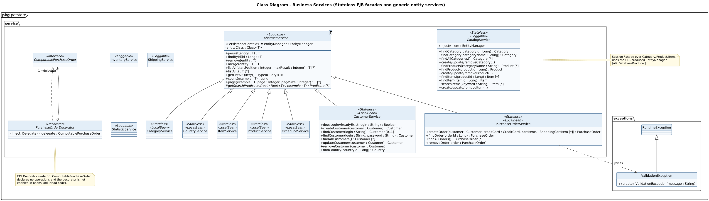

<!-- GENERATED by docs/uml/gen_markdown.py from the .puml source. Do not edit by hand. -->
# Class Diagram - Business Services (Stateless EJB facades and generic entity services)

| Property | Value |
|---|---|
| UML 2.5.1 diagram kind | Class |
| Frame heading (Annex A) | `pkg petstore` |
| Summary | Business service layer: AbstractService<T> generic hierarchy, CatalogService session facade, CDI decorator stub and exceptions. |
| PlantUML source | [`src/structure/02a-class-service-layer.puml`](../../src/structure/02a-class-service-layer.puml) |
| Rendered | [PNG](../../rendered/structure/02a-class-service-layer.png) · [SVG](../../rendered/structure/02a-class-service-layer.svg) |
| References | none |
| Referenced by | none |

## Diagram



## PlantUML source

The block below is the exact content of `src/structure/02a-class-service-layer.puml`. It includes the shared
style file `../_style.iuml` (reproduced underneath) so it renders identically in any
PlantUML tool when saved next to that file.

```plantuml
@startuml 02a-class-service-layer
' @kind: Class
' @summary: Business service layer: AbstractService<T> generic hierarchy, CatalogService session facade, CDI decorator stub and exceptions.
!include ../_style.iuml
mainframe **pkg** petstore
title Class Diagram - Business Services (Stateless EJB facades and generic entity services)

package service {
  abstract class "AbstractService<T>" as AbstractService <<Loggable>> {
    <<PersistenceContext>> # entityManager : EntityManager
    - entityClass : Class<T>
    --
    + persist(entity : T) : T
    + findById(id : Long) : T
    + remove(entity : T)
    + merge(entity : T) : T
    + listAll(startPosition : Integer, maxResult : Integer) : T [*]
    + listAll() : T [*]
    + getListAllQuery() : TypedQuery<T>
    + count(example : T) : Long
    + page(example : T, page : Integer, pageSize : Integer) : T [*]
    # {abstract} getSearchPredicates(root : Root<T>, example : T) : Predicate [*]
  }

  class CategoryService <<Stateless>> <<LocalBean>>
  class CountryService <<Stateless>> <<LocalBean>>
  class ItemService <<Stateless>> <<LocalBean>>
  class ProductService <<Stateless>> <<LocalBean>>
  class OrderLineService <<Stateless>> <<LocalBean>>
  class CustomerService <<Stateless>> <<LocalBean>> {
    + doesLoginAlreadyExist(login : String) : Boolean
    + createCustomer(customer : Customer) : Customer
    + findCustomer(login : String) : Customer [0..1]
    + findCustomer(login : String, password : String) : Customer
    + findAllCustomers() : Customer [*]
    + updateCustomer(customer : Customer) : Customer
    + removeCustomer(customer : Customer)
    + findCountry(countryId : Long) : Country
  }
  class PurchaseOrderService <<Stateless>> <<LocalBean>> {
    + createOrder(customer : Customer, creditCard : CreditCard, cartItems : ShoppingCartItem [*]) : PurchaseOrder
    + findOrder(orderId : Long) : PurchaseOrder
    + findAllOrders() : PurchaseOrder [*]
    + removeOrder(order : PurchaseOrder)
  }
  class CatalogService <<Stateless>> <<Loggable>> {
    <<Inject>> - em : EntityManager
    + findCategory(categoryId : Long) : Category
    + findCategory(categoryName : String) : Category
    + findAllCategories() : Category [*]
    + create/update/removeCategory(..)
    + findProducts(categoryName : String) : Product [*]
    + findProduct(productId : Long) : Product
    + create/update/removeProduct(..)
    + findItems(productId : Long) : Item [*]
    + findItem(itemId : Long) : Item
    + searchItems(keyword : String) : Item [*]
    + create/update/removeItem(..)
  }

  interface ComputablePurchaseOrder <<interface>>
  abstract class PurchaseOrderDecorator <<Decorator>> {
    <<Inject, Delegate>> - delegate : ComputablePurchaseOrder
  }
  class InventoryService <<Loggable>>
  class ShippingService <<Loggable>>
  class StatisticService <<Loggable>>
}


package exceptions {
  class ValidationException {
    + <<create>> ValidationException(message : String)
  }
  class RuntimeException
}


AbstractService <|-- CategoryService
AbstractService <|-- CountryService
AbstractService <|-- ItemService
AbstractService <|-- ProductService
AbstractService <|-- OrderLineService
AbstractService <|-- CustomerService
AbstractService <|-- PurchaseOrderService
ComputablePurchaseOrder <|.. PurchaseOrderDecorator
PurchaseOrderDecorator o--> "1 +delegate" ComputablePurchaseOrder
RuntimeException <|-- ValidationException
PurchaseOrderService ..> ValidationException : raises
AbstractService -[hidden]right- CatalogService

note right of CatalogService
  Session Facade over Category/Product/Item.
  Uses the CDI-produced EntityManager
  (util.DatabaseProducer).
end note
note bottom of PurchaseOrderDecorator
  CDI Decorator skeleton: ComputablePurchaseOrder
  declares no operations and the decorator is not
  enabled in beans.xml (dead code).
end note
@enduml
```

<details>
<summary>Shared style: <code>src/_style.iuml</code></summary>

```plantuml
' =====================================================================
'  Shared PlantUML style for the PetStore EE7 UML 2.5.1 model
'  Source of truth : src/main/java/org/agoncal/application/petstore/**
'  Notation        : OMG UML 2.5.1 (formal/17-12-05), Annex A frames
'  Licence         : CC BY-SA 3.0 (derivative of agoncal/petstore-ee7)
' =====================================================================
!pragma useIntermediatePackages false
set separator none
skinparam dpi 110
skinparam shadowing false
skinparam roundCorner 4
skinparam defaultFontName "Helvetica"
skinparam defaultFontSize 12
skinparam titleFontSize 15
skinparam titleFontStyle bold
skinparam ArrowColor #333333
skinparam ArrowFontSize 11
skinparam BackgroundColor #FFFFFF
skinparam NoteBackgroundColor #FFFBE6
skinparam NoteBorderColor #B59F3B
skinparam NoteFontSize 11
skinparam packageStyle folder
skinparam ClassBackgroundColor #F7FAFD
skinparam ClassBorderColor #2F5D8A
skinparam ClassHeaderBackgroundColor #E3EEF8
skinparam ClassAttributeIconSize 0
skinparam ObjectBackgroundColor #F7FAFD
skinparam ObjectBorderColor #2F5D8A
skinparam ComponentBackgroundColor #F7FAFD
skinparam ComponentBorderColor #2F5D8A
skinparam NodeBackgroundColor #F2F2F2
skinparam NodeBorderColor #555555
skinparam ArtifactBackgroundColor #FFFFFF
skinparam ActorBorderColor #2F5D8A
skinparam UsecaseBackgroundColor #F7FAFD
skinparam UsecaseBorderColor #2F5D8A
skinparam ActivityBackgroundColor #F7FAFD
skinparam ActivityBorderColor #2F5D8A
skinparam ActivityDiamondBackgroundColor #FFFFFF
skinparam PartitionBorderColor #7A7A7A
skinparam StateBackgroundColor #F7FAFD
skinparam StateBorderColor #2F5D8A
skinparam SequenceLifeLineBorderColor #7A7A7A
skinparam SequenceGroupBorderColor #555555
skinparam SequenceGroupHeaderFontStyle bold
skinparam ParticipantBackgroundColor #F7FAFD
skinparam ParticipantBorderColor #2F5D8A
skinparam stereotypeCBackgroundColor #C9DDF0
skinparam legendBackgroundColor #FAFAFA
skinparam legendBorderColor #999999
skinparam legendFontSize 10
hide circle
```

</details>

[Back to index](../README.md)
