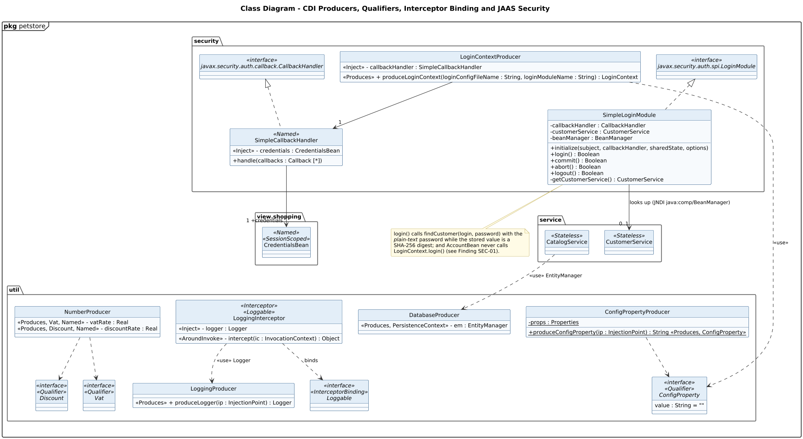

<!-- GENERATED by docs/uml/gen_markdown.py from the .puml source. Do not edit by hand. -->
# Class Diagram - CDI Producers, Qualifiers, Interceptor Binding and JAAS Security

| Property | Value |
|---|---|
| UML 2.5.1 diagram kind | Class |
| Frame heading (Annex A) | `pkg petstore` |
| Summary | Infrastructure and security: CDI producers, qualifiers, interceptor binding and JAAS LoginModule/CallbackHandler. |
| PlantUML source | [`src/structure/02b-class-infrastructure-security.puml`](../../src/structure/02b-class-infrastructure-security.puml) |
| Rendered | [PNG](../../rendered/structure/02b-class-infrastructure-security.png) · [SVG](../../rendered/structure/02b-class-infrastructure-security.svg) |
| References | none |
| Referenced by | none |

## Diagram



## PlantUML source

The block below is the exact content of `src/structure/02b-class-infrastructure-security.puml`. It includes the shared
style file `../_style.iuml` (reproduced underneath) so it renders identically in any
PlantUML tool when saved next to that file.

```plantuml
@startuml 02b-class-infrastructure-security
' @kind: Class
' @summary: Infrastructure and security: CDI producers, qualifiers, interceptor binding and JAAS LoginModule/CallbackHandler.
!include ../_style.iuml
mainframe **pkg** petstore
title Class Diagram - CDI Producers, Qualifiers, Interceptor Binding and JAAS Security

package util {
  interface Loggable <<interface>> <<InterceptorBinding>>
  interface ConfigProperty <<interface>> <<Qualifier>> {
    value : String = ""
  }
  interface Vat <<interface>> <<Qualifier>>
  interface Discount <<interface>> <<Qualifier>>
  class LoggingInterceptor <<Interceptor>> <<Loggable>> {
    <<Inject>> - logger : Logger
    <<AroundInvoke>> - intercept(ic : InvocationContext) : Object
  }
  class LoggingProducer {
    <<Produces>> + produceLogger(ip : InjectionPoint) : Logger
  }
  class DatabaseProducer {
    <<Produces, PersistenceContext>> - em : EntityManager
  }
  class ConfigPropertyProducer {
    - {static} props : Properties
    + {static} produceConfigProperty(ip : InjectionPoint) : String <<Produces, ConfigProperty>>
  }
  class NumberProducer {
    <<Produces, Vat, Named>> - vatRate : Real
    <<Produces, Discount, Named>> - discountRate : Real
  }
}

package security {
  class LoginContextProducer {
    <<Inject>> - callbackHandler : SimpleCallbackHandler
    <<Produces>> + produceLoginContext(loginConfigFileName : String, loginModuleName : String) : LoginContext
  }
  class SimpleCallbackHandler <<Named>> {
    <<Inject>> - credentials : CredentialsBean
    + handle(callbacks : Callback [*])
  }
  class SimpleLoginModule {
    - callbackHandler : CallbackHandler
    - customerService : CustomerService
    - beanManager : BeanManager
    + initialize(subject, callbackHandler, sharedState, options)
    + login() : Boolean
    + commit() : Boolean
    + abort() : Boolean
    + logout() : Boolean
    - getCustomerService() : CustomerService
  }
  interface "javax.security.auth.spi.LoginModule" as LoginModule <<interface>>
  interface "javax.security.auth.callback.CallbackHandler" as CallbackHandler <<interface>>
}


package service {
  class CustomerService <<Stateless>>
  class CatalogService <<Stateless>>
}
package "view.shopping" {
  class CredentialsBean <<Named>> <<SessionScoped>>
}

LoginModule <|.. SimpleLoginModule
CallbackHandler <|.. SimpleCallbackHandler
SimpleLoginModule --> "0..1" CustomerService : looks up (JNDI java:comp/BeanManager)
LoginContextProducer --> "1" SimpleCallbackHandler
LoggingInterceptor ..> Loggable : binds
LoggingInterceptor ..> LoggingProducer : <<use>> Logger
NumberProducer ..> Vat
NumberProducer ..> Discount
ConfigPropertyProducer ..> ConfigProperty
LoginContextProducer ..> ConfigProperty : <<use>>
CatalogService ..> DatabaseProducer : <<use>> EntityManager
SimpleCallbackHandler --> "1 +credentials" CredentialsBean

note bottom of SimpleLoginModule
  login() calls findCustomer(login, password) with the
  //plain-text// password while the stored value is a
  SHA-256 digest; and AccountBean never calls
  LoginContext.login() (see Finding SEC-01).
end note
@enduml
```

<details>
<summary>Shared style: <code>src/_style.iuml</code></summary>

```plantuml
' =====================================================================
'  Shared PlantUML style for the PetStore EE7 UML 2.5.1 model
'  Source of truth : src/main/java/org/agoncal/application/petstore/**
'  Notation        : OMG UML 2.5.1 (formal/17-12-05), Annex A frames
'  Licence         : CC BY-SA 3.0 (derivative of agoncal/petstore-ee7)
' =====================================================================
!pragma useIntermediatePackages false
set separator none
skinparam dpi 110
skinparam shadowing false
skinparam roundCorner 4
skinparam defaultFontName "Helvetica"
skinparam defaultFontSize 12
skinparam titleFontSize 15
skinparam titleFontStyle bold
skinparam ArrowColor #333333
skinparam ArrowFontSize 11
skinparam BackgroundColor #FFFFFF
skinparam NoteBackgroundColor #FFFBE6
skinparam NoteBorderColor #B59F3B
skinparam NoteFontSize 11
skinparam packageStyle folder
skinparam ClassBackgroundColor #F7FAFD
skinparam ClassBorderColor #2F5D8A
skinparam ClassHeaderBackgroundColor #E3EEF8
skinparam ClassAttributeIconSize 0
skinparam ObjectBackgroundColor #F7FAFD
skinparam ObjectBorderColor #2F5D8A
skinparam ComponentBackgroundColor #F7FAFD
skinparam ComponentBorderColor #2F5D8A
skinparam NodeBackgroundColor #F2F2F2
skinparam NodeBorderColor #555555
skinparam ArtifactBackgroundColor #FFFFFF
skinparam ActorBorderColor #2F5D8A
skinparam UsecaseBackgroundColor #F7FAFD
skinparam UsecaseBorderColor #2F5D8A
skinparam ActivityBackgroundColor #F7FAFD
skinparam ActivityBorderColor #2F5D8A
skinparam ActivityDiamondBackgroundColor #FFFFFF
skinparam PartitionBorderColor #7A7A7A
skinparam StateBackgroundColor #F7FAFD
skinparam StateBorderColor #2F5D8A
skinparam SequenceLifeLineBorderColor #7A7A7A
skinparam SequenceGroupBorderColor #555555
skinparam SequenceGroupHeaderFontStyle bold
skinparam ParticipantBackgroundColor #F7FAFD
skinparam ParticipantBorderColor #2F5D8A
skinparam stereotypeCBackgroundColor #C9DDF0
skinparam legendBackgroundColor #FAFAFA
skinparam legendBorderColor #999999
skinparam legendFontSize 10
hide circle
```

</details>

[Back to index](../README.md)
