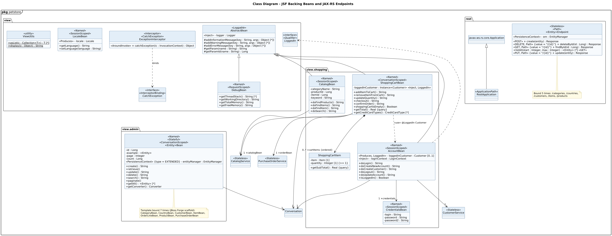

<!-- GENERATED by docs/uml/gen_markdown.py from the .puml source. Do not edit by hand. -->
# Class Diagram - JSF Backing Beans and JAX-RS Endpoints

| Property | Value |
|---|---|
| UML 2.5.1 diagram kind | Class |
| Frame heading (Annex A) | `pkg petstore` |
| Summary | Presentation and REST boundary: JSF backing beans (shopping and admin) and JAX-RS endpoints. |
| PlantUML source | [`src/structure/03-class-presentation-rest.puml`](../../src/structure/03-class-presentation-rest.puml) |
| Rendered | [PNG](../../rendered/structure/03-class-presentation-rest.png) · [SVG](../../rendered/structure/03-class-presentation-rest.svg) |
| References | none |
| Referenced by | none |

## Diagram



## PlantUML source

The block below is the exact content of `src/structure/03-class-presentation-rest.puml`. It includes the shared
style file `../_style.iuml` (reproduced underneath) so it renders identically in any
PlantUML tool when saved next to that file.

```plantuml
@startuml 03-class-presentation-rest
' @kind: Class
' @summary: Presentation and REST boundary: JSF backing beans (shopping and admin) and JAX-RS endpoints.
!include ../_style.iuml
mainframe **pkg** petstore
title Class Diagram - JSF Backing Beans and JAX-RS Endpoints

package view {
  abstract class AbstractBean <<Loggable>> {
    <<Inject>> - logger : Logger
    # addInformationMessage(key : String, args : Object [*])
    # addWarningMessage(key : String, args : Object [*])
    # addErrorMessage(key : String, args : Object [*])
    # getParam(name : String) : String
    # getParamId(name : String) : Long
  }
  interface CatchException <<interface>> <<InterceptorBinding>>
  interface LoggedIn <<interface>> <<Qualifier>>
  class ExceptionInterceptor <<Interceptor>> <<CatchException>> {
    <<AroundInvoke>> + catchException(ic : InvocationContext) : Object
  }
  class LocaleBean <<Named>> <<SessionScoped>> {
    <<Produces>> - locale : Locale
    + getLanguage() : String
    + setLanguage(language : String)
  }
  class DebugBean <<Named>> <<RequestScoped>> {
    + getThreadStack() : String [*]
    + getWorkingDirectory() : String
    + getTotalMemory() : String
    + getFreeMemory() : String
  }
  class ViewUtils <<utility>> {
    + {static} asList(c : Collection<T>) : T [*]
    + {static} display(o : Object) : String
  }
}

package "view.shopping" as shopping {
  class AccountBean <<Named>> <<SessionScoped>> {
    <<Produces, LoggedIn>> - loggedinCustomer : Customer [0..1]
    <<Inject>> - loginContext : LoginContext
    + doLogin() : String
    + doCreateNewAccount() : String
    + doCreateCustomer() : String
    + doLogout() : String
    + doUpdateAccount() : String
    + isLoggedIn() : Boolean
  }
  class CatalogBean <<Named>> <<SessionScoped>> {
    - categoryName : String
    - productId : Long
    - itemId : Long
    - keyword : String
    + doFindProducts() : String
    + doFindItems() : String
    + doFindItem() : String
    + doSearch() : String
  }
  class ShoppingCartBean <<Named>> <<ConversationScoped>> {
    - loggedInCustomer : Instance<Customer> <<Inject, LoggedIn>>
    + addItemToCart() : String
    + removeItemFromCart() : String
    + updateQuantity() : String
    + checkout() : String
    + confirmOrder() : String
    + shoppingCartIsEmpty() : Boolean
    + getTotal() : Real {query}
    + getCreditCardTypes() : CreditCardType [*]
  }
  class CredentialsBean <<Named>> <<SessionScoped>> {
    - login : String
    - password : String
    - password2 : String
  }
  class ShoppingCartItem {
    - item : Item [1]
    - quantity : Integer [1] {>= 1}
    + getSubTotal() : Real {query}
  }
}

package "view.admin" as admin {
  class "<Entity>Bean" as EntityBean <<Named>> <<Stateful>> <<ConversationScoped>> {
    - id : Long
    - example : <Entity>
    - page : Integer
    - count : Long
    <<PersistenceContext>> {type = EXTENDED} - entityManager : EntityManager
    + create() : String
    + retrieve()
    + update() : String
    + delete() : String
    + search() : String
    + paginate()
    + getAll() : <Entity> [*]
    + getConverter() : Converter
  }
  note bottom of EntityBean
    Template bound 7 times (JBoss Forge scaffold):
    CategoryBean, CountryBean, CustomerBean, ItemBean,
    OrderLineBean, ProductBean, PurchaseOrderBean
  end note
}

package rest {
  class RestApplication <<ApplicationPath>>
  class "<Entity>Endpoint" as Endpoint <<Stateless>> <<Path>> {
    <<PersistenceContext>> - em : EntityManager
    <<POST>> + create(entity) : Response
    <<DELETE, Path>> {value = "/{id}"} + deleteById(id : Long) : Response
    <<GET, Path>> {value = "/{id}"} + findById(id : Long) : Response
    + listAll(start : Integer, max : Integer) : <Entity> [*] <<GET>>
    <<PUT, Path>> {value = "/{id}"} + update(entity) : Response
  }
  note bottom of Endpoint
    Bound 5 times: /categories, /countries,
    /customers, /items, /products
  end note
  class "javax.ws.rs.core.Application" as Application
}

class CatalogService <<Stateless>>
class CustomerService <<Stateless>>
class PurchaseOrderService <<Stateless>>
class Conversation

AbstractBean <|-- AccountBean
AbstractBean <|-- CatalogBean
AbstractBean <|-- ShoppingCartBean
AbstractBean <|-- DebugBean
Application <|-- RestApplication

AccountBean --> "1" CustomerService
AccountBean --> "1 +credentials" CredentialsBean
AccountBean --> "1" Conversation
CatalogBean --> "1" CatalogService
ShoppingCartBean --> "1 +catalogBean" CatalogService
ShoppingCartBean --> "1 +orderBean" PurchaseOrderService
ShoppingCartBean --> "1" Conversation
ShoppingCartBean *--> "0..* +cartItems {ordered}" ShoppingCartItem
ShoppingCartBean ..> AccountBean : <<use>> @LoggedIn Customer
EntityBean --> "1" Conversation
ExceptionInterceptor ..> CatchException : binds
AccountBean ..> LoggedIn
@enduml
```

<details>
<summary>Shared style: <code>src/_style.iuml</code></summary>

```plantuml
' =====================================================================
'  Shared PlantUML style for the PetStore EE7 UML 2.5.1 model
'  Source of truth : src/main/java/org/agoncal/application/petstore/**
'  Notation        : OMG UML 2.5.1 (formal/17-12-05), Annex A frames
'  Licence         : CC BY-SA 3.0 (derivative of agoncal/petstore-ee7)
' =====================================================================
!pragma useIntermediatePackages false
set separator none
skinparam dpi 110
skinparam shadowing false
skinparam roundCorner 4
skinparam defaultFontName "Helvetica"
skinparam defaultFontSize 12
skinparam titleFontSize 15
skinparam titleFontStyle bold
skinparam ArrowColor #333333
skinparam ArrowFontSize 11
skinparam BackgroundColor #FFFFFF
skinparam NoteBackgroundColor #FFFBE6
skinparam NoteBorderColor #B59F3B
skinparam NoteFontSize 11
skinparam packageStyle folder
skinparam ClassBackgroundColor #F7FAFD
skinparam ClassBorderColor #2F5D8A
skinparam ClassHeaderBackgroundColor #E3EEF8
skinparam ClassAttributeIconSize 0
skinparam ObjectBackgroundColor #F7FAFD
skinparam ObjectBorderColor #2F5D8A
skinparam ComponentBackgroundColor #F7FAFD
skinparam ComponentBorderColor #2F5D8A
skinparam NodeBackgroundColor #F2F2F2
skinparam NodeBorderColor #555555
skinparam ArtifactBackgroundColor #FFFFFF
skinparam ActorBorderColor #2F5D8A
skinparam UsecaseBackgroundColor #F7FAFD
skinparam UsecaseBorderColor #2F5D8A
skinparam ActivityBackgroundColor #F7FAFD
skinparam ActivityBorderColor #2F5D8A
skinparam ActivityDiamondBackgroundColor #FFFFFF
skinparam PartitionBorderColor #7A7A7A
skinparam StateBackgroundColor #F7FAFD
skinparam StateBorderColor #2F5D8A
skinparam SequenceLifeLineBorderColor #7A7A7A
skinparam SequenceGroupBorderColor #555555
skinparam SequenceGroupHeaderFontStyle bold
skinparam ParticipantBackgroundColor #F7FAFD
skinparam ParticipantBorderColor #2F5D8A
skinparam stereotypeCBackgroundColor #C9DDF0
skinparam legendBackgroundColor #FAFAFA
skinparam legendBorderColor #999999
skinparam legendFontSize 10
hide circle
```

</details>

[Back to index](../README.md)
