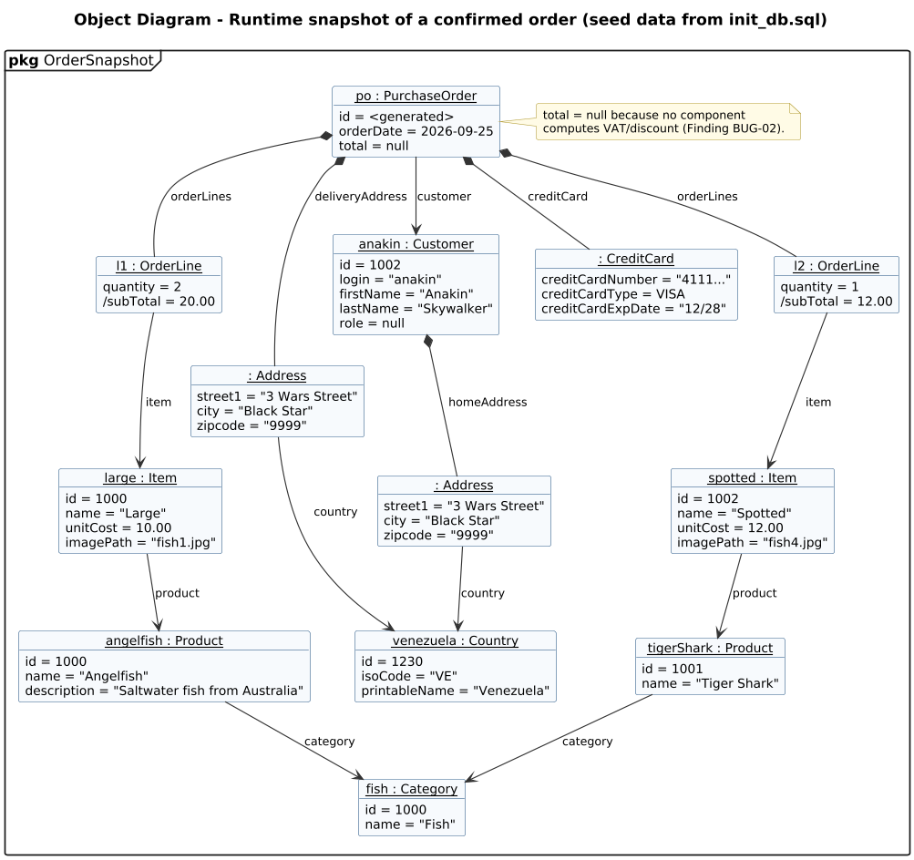

<!-- GENERATED by docs/uml/gen_markdown.py from the .puml source. Do not edit by hand. -->
# Object Diagram - Runtime snapshot of a confirmed order (seed data from init_db.sql)

| Property | Value |
|---|---|
| UML 2.5.1 diagram kind | Object |
| Frame heading (Annex A) | `pkg OrderSnapshot` |
| Summary | Instance specifications of a confirmed order built from init_db.sql seed data. |
| PlantUML source | [`src/structure/04-object-order-snapshot.puml`](../../src/structure/04-object-order-snapshot.puml) |
| Rendered | [PNG](../../rendered/structure/04-object-order-snapshot.png) · [SVG](../../rendered/structure/04-object-order-snapshot.svg) |
| References | none |
| Referenced by | none |

## Diagram



## PlantUML source

The block below is the exact content of `src/structure/04-object-order-snapshot.puml`. It includes the shared
style file `../_style.iuml` (reproduced underneath) so it renders identically in any
PlantUML tool when saved next to that file.

```plantuml
@startuml 04-object-order-snapshot
' @kind: Object
' @summary: Instance specifications of a confirmed order built from init_db.sql seed data.
!include ../_style.iuml
mainframe **pkg** OrderSnapshot
title Object Diagram - Runtime snapshot of a confirmed order (seed data from init_db.sql)

object "<u>fish : Category</u>" as cat {
  id = 1000
  name = "Fish"
}
object "<u>angelfish : Product</u>" as prod {
  id = 1000
  name = "Angelfish"
  description = "Saltwater fish from Australia"
}
object "<u>tigerShark : Product</u>" as prod2 {
  id = 1001
  name = "Tiger Shark"
}
object "<u>large : Item</u>" as item1 {
  id = 1000
  name = "Large"
  unitCost = 10.00
  imagePath = "fish1.jpg"
}
object "<u>spotted : Item</u>" as item2 {
  id = 1002
  name = "Spotted"
  unitCost = 12.00
  imagePath = "fish4.jpg"
}
object "<u>anakin : Customer</u>" as cust {
  id = 1002
  login = "anakin"
  firstName = "Anakin"
  lastName = "Skywalker"
  role = null
}
object "<u>: Address</u>" as home {
  street1 = "3 Wars Street"
  city = "Black Star"
  zipcode = "9999"
}
object "<u>venezuela : Country</u>" as ctry {
  id = 1230
  isoCode = "VE"
  printableName = "Venezuela"
}
object "<u>po : PurchaseOrder</u>" as po {
  id = <generated>
  orderDate = 2026-09-25
  total = null
}
object "<u>l1 : OrderLine</u>" as l1 {
  quantity = 2
  /subTotal = 20.00
}
object "<u>l2 : OrderLine</u>" as l2 {
  quantity = 1
  /subTotal = 12.00
}
object "<u>: CreditCard</u>" as cc {
  creditCardNumber = "4111..."
  creditCardType = VISA
  creditCardExpDate = "12/28"
}
object "<u>: Address</u>" as dlv {
  street1 = "3 Wars Street"
  city = "Black Star"
  zipcode = "9999"
}

prod --> cat : category
prod2 --> cat : category
item1 --> prod : product
item2 --> prod2 : product
cust *-- home : homeAddress
home --> ctry : country
dlv --> ctry : country
po --> cust : customer
po *-- l1 : orderLines
po *-- l2 : orderLines
po *-- cc : creditCard
po *-- dlv : deliveryAddress
l1 --> item1 : item
l2 --> item2 : item

note right of po
  total = null because no component
  computes VAT/discount (Finding BUG-02).
end note
@enduml
```

<details>
<summary>Shared style: <code>src/_style.iuml</code></summary>

```plantuml
' =====================================================================
'  Shared PlantUML style for the PetStore EE7 UML 2.5.1 model
'  Source of truth : src/main/java/org/agoncal/application/petstore/**
'  Notation        : OMG UML 2.5.1 (formal/17-12-05), Annex A frames
'  Licence         : CC BY-SA 3.0 (derivative of agoncal/petstore-ee7)
' =====================================================================
!pragma useIntermediatePackages false
set separator none
skinparam dpi 110
skinparam shadowing false
skinparam roundCorner 4
skinparam defaultFontName "Helvetica"
skinparam defaultFontSize 12
skinparam titleFontSize 15
skinparam titleFontStyle bold
skinparam ArrowColor #333333
skinparam ArrowFontSize 11
skinparam BackgroundColor #FFFFFF
skinparam NoteBackgroundColor #FFFBE6
skinparam NoteBorderColor #B59F3B
skinparam NoteFontSize 11
skinparam packageStyle folder
skinparam ClassBackgroundColor #F7FAFD
skinparam ClassBorderColor #2F5D8A
skinparam ClassHeaderBackgroundColor #E3EEF8
skinparam ClassAttributeIconSize 0
skinparam ObjectBackgroundColor #F7FAFD
skinparam ObjectBorderColor #2F5D8A
skinparam ComponentBackgroundColor #F7FAFD
skinparam ComponentBorderColor #2F5D8A
skinparam NodeBackgroundColor #F2F2F2
skinparam NodeBorderColor #555555
skinparam ArtifactBackgroundColor #FFFFFF
skinparam ActorBorderColor #2F5D8A
skinparam UsecaseBackgroundColor #F7FAFD
skinparam UsecaseBorderColor #2F5D8A
skinparam ActivityBackgroundColor #F7FAFD
skinparam ActivityBorderColor #2F5D8A
skinparam ActivityDiamondBackgroundColor #FFFFFF
skinparam PartitionBorderColor #7A7A7A
skinparam StateBackgroundColor #F7FAFD
skinparam StateBorderColor #2F5D8A
skinparam SequenceLifeLineBorderColor #7A7A7A
skinparam SequenceGroupBorderColor #555555
skinparam SequenceGroupHeaderFontStyle bold
skinparam ParticipantBackgroundColor #F7FAFD
skinparam ParticipantBorderColor #2F5D8A
skinparam stereotypeCBackgroundColor #C9DDF0
skinparam legendBackgroundColor #FAFAFA
skinparam legendBorderColor #999999
skinparam legendFontSize 10
hide circle
```

</details>

[Back to index](../README.md)
