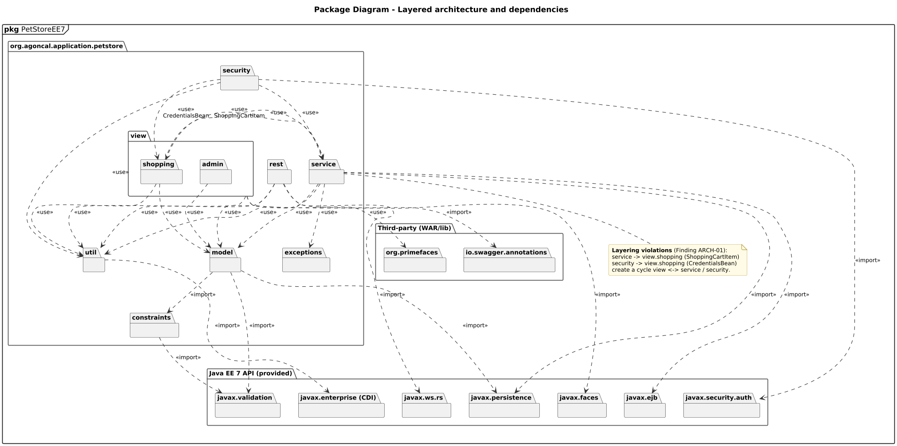

<!-- GENERATED by docs/uml/gen_markdown.py from the .puml source. Do not edit by hand. -->
# Package Diagram - Layered architecture and dependencies

| Property | Value |
|---|---|
| UML 2.5.1 diagram kind | Package |
| Frame heading (Annex A) | `pkg PetStoreEE7` |
| Summary | Application packages with <<use>>/<<import>> dependencies onto Java EE and third-party packages; highlights a layering cycle. |
| PlantUML source | [`src/structure/05-package.puml`](../../src/structure/05-package.puml) |
| Rendered | [PNG](../../rendered/structure/05-package.png) · [SVG](../../rendered/structure/05-package.svg) |
| References | none |
| Referenced by | none |

## Diagram



## PlantUML source

The block below is the exact content of `src/structure/05-package.puml`. It includes the shared
style file `../_style.iuml` (reproduced underneath) so it renders identically in any
PlantUML tool when saved next to that file.

```plantuml
@startuml 05-package
' @kind: Package
' @summary: Application packages with <<use>>/<<import>> dependencies onto Java EE and third-party packages; highlights a layering cycle.
!include ../_style.iuml
mainframe **pkg** PetStoreEE7
title Package Diagram - Layered architecture and dependencies

package "org.agoncal.application.petstore" as root {
  package view {
    package shopping {
    }
    package admin {
    }
  }
  package rest {
  }
  package security {
  }
  package service {
  }
  package model {
  }
  package constraints {
  }
  package exceptions {
  }
  package util {
  }
}

package "Java EE 7 API (provided)" as javaee {
  package "javax.faces" as jsf {
  }
  package "javax.ws.rs" as jaxrs {
  }
  package "javax.ejb" as ejb {
  }
  package "javax.enterprise (CDI)" as cdi {
  }
  package "javax.persistence" as jpa {
  }
  package "javax.validation" as bv {
  }
  package "javax.security.auth" as jaas {
  }
}
package "Third-party (WAR/lib)" as tp {
  package "org.primefaces" as pf {
  }
  package "io.swagger.annotations" as swag {
  }
}

shopping ..> service : <<use>>
shopping ..> model : <<use>>
shopping ..> util : <<use>>
admin ..> model : <<use>>
view ..> util : <<use>>
rest ..> model : <<use>>
rest ..> util : <<use>>
security ..> service : <<use>>
security ..> shopping : <<use>>\nCredentialsBean
security ..> util : <<use>>
service ..> model : <<use>>
service ..> exceptions : <<use>>
service ..> util : <<use>>
service ..> shopping : <<use>>\nShoppingCartItem
model ..> constraints : <<import>>

view ..> jsf : <<import>>
view ..> pf : <<use>>
rest ..> jaxrs : <<import>>
rest ..> swag : <<import>>
service ..> ejb : <<import>>
service ..> jpa : <<import>>
model ..> jpa : <<import>>
model ..> bv : <<import>>
constraints ..> bv : <<import>>
util ..> cdi : <<import>>
security ..> jaas : <<import>>

note bottom of service
  **Layering violations** (Finding ARCH-01):
  service -> view.shopping (ShoppingCartItem)
  security -> view.shopping (CredentialsBean)
  create a cycle view <-> service / security.
end note
@enduml
```

<details>
<summary>Shared style: <code>src/_style.iuml</code></summary>

```plantuml
' =====================================================================
'  Shared PlantUML style for the PetStore EE7 UML 2.5.1 model
'  Source of truth : src/main/java/org/agoncal/application/petstore/**
'  Notation        : OMG UML 2.5.1 (formal/17-12-05), Annex A frames
'  Licence         : CC BY-SA 3.0 (derivative of agoncal/petstore-ee7)
' =====================================================================
!pragma useIntermediatePackages false
set separator none
skinparam dpi 110
skinparam shadowing false
skinparam roundCorner 4
skinparam defaultFontName "Helvetica"
skinparam defaultFontSize 12
skinparam titleFontSize 15
skinparam titleFontStyle bold
skinparam ArrowColor #333333
skinparam ArrowFontSize 11
skinparam BackgroundColor #FFFFFF
skinparam NoteBackgroundColor #FFFBE6
skinparam NoteBorderColor #B59F3B
skinparam NoteFontSize 11
skinparam packageStyle folder
skinparam ClassBackgroundColor #F7FAFD
skinparam ClassBorderColor #2F5D8A
skinparam ClassHeaderBackgroundColor #E3EEF8
skinparam ClassAttributeIconSize 0
skinparam ObjectBackgroundColor #F7FAFD
skinparam ObjectBorderColor #2F5D8A
skinparam ComponentBackgroundColor #F7FAFD
skinparam ComponentBorderColor #2F5D8A
skinparam NodeBackgroundColor #F2F2F2
skinparam NodeBorderColor #555555
skinparam ArtifactBackgroundColor #FFFFFF
skinparam ActorBorderColor #2F5D8A
skinparam UsecaseBackgroundColor #F7FAFD
skinparam UsecaseBorderColor #2F5D8A
skinparam ActivityBackgroundColor #F7FAFD
skinparam ActivityBorderColor #2F5D8A
skinparam ActivityDiamondBackgroundColor #FFFFFF
skinparam PartitionBorderColor #7A7A7A
skinparam StateBackgroundColor #F7FAFD
skinparam StateBorderColor #2F5D8A
skinparam SequenceLifeLineBorderColor #7A7A7A
skinparam SequenceGroupBorderColor #555555
skinparam SequenceGroupHeaderFontStyle bold
skinparam ParticipantBackgroundColor #F7FAFD
skinparam ParticipantBorderColor #2F5D8A
skinparam stereotypeCBackgroundColor #C9DDF0
skinparam legendBackgroundColor #FAFAFA
skinparam legendBorderColor #999999
skinparam legendFontSize 10
hide circle
```

</details>

[Back to index](../README.md)
