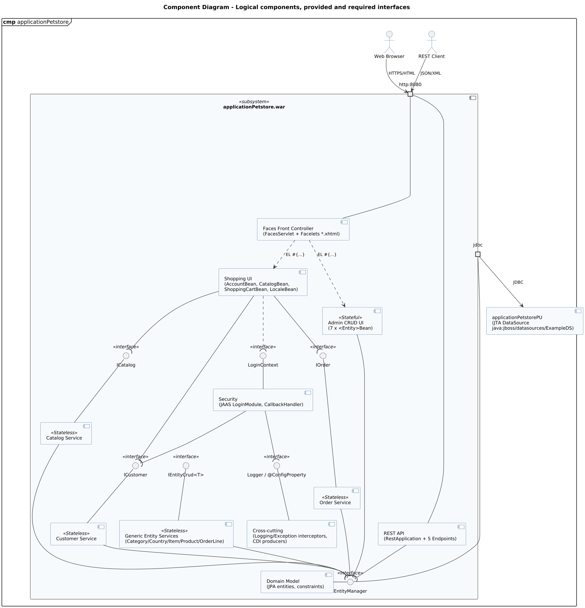

<!-- GENERATED by docs/uml/gen_markdown.py from the .puml source. Do not edit by hand. -->
# Component Diagram - Logical components, provided and required interfaces

| Property | Value |
|---|---|
| UML 2.5.1 diagram kind | Component |
| Frame heading (Annex A) | `cmp applicationPetstore` |
| Summary | Logical components of the WAR subsystem with provided/required interfaces (ball-and-socket) and ports. |
| PlantUML source | [`src/structure/06-component.puml`](../../src/structure/06-component.puml) |
| Rendered | [PNG](../../rendered/structure/06-component.png) · [SVG](../../rendered/structure/06-component.svg) |
| References | none |
| Referenced by | none |

## Diagram



## PlantUML source

The block below is the exact content of `src/structure/06-component.puml`. It includes the shared
style file `../_style.iuml` (reproduced underneath) so it renders identically in any
PlantUML tool when saved next to that file.

```plantuml
@startuml 06-component
' @kind: Component
' @summary: Logical components of the WAR subsystem with provided/required interfaces (ball-and-socket) and ports.
!include ../_style.iuml
mainframe **cmp** applicationPetstore
title Component Diagram - Logical components, provided and required interfaces

actor "Web Browser" as browser
actor "REST Client" as restc

component "applicationPetstore.war" as war <<subsystem>> {
  portin "http:8080" as phttp

  component "Faces Front Controller\n(FacesServlet + Facelets *.xhtml)" as faces
  component "Shopping UI\n(AccountBean, CatalogBean,\nShoppingCartBean, LocaleBean)" as shopui
  component "Admin CRUD UI\n(7 x <Entity>Bean)" as adminui <<Stateful>>
  component "REST API\n(RestApplication + 5 Endpoints)" as restapi
  component "Catalog Service" as catsvc <<Stateless>>
  component "Customer Service" as custsvc <<Stateless>>
  component "Order Service" as ordsvc <<Stateless>>
  component "Generic Entity Services\n(Category/Country/Item/Product/OrderLine)" as gensvc <<Stateless>>
  component "Security\n(JAAS LoginModule, CallbackHandler)" as sec
  component "Cross-cutting\n(Logging/Exception interceptors,\nCDI producers)" as xcut
  component "Domain Model\n(JPA entities, constraints)" as domain

  portout "jdbc" as pjdbc

  interface "ICatalog" as ICatalog <<interface>>
  interface "ICustomer" as ICustomer <<interface>>
  interface "IOrder" as IOrder <<interface>>
  interface "IEntityCrud<T>" as ICrud <<interface>>
  interface "EntityManager" as IEM <<interface>>
  interface "LoginContext" as ILogin <<interface>>
  interface "Logger / @ConfigProperty" as ICfg <<interface>>
}

component "applicationPetstorePU\n(JTA DataSource\njava:jboss/datasources/ExampleDS)" as ds

browser --> phttp : HTTPS/HTML
restc --> phttp : JSON/XML
phttp - faces
phttp - restapi
faces ..> shopui : EL #{...}
faces ..> adminui : EL #{...}

catsvc -up- ICatalog
custsvc -up- ICustomer
ordsvc -up- IOrder
gensvc -up- ICrud
domain - IEM
sec -up- ILogin
xcut -up- ICfg

shopui --( ICatalog
shopui --( ICustomer
shopui --( IOrder
shopui ..( ILogin
adminui --( IEM
restapi --( IEM
catsvc --( IEM
custsvc --( IEM
ordsvc --( IEM
gensvc --( IEM
sec --( ICustomer
sec --( ICfg
IEM - pjdbc
pjdbc --> ds : JDBC
@enduml
```

<details>
<summary>Shared style: <code>src/_style.iuml</code></summary>

```plantuml
' =====================================================================
'  Shared PlantUML style for the PetStore EE7 UML 2.5.1 model
'  Source of truth : src/main/java/org/agoncal/application/petstore/**
'  Notation        : OMG UML 2.5.1 (formal/17-12-05), Annex A frames
'  Licence         : CC BY-SA 3.0 (derivative of agoncal/petstore-ee7)
' =====================================================================
!pragma useIntermediatePackages false
set separator none
skinparam dpi 110
skinparam shadowing false
skinparam roundCorner 4
skinparam defaultFontName "Helvetica"
skinparam defaultFontSize 12
skinparam titleFontSize 15
skinparam titleFontStyle bold
skinparam ArrowColor #333333
skinparam ArrowFontSize 11
skinparam BackgroundColor #FFFFFF
skinparam NoteBackgroundColor #FFFBE6
skinparam NoteBorderColor #B59F3B
skinparam NoteFontSize 11
skinparam packageStyle folder
skinparam ClassBackgroundColor #F7FAFD
skinparam ClassBorderColor #2F5D8A
skinparam ClassHeaderBackgroundColor #E3EEF8
skinparam ClassAttributeIconSize 0
skinparam ObjectBackgroundColor #F7FAFD
skinparam ObjectBorderColor #2F5D8A
skinparam ComponentBackgroundColor #F7FAFD
skinparam ComponentBorderColor #2F5D8A
skinparam NodeBackgroundColor #F2F2F2
skinparam NodeBorderColor #555555
skinparam ArtifactBackgroundColor #FFFFFF
skinparam ActorBorderColor #2F5D8A
skinparam UsecaseBackgroundColor #F7FAFD
skinparam UsecaseBorderColor #2F5D8A
skinparam ActivityBackgroundColor #F7FAFD
skinparam ActivityBorderColor #2F5D8A
skinparam ActivityDiamondBackgroundColor #FFFFFF
skinparam PartitionBorderColor #7A7A7A
skinparam StateBackgroundColor #F7FAFD
skinparam StateBorderColor #2F5D8A
skinparam SequenceLifeLineBorderColor #7A7A7A
skinparam SequenceGroupBorderColor #555555
skinparam SequenceGroupHeaderFontStyle bold
skinparam ParticipantBackgroundColor #F7FAFD
skinparam ParticipantBorderColor #2F5D8A
skinparam stereotypeCBackgroundColor #C9DDF0
skinparam legendBackgroundColor #FAFAFA
skinparam legendBorderColor #999999
skinparam legendFontSize 10
hide circle
```

</details>

[Back to index](../README.md)
