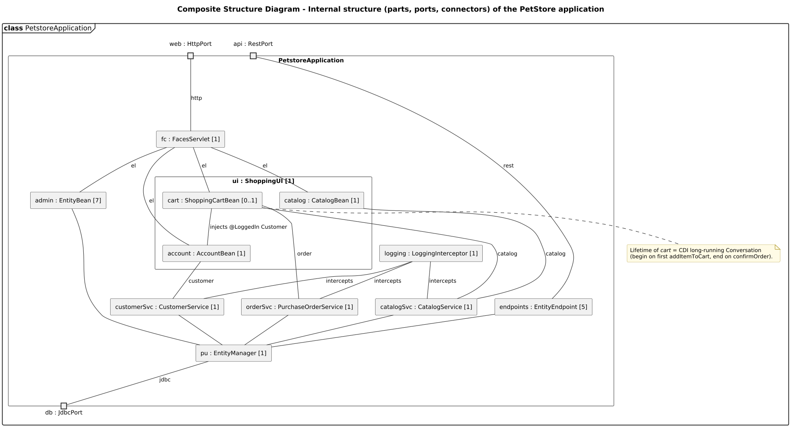

<!-- GENERATED by docs/uml/gen_markdown.py from the .puml source. Do not edit by hand. -->
# Composite Structure Diagram - Internal structure (parts, ports, connectors) of the PetStore application

| Property | Value |
|---|---|
| UML 2.5.1 diagram kind | Composite Structure |
| Frame heading (Annex A) | `class PetstoreApplication` |
| Summary | Internal structure of the application classifier: typed parts with multiplicities, ports and connectors. |
| PlantUML source | [`src/structure/07a-composite-structure-application.puml`](../../src/structure/07a-composite-structure-application.puml) |
| Rendered | [PNG](../../rendered/structure/07a-composite-structure-application.png) · [SVG](../../rendered/structure/07a-composite-structure-application.svg) |
| References | none |
| Referenced by | none |

## Diagram



## PlantUML source

The block below is the exact content of `src/structure/07a-composite-structure-application.puml`. It includes the shared
style file `../_style.iuml` (reproduced underneath) so it renders identically in any
PlantUML tool when saved next to that file.

```plantuml
@startuml 07a-composite-structure-application
' @kind: Composite Structure
' @summary: Internal structure of the application classifier: typed parts with multiplicities, ports and connectors.
!include ../_style.iuml
mainframe **class** PetstoreApplication
title Composite Structure Diagram - Internal structure (parts, ports, connectors) of the PetStore application

' The structured classifier is the frame; parts are typed <name> : <Type> [multiplicity]
rectangle "PetstoreApplication" as app {
  portin "web : HttpPort" as web
  portin "api : RestPort" as api
  portout "db : JdbcPort" as db

  rectangle "fc : FacesServlet [1]" as fc
  rectangle "ui : ShoppingUI [1]" as ui {
    rectangle "account : AccountBean [1]" as acc
    rectangle "catalog : CatalogBean [1]" as cat
    rectangle "cart : ShoppingCartBean [0..1]" as cart
  }
  rectangle "admin : EntityBean [7]" as adm
  rectangle "endpoints : EntityEndpoint [5]" as ep
  rectangle "catalogSvc : CatalogService [1]" as cs
  rectangle "customerSvc : CustomerService [1]" as cu
  rectangle "orderSvc : PurchaseOrderService [1]" as os
  rectangle "logging : LoggingInterceptor [1]" as li
  rectangle "pu : EntityManager [1]" as em
}

web -- fc : http
api -- ep : rest
fc -- acc : el
fc -- cat : el
fc -- cart : el
fc -- adm : el
acc -- cu : customer
cat -- cs : catalog
cart -- cs : catalog
cart -- os : order
cart -- acc : injects @LoggedIn Customer
cs -- em
cu -- em
os -- em
adm -- em
ep -- em
em -- db : jdbc
li -- cs : intercepts
li -- cu : intercepts
li -- os : intercepts

note bottom of cart
  Lifetime of //cart// = CDI long-running Conversation
  (begin on first addItemToCart, end on confirmOrder).
end note
@enduml
```

<details>
<summary>Shared style: <code>src/_style.iuml</code></summary>

```plantuml
' =====================================================================
'  Shared PlantUML style for the PetStore EE7 UML 2.5.1 model
'  Source of truth : src/main/java/org/agoncal/application/petstore/**
'  Notation        : OMG UML 2.5.1 (formal/17-12-05), Annex A frames
'  Licence         : CC BY-SA 3.0 (derivative of agoncal/petstore-ee7)
' =====================================================================
!pragma useIntermediatePackages false
set separator none
skinparam dpi 110
skinparam shadowing false
skinparam roundCorner 4
skinparam defaultFontName "Helvetica"
skinparam defaultFontSize 12
skinparam titleFontSize 15
skinparam titleFontStyle bold
skinparam ArrowColor #333333
skinparam ArrowFontSize 11
skinparam BackgroundColor #FFFFFF
skinparam NoteBackgroundColor #FFFBE6
skinparam NoteBorderColor #B59F3B
skinparam NoteFontSize 11
skinparam packageStyle folder
skinparam ClassBackgroundColor #F7FAFD
skinparam ClassBorderColor #2F5D8A
skinparam ClassHeaderBackgroundColor #E3EEF8
skinparam ClassAttributeIconSize 0
skinparam ObjectBackgroundColor #F7FAFD
skinparam ObjectBorderColor #2F5D8A
skinparam ComponentBackgroundColor #F7FAFD
skinparam ComponentBorderColor #2F5D8A
skinparam NodeBackgroundColor #F2F2F2
skinparam NodeBorderColor #555555
skinparam ArtifactBackgroundColor #FFFFFF
skinparam ActorBorderColor #2F5D8A
skinparam UsecaseBackgroundColor #F7FAFD
skinparam UsecaseBorderColor #2F5D8A
skinparam ActivityBackgroundColor #F7FAFD
skinparam ActivityBorderColor #2F5D8A
skinparam ActivityDiamondBackgroundColor #FFFFFF
skinparam PartitionBorderColor #7A7A7A
skinparam StateBackgroundColor #F7FAFD
skinparam StateBorderColor #2F5D8A
skinparam SequenceLifeLineBorderColor #7A7A7A
skinparam SequenceGroupBorderColor #555555
skinparam SequenceGroupHeaderFontStyle bold
skinparam ParticipantBackgroundColor #F7FAFD
skinparam ParticipantBorderColor #2F5D8A
skinparam stereotypeCBackgroundColor #C9DDF0
skinparam legendBackgroundColor #FAFAFA
skinparam legendBorderColor #999999
skinparam legendFontSize 10
hide circle
```

</details>

[Back to index](../README.md)
