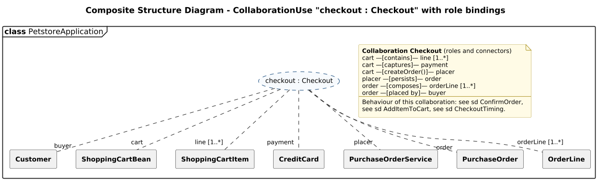

<!-- GENERATED by docs/uml/gen_markdown.py from the .puml source. Do not edit by hand. -->
# Composite Structure Diagram - CollaborationUse "checkout : Checkout" with role bindings

| Property | Value |
|---|---|
| UML 2.5.1 diagram kind | Composite Structure |
| Frame heading (Annex A) | `class PetstoreApplication` |
| Summary | CollaborationUse "checkout : Checkout" and its role bindings to the classes that play each role. |
| PlantUML source | [`src/structure/07b-composite-structure-checkout-collaboration.puml`](../../src/structure/07b-composite-structure-checkout-collaboration.puml) |
| Rendered | [PNG](../../rendered/structure/07b-composite-structure-checkout-collaboration.png) · [SVG](../../rendered/structure/07b-composite-structure-checkout-collaboration.svg) |
| References | [sd ConfirmOrder](../behaviour/13a-sequence-confirm-order.md), [sd AddItemToCart](../behaviour/14-communication-add-to-cart.md), [sd CheckoutTiming](../behaviour/16-timing-checkout.md) |
| Referenced by | none |

## Diagram



## PlantUML source

The block below is the exact content of `src/structure/07b-composite-structure-checkout-collaboration.puml`. It includes the shared
style file `../_style.iuml` (reproduced underneath) so it renders identically in any
PlantUML tool when saved next to that file.

```plantuml
@startuml 07b-composite-structure-checkout-collaboration
' @kind: Composite Structure
' @summary: CollaborationUse "checkout : Checkout" and its role bindings to the classes that play each role.
!include ../_style.iuml
mainframe **class** PetstoreApplication
title Composite Structure Diagram - CollaborationUse "checkout : Checkout" with role bindings

' UML 2.5.1 clause 11.7.4: a CollaborationUse is a dashed ellipse "name : Collaboration";
' each role binding is a dashed dependency labelled with the role name, ending on the
' classifier (or part) that plays that role.
usecase "checkout : Checkout" as coll #line.dashed

rectangle "**Customer**" as r1
rectangle "**ShoppingCartBean**" as r2
rectangle "**ShoppingCartItem**" as r3
rectangle "**CreditCard**" as r4
rectangle "**PurchaseOrderService**" as r5
rectangle "**PurchaseOrder**" as r6
rectangle "**OrderLine**" as r7

coll .. "buyer" r1
coll .. "cart" r2
coll .. "line [1..*]" r3
coll .. "payment" r4
coll .. "placer" r5
coll .. "order" r6
coll .. "orderLine [1..*]" r7

note as N1
  **Collaboration Checkout** (roles and connectors)
  cart —[contains]— line [1..*]
  cart —[captures]— payment
  cart —[createOrder()]— placer
  placer —[persists]— order
  order —[composes]— orderLine [1..*]
  order —[placed by]— buyer
  ----
  Behaviour of this collaboration: see sd ConfirmOrder,
  see sd AddItemToCart, see sd CheckoutTiming.
end note
@enduml
```

<details>
<summary>Shared style: <code>src/_style.iuml</code></summary>

```plantuml
' =====================================================================
'  Shared PlantUML style for the PetStore EE7 UML 2.5.1 model
'  Source of truth : src/main/java/org/agoncal/application/petstore/**
'  Notation        : OMG UML 2.5.1 (formal/17-12-05), Annex A frames
'  Licence         : CC BY-SA 3.0 (derivative of agoncal/petstore-ee7)
' =====================================================================
!pragma useIntermediatePackages false
set separator none
skinparam dpi 110
skinparam shadowing false
skinparam roundCorner 4
skinparam defaultFontName "Helvetica"
skinparam defaultFontSize 12
skinparam titleFontSize 15
skinparam titleFontStyle bold
skinparam ArrowColor #333333
skinparam ArrowFontSize 11
skinparam BackgroundColor #FFFFFF
skinparam NoteBackgroundColor #FFFBE6
skinparam NoteBorderColor #B59F3B
skinparam NoteFontSize 11
skinparam packageStyle folder
skinparam ClassBackgroundColor #F7FAFD
skinparam ClassBorderColor #2F5D8A
skinparam ClassHeaderBackgroundColor #E3EEF8
skinparam ClassAttributeIconSize 0
skinparam ObjectBackgroundColor #F7FAFD
skinparam ObjectBorderColor #2F5D8A
skinparam ComponentBackgroundColor #F7FAFD
skinparam ComponentBorderColor #2F5D8A
skinparam NodeBackgroundColor #F2F2F2
skinparam NodeBorderColor #555555
skinparam ArtifactBackgroundColor #FFFFFF
skinparam ActorBorderColor #2F5D8A
skinparam UsecaseBackgroundColor #F7FAFD
skinparam UsecaseBorderColor #2F5D8A
skinparam ActivityBackgroundColor #F7FAFD
skinparam ActivityBorderColor #2F5D8A
skinparam ActivityDiamondBackgroundColor #FFFFFF
skinparam PartitionBorderColor #7A7A7A
skinparam StateBackgroundColor #F7FAFD
skinparam StateBorderColor #2F5D8A
skinparam SequenceLifeLineBorderColor #7A7A7A
skinparam SequenceGroupBorderColor #555555
skinparam SequenceGroupHeaderFontStyle bold
skinparam ParticipantBackgroundColor #F7FAFD
skinparam ParticipantBorderColor #2F5D8A
skinparam stereotypeCBackgroundColor #C9DDF0
skinparam legendBackgroundColor #FAFAFA
skinparam legendBorderColor #999999
skinparam legendFontSize 10
hide circle
```

</details>

[Back to index](../README.md)
