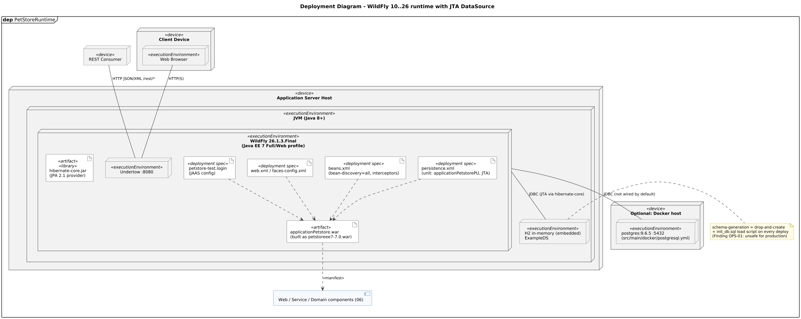

<!-- GENERATED by docs/uml/gen_markdown.py from the .puml source. Do not edit by hand. -->
# Deployment Diagram - WildFly 10..26 runtime with JTA DataSource

| Property | Value |
|---|---|
| UML 2.5.1 diagram kind | Deployment |
| Frame heading (Annex A) | `dep PetStoreRuntime` |
| Summary | Runtime topology: devices, execution environments (JVM, WildFly, database), artifacts, deployment specifications (dependency to the deployed artifact, 19.2.4) and <<manifest>>. |
| PlantUML source | [`src/structure/08-deployment.puml`](../../src/structure/08-deployment.puml) |
| Rendered | [PNG](../../rendered/structure/08-deployment.png) · [SVG](../../rendered/structure/08-deployment.svg) |
| References | none |
| Referenced by | none |

## Diagram



## PlantUML source

The block below is the exact content of `src/structure/08-deployment.puml`. It includes the shared
style file `../_style.iuml` (reproduced underneath) so it renders identically in any
PlantUML tool when saved next to that file.

```plantuml
@startuml 08-deployment
' @kind: Deployment
' @summary: Runtime topology: devices, execution environments (JVM, WildFly, database), artifacts, deployment specifications (dependency to the deployed artifact, 19.2.4) and <<manifest>>.
!include ../_style.iuml
set separator none
mainframe **dep** PetStoreRuntime
title Deployment Diagram - WildFly 10..26 runtime with JTA DataSource

node "Client Device" as client <<device>> {
  node "Web Browser" as br <<executionEnvironment>>
}
node "REST Consumer" as rc <<device>>

node "Application Server Host" as host <<device>> {
  label " " as hostpad
  node "JVM (Java 8+)" as jvm <<executionEnvironment>> {
    node "WildFly 26.1.3.Final\n(Java EE 7 Full/Web profile)" as wf <<executionEnvironment>> {
      artifact "applicationPetstore.war\n(built as petstoreee7-7.0.war)" as war <<artifact>>
      artifact "persistence.xml\n(unit: applicationPetstorePU, JTA)" as pxml <<deployment spec>>
      artifact "beans.xml\n(bean-discovery=all, interceptors)" as bxml <<deployment spec>>
      artifact "web.xml / faces-config.xml" as wxml <<deployment spec>>
      artifact "petstore-test.login\n(JAAS config)" as jaas <<deployment spec>>
      node "Undertow :8080" as ut <<executionEnvironment>>
      artifact "hibernate-core.jar\n(JPA 2.1 provider)" as hib <<artifact>> <<library>>
    }
    node "H2 in-memory (embedded)\nExampleDS" as h2 <<executionEnvironment>>
  }
}

node "Optional: Docker host" as dh <<device>> {
  node "postgres:9.6.5 :5432\n(src/main/docker/postgresql.yml)" as pg <<executionEnvironment>>
}

component "Web / Service / Domain components (06)" as comps

war ..> comps : <<manifest>>
pxml ..> war
bxml ..> war
wxml ..> war
jaas ..> war

br -- ut : HTTP(S)
rc -- ut : HTTP JSON/XML /rest/*
wf -- h2 : JDBC (JTA via hibernate-core)
wf -- pg : JDBC (not wired by default)

note right of h2
  schema-generation = drop-and-create
  + init_db.sql load script on every deploy
  (Finding OPS-01: unsafe for production)
end note
@enduml
```

<details>
<summary>Shared style: <code>src/_style.iuml</code></summary>

```plantuml
' =====================================================================
'  Shared PlantUML style for the PetStore EE7 UML 2.5.1 model
'  Source of truth : src/main/java/org/agoncal/application/petstore/**
'  Notation        : OMG UML 2.5.1 (formal/17-12-05), Annex A frames
'  Licence         : CC BY-SA 3.0 (derivative of agoncal/petstore-ee7)
' =====================================================================
!pragma useIntermediatePackages false
set separator none
skinparam dpi 110
skinparam shadowing false
skinparam roundCorner 4
skinparam defaultFontName "Helvetica"
skinparam defaultFontSize 12
skinparam titleFontSize 15
skinparam titleFontStyle bold
skinparam ArrowColor #333333
skinparam ArrowFontSize 11
skinparam BackgroundColor #FFFFFF
skinparam NoteBackgroundColor #FFFBE6
skinparam NoteBorderColor #B59F3B
skinparam NoteFontSize 11
skinparam packageStyle folder
skinparam ClassBackgroundColor #F7FAFD
skinparam ClassBorderColor #2F5D8A
skinparam ClassHeaderBackgroundColor #E3EEF8
skinparam ClassAttributeIconSize 0
skinparam ObjectBackgroundColor #F7FAFD
skinparam ObjectBorderColor #2F5D8A
skinparam ComponentBackgroundColor #F7FAFD
skinparam ComponentBorderColor #2F5D8A
skinparam NodeBackgroundColor #F2F2F2
skinparam NodeBorderColor #555555
skinparam ArtifactBackgroundColor #FFFFFF
skinparam ActorBorderColor #2F5D8A
skinparam UsecaseBackgroundColor #F7FAFD
skinparam UsecaseBorderColor #2F5D8A
skinparam ActivityBackgroundColor #F7FAFD
skinparam ActivityBorderColor #2F5D8A
skinparam ActivityDiamondBackgroundColor #FFFFFF
skinparam PartitionBorderColor #7A7A7A
skinparam StateBackgroundColor #F7FAFD
skinparam StateBorderColor #2F5D8A
skinparam SequenceLifeLineBorderColor #7A7A7A
skinparam SequenceGroupBorderColor #555555
skinparam SequenceGroupHeaderFontStyle bold
skinparam ParticipantBackgroundColor #F7FAFD
skinparam ParticipantBorderColor #2F5D8A
skinparam stereotypeCBackgroundColor #C9DDF0
skinparam legendBackgroundColor #FAFAFA
skinparam legendBorderColor #999999
skinparam legendFontSize 10
hide circle
```

</details>

[Back to index](../README.md)
