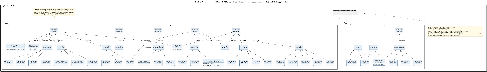

<!-- GENERATED by docs/uml/gen_markdown.py from the .puml source. Do not edit by hand. -->
# Profile Diagram - JavaEE7 and PetStore profiles (all stereotypes used in this model) and their application

| Property | Value |
|---|---|
| UML 2.5.1 diagram kind | Profile |
| Frame heading (Annex A) | `pkg PetStoreModel` |
| Summary | JavaEE7 and PetStore profiles: every stereotype used in this model, tag definitions, abstract stereotypes extending metaclasses, and profile applications. |
| PlantUML source | [`src/structure/09-profile-javaee7.puml`](../../src/structure/09-profile-javaee7.puml) |
| Rendered | [PNG](../../rendered/structure/09-profile-javaee7.png) · [SVG](../../rendered/structure/09-profile-javaee7.svg) |
| References | none |
| Referenced by | none |

## Diagram



## PlantUML source

The block below is the exact content of `src/structure/09-profile-javaee7.puml`. It includes the shared
style file `../_style.iuml` (reproduced underneath) so it renders identically in any
PlantUML tool when saved next to that file.

```plantuml
@startuml 09-profile-javaee7
' @kind: Profile
' @summary: JavaEE7 and PetStore profiles: every stereotype used in this model, tag definitions, abstract stereotypes extending metaclasses, and profile applications.
!include ../_style.iuml
mainframe **pkg** PetStoreModel
title Profile Diagram - JavaEE7 and PetStore profiles (all stereotypes used in this model) and their application

' UML 2.5.1 clause 12.3:
'  * a Stereotype is a Class with keyword <<stereotype>>; its attributes are tag definitions;
'  * an Extension connects a Stereotype to a <<metaclass>> (solid line, filled triangle at the metaclass);
'  * Stereotypes may specialise other Stereotypes (Generalization). Here each abstract stereotype carries
'    the Extension once and the concrete stereotypes inherit it;
'  * a ProfileApplication is a dashed arrow with keyword <<apply>> from the applying package to the profile.

package "JavaEE7" <<profile>> as jee {
  class "Class" as MClass <<metaclass>>
  class "DataType" as MDT <<metaclass>>
  class "Interface" as MIf <<metaclass>>
  class "Property" as MProp <<metaclass>>
  class "Operation" as MOp <<metaclass>>

  abstract class EjbAnnotation <<stereotype>>
  class Stateless <<stereotype>>
  class Stateful <<stereotype>>
  class LocalBean <<stereotype>>

  abstract class CdiScope <<stereotype>>
  class RequestScoped <<stereotype>>
  class SessionScoped <<stereotype>>
  class ConversationScoped <<stereotype>>
  class ApplicationScoped <<stereotype>>

  abstract class CdiBean <<stereotype>>
  class Named <<stereotype>>
  class Interceptor <<stereotype>>
  class Decorator <<stereotype>>

  class Entity <<stereotype>> {
    cacheable : Boolean = false
  }
  class Embeddable <<stereotype>>
  class Path <<stereotype>> {
    value : String
  }
  class ApplicationPath <<stereotype>> {
    value : String
  }

  abstract class AnnotationType <<stereotype>>
  class Qualifier <<stereotype>>
  class InterceptorBinding <<stereotype>>
  class Constraint <<stereotype>>

  abstract class InjectionPoint <<stereotype>>
  class Inject <<stereotype>>
  class Delegate <<stereotype>>
  class PersistenceContext <<stereotype>> {
    unitName : String
    type : String = "TRANSACTION"
  }
  class Produces <<stereotype>>

  abstract class Callback <<stereotype>>
  class PrePersist <<stereotype>>
  class PostLoad <<stereotype>>
  class PostPersist <<stereotype>>
  class PostUpdate <<stereotype>>
  class AroundInvoke <<stereotype>>

  abstract class HttpMethod <<stereotype>>
  class GET <<stereotype>>
  class POST <<stereotype>>
  class PUT <<stereotype>>
  class DELETE <<stereotype>>
}

package "PetStore" <<profile>> as app {
  class "Class" as AClass <<metaclass>>
  class "Property" as AProp <<metaclass>>
  class "Operation" as AOp <<metaclass>>
  class Loggable <<stereotype>>
  class CatchException <<stereotype>>
  abstract class PetStoreQualifier <<stereotype>>
  class Vat <<stereotype>>
  class Discount <<stereotype>>
  class LoggedIn <<stereotype>>
  class ConfigProperty <<stereotype>> {
    value : String = ""
  }
}

' ---- Extensions (stereotype -> metaclass) ----
EjbAnnotation -up-> MClass : extension
CdiScope -up-> MClass : extension
CdiBean -up-> MClass : extension
Named -up-> MProp : extension
Entity -up-> MClass : extension
Path -up-> MClass : extension
Path -up-> MOp : extension
ApplicationPath -up-> MClass : extension
Embeddable -up-> MDT : extension
AnnotationType -up-> MIf : extension
InjectionPoint -up-> MProp : extension
Produces -up-> MProp : extension
Produces -up-> MOp : extension
Callback -up-> MOp : extension
HttpMethod -up-> MOp : extension
Loggable -up-> AClass : extension
Loggable -up-> AOp : extension
CatchException -up-> AClass : extension
PetStoreQualifier -up-> AProp : extension
ConfigProperty -up-> AOp : extension

' ---- Stereotype generalizations ----
EjbAnnotation <|-- Stateless
EjbAnnotation <|-- Stateful
EjbAnnotation <|-- LocalBean
CdiScope <|-- RequestScoped
CdiScope <|-- SessionScoped
CdiScope <|-- ConversationScoped
CdiScope <|-- ApplicationScoped
CdiBean <|-- Named
CdiBean <|-- Interceptor
CdiBean <|-- Decorator
AnnotationType <|-- Qualifier
AnnotationType <|-- InterceptorBinding
AnnotationType <|-- Constraint
InjectionPoint <|-- Inject
InjectionPoint <|-- Delegate
InjectionPoint <|-- PersistenceContext
Callback <|-- PrePersist
Callback <|-- PostLoad
Callback <|-- PostPersist
Callback <|-- PostUpdate
Callback <|-- AroundInvoke
HttpMethod <|-- GET
HttpMethod <|-- POST
HttpMethod <|-- PUT
HttpMethod <|-- DELETE
PetStoreQualifier <|-- Vat
PetStoreQualifier <|-- Discount
PetStoreQualifier <|-- LoggedIn
PetStoreQualifier <|-- ConfigProperty

package "org.agoncal.application.petstore" as pm {
}
pm ..> jee : <<apply>>
pm ..> app : <<apply>>

note bottom of pm
  Applied examples (stereotype + tagged values):
  Category <<Entity>> {cacheable = true}
  Address <<Embeddable>>; CatalogService <<Stateless>> <<Loggable>>
  ShoppingCartBean <<Named>> <<ConversationScoped>> <<CatchException>>
  CategoryEndpoint <<Stateless>> <<Path>> {value = "/categories"}
  AbstractService::entityManager <<PersistenceContext>> {unitName = "applicationPetstorePU"}
  NumberProducer::vatRate <<Produces>> <<Vat>> <<Named>>
end note

note top of MClass
  **Notation deviation (PlantUML):** UML 2.5.1 clause 12.3.4 draws an
  Extension as a solid line with a **filled** triangle at the metaclass
  end. PlantUML has no filled-triangle head, so each Extension is drawn
  as a solid arrow named "extension". Hollow triangles are
  Generalizations between stereotypes (abstract stereotypes in italics).
end note
@enduml
```

<details>
<summary>Shared style: <code>src/_style.iuml</code></summary>

```plantuml
' =====================================================================
'  Shared PlantUML style for the PetStore EE7 UML 2.5.1 model
'  Source of truth : src/main/java/org/agoncal/application/petstore/**
'  Notation        : OMG UML 2.5.1 (formal/17-12-05), Annex A frames
'  Licence         : CC BY-SA 3.0 (derivative of agoncal/petstore-ee7)
' =====================================================================
!pragma useIntermediatePackages false
set separator none
skinparam dpi 110
skinparam shadowing false
skinparam roundCorner 4
skinparam defaultFontName "Helvetica"
skinparam defaultFontSize 12
skinparam titleFontSize 15
skinparam titleFontStyle bold
skinparam ArrowColor #333333
skinparam ArrowFontSize 11
skinparam BackgroundColor #FFFFFF
skinparam NoteBackgroundColor #FFFBE6
skinparam NoteBorderColor #B59F3B
skinparam NoteFontSize 11
skinparam packageStyle folder
skinparam ClassBackgroundColor #F7FAFD
skinparam ClassBorderColor #2F5D8A
skinparam ClassHeaderBackgroundColor #E3EEF8
skinparam ClassAttributeIconSize 0
skinparam ObjectBackgroundColor #F7FAFD
skinparam ObjectBorderColor #2F5D8A
skinparam ComponentBackgroundColor #F7FAFD
skinparam ComponentBorderColor #2F5D8A
skinparam NodeBackgroundColor #F2F2F2
skinparam NodeBorderColor #555555
skinparam ArtifactBackgroundColor #FFFFFF
skinparam ActorBorderColor #2F5D8A
skinparam UsecaseBackgroundColor #F7FAFD
skinparam UsecaseBorderColor #2F5D8A
skinparam ActivityBackgroundColor #F7FAFD
skinparam ActivityBorderColor #2F5D8A
skinparam ActivityDiamondBackgroundColor #FFFFFF
skinparam PartitionBorderColor #7A7A7A
skinparam StateBackgroundColor #F7FAFD
skinparam StateBorderColor #2F5D8A
skinparam SequenceLifeLineBorderColor #7A7A7A
skinparam SequenceGroupBorderColor #555555
skinparam SequenceGroupHeaderFontStyle bold
skinparam ParticipantBackgroundColor #F7FAFD
skinparam ParticipantBorderColor #2F5D8A
skinparam stereotypeCBackgroundColor #C9DDF0
skinparam legendBackgroundColor #FAFAFA
skinparam legendBorderColor #999999
skinparam legendFontSize 10
hide circle
```

</details>

[Back to index](../README.md)
