# PetStore EE7 — Interface Design: Information Architecture, Screen Flow, Wireframes and UI Guidelines

| Item | Value |
|---|---|
| Scope | Storefront (`/shopping`) and back office (`/admin`) user interfaces; the REST interface is covered in [`../api/`](../api/README.md) |
| Standards applied | **WCAG 2.2** Level AA (W3C, 2023) · **ISO 9241-110:2020** interaction principles · **Nielsen's 10 usability heuristics** · **GOV.UK / Baymard** form and checkout conventions · **HTML autocomplete tokens** (WHATWG) |
| Method | Wireframes reverse-engineered from the Facelets views (`src/main/webapp/**/*.xhtml`) and the shared template (`resources/templates/template.xhtml`) |
| Sources | `src/*.puml`: PlantUML **Salt** wireframes, screen flow, and a WBS site map; shared page chrome in [`src/_chrome.iuml`](src/_chrome.iuml) |
| Traceability | Every screen names the use case (UC-xx) from [use case diagram 10a/10b](../uml/markdown/behaviour/10a-use-case-shopping.md) that it realises |

---

## 1. Information architecture

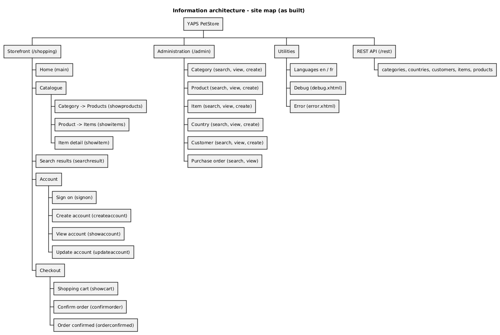

## 2. Screen inventory

| ID | Screen | View | Backing bean(s) | Use cases | Access (as built) |
|---|---|---|---|---|---|
| WF-01 | Home | `shopping/main.xhtml` | — | UC01 | Public |
| WF-02 | Products of a category | `shopping/showproducts.xhtml?categoryName=` | CatalogBean | UC01 | Public |
| WF-03 | Items of a product | `shopping/showitems.xhtml?productId=` | CatalogBean | UC01 | Public |
| WF-04 | Item detail | `shopping/showitem.xhtml?itemId=` | CatalogBean, ShoppingCartBean | UC03, UC10 | Public; *Add to cart* only when signed in |
| WF-05 | Search results | `shopping/searchresult.xhtml` | CatalogBean, ShoppingCartBean | UC02, UC10 | Public |
| WF-06 | Sign on | `shopping/signon.xhtml` | AccountBean, CredentialsBean | UC07, UC05 | Public |
| WF-07 | Create account | `shopping/createaccount.xhtml` | AccountBean, CountryBean | UC05, UC06 | Public |
| WF-08 | Account / update account | `shopping/showaccount.xhtml`, `updateaccount.xhtml` | AccountBean | UC09, UC06 | Signed in (by rendering only) |
| WF-09 | Shopping cart | `shopping/showcart.xhtml` | ShoppingCartBean | UC11, UC12 | Signed in (by rendering only) |
| WF-10 | Confirm order | `shopping/confirmorder.xhtml` | ShoppingCartBean, CountryBean | UC13, UC14 | Signed in (by rendering only) |
| WF-11 | Order confirmed | `shopping/orderconfirmed.xhtml` | ShoppingCartBean | UC13 | Signed in (by rendering only) |
| WF-12 | Admin search (×6 entities) | `admin/<entity>/search.xhtml` | `<Entity>Bean` | UC15–UC19 | **Unprotected** (SEC-02) |
| WF-13 | Admin create/edit (×6 entities) | `admin/<entity>/create.xhtml`, `view.xhtml` | `<Entity>Bean` | UC15–UC18 | **Unprotected** (SEC-02) |
| WF-20 | *Proposed* checkout | — | — | UC13, UC14 | Signed in, enforced by the server |

"By rendering only" means the link is hidden in the page, but the URL itself is not protected by a security constraint.

## 3. Screen flow

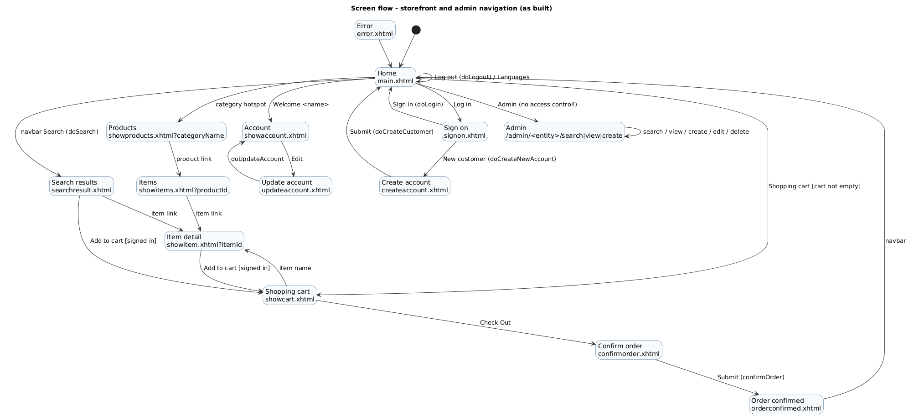

The screen flow is derived from `h:link outcome`, action return values (for example `"showcart.faces"`) and `f:viewParam`
declarations. It is a navigation map, not a UML diagram. The behaviour behind each arrow is modelled in the
[UML interactions](../uml/markdown/behaviour/15-interaction-overview-shopping.md).

## 4. Wireframes — as built

Every wireframe uses the shared page chrome: Bootstrap 3 fixed-top navbar, keyword search and footer. Red text marks a
defect.

### WF-01 Home
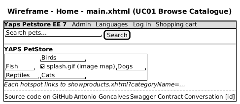

### WF-02 Products of a category
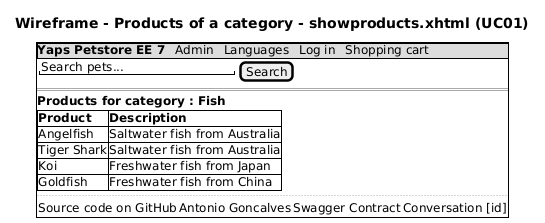

### WF-03 Items of a product
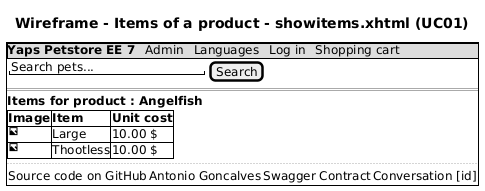

### WF-04 Item detail
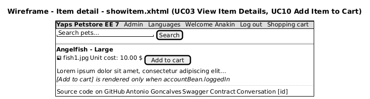

### WF-05 Search results
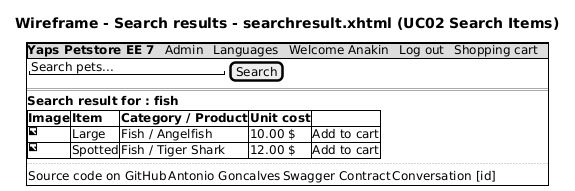

### WF-06 Sign on
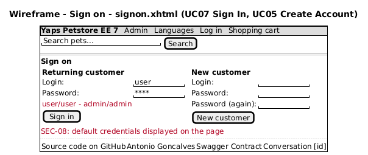

### WF-07 Create account
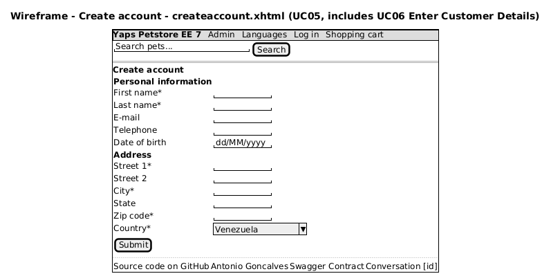

### WF-08 Account
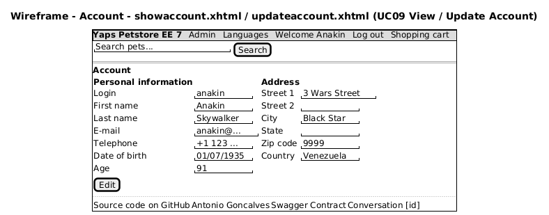

### WF-09 Shopping cart
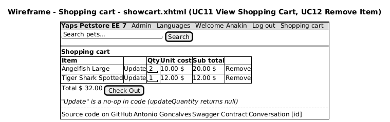

### WF-10 Confirm order
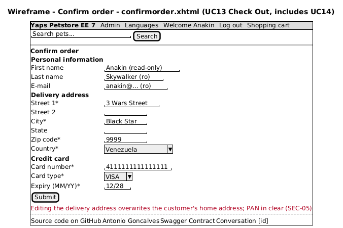

### WF-11 Order confirmed
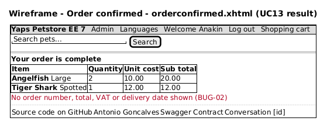

### WF-12 Admin search
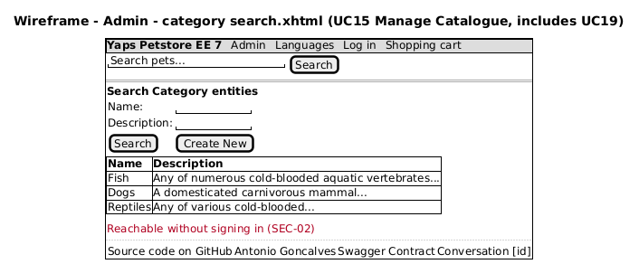

### WF-13 Admin create / edit
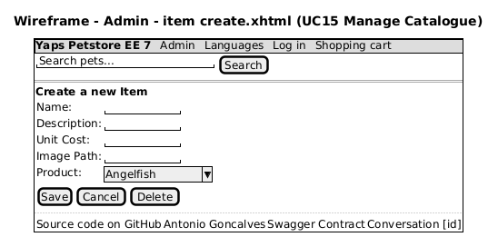

## 5. Wireframe — proposed checkout (target state)

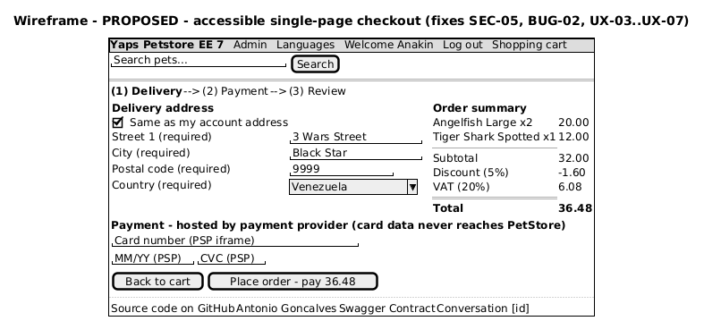

The design choices follow established checkout conventions (Baymard Institute, GOV.UK Design System):

- **Progress indicator** (Delivery → Payment → Review) so users know where they are (Nielsen heuristic 1: visibility of system status).
- **Delivery address separate from the account address**, defaulting to "same as account", so checkout no longer overwrites the account address (UX-04).
- **Payment fields hosted by the PSP** (iframe or hosted fields), so card data never reaches PetStore (SEC-05, ADR-0007).
- **Order summary always visible**, with subtotal, discount, VAT and total, computed by the server (BUG-02).
- **One primary action** that states the amount ("Place order – pay 36.48").
- Visible text labels with "(required)" instead of a bare asterisk, and correct `autocomplete` tokens on every field.

## 6. UI review findings

Each finding cites the view file and the relevant WCAG 2.2 success criterion or heuristic.

| ID | Screen | Finding (evidence) | Standard | Severity | Recommendation |
|---|---|---|---|---|---|
| UX-01 | WF-06 | Default credentials `user/user - admin/admin` printed under the sign-in form (`signon.xhtml`) | OWASP ASVS V2; security | High (= SEC-08) | Remove; use development-only seed data |
| UX-02 | WF-10 | Field captions are `h:outputText`, not `h:outputLabel for=…`, so inputs have no programmatic label (`confirmorder.xhtml`, also `showaccount.xhtml`) | WCAG 1.3.1, 3.3.2, 4.1.2 (A) | High | Use `<h:outputLabel for>`; group with `<fieldset>`/`<legend>` |
| UX-03 | WF-10 | No `autocomplete` tokens (`street-address`, `postal-code`, `cc-number`, `cc-exp`) | WCAG 1.3.5 Identify Input Purpose (AA) | Medium | Add `pt:autocomplete` passthrough attributes |
| UX-04 | WF-10 | Editing the delivery address writes to `customer.homeAddress`, which silently changes the customer's account | Heuristic 3 (user control), data integrity | Medium | Separate delivery address; "same as account" checkbox (WF-20) |
| UX-05 | WF-11 | Confirmation shows no order number, total, VAT or next steps | Heuristic 1 (visibility of system status) | Medium | Show order number, totals, and e-mail confirmation (BUG-02) |
| UX-06 | WF-09 | The *Update* link does nothing (`updateQuantity()` returns `null`); the quantity box has no label | Heuristic 5 (error prevention), WCAG 3.3.2 | Medium | Make quantity update work (or auto-update with a live region); label it |
| UX-07 | WF-09, WF-11, WF-03, WF-05 | Storefront `h:dataTable`s have no header facets, so they render no `<th>` and screen readers cannot announce columns | WCAG 1.3.1 (A) | Medium | Add `<f:facet name="header">` and a `<caption>` |
| UX-08 | WF-01 | The only way to reach categories from Home is a fixed-size image map (350×355 px); category names exist only as `alt` text, and the hotspots are small and do not reflow | WCAG 1.4.10 Reflow (AA), 2.5.8 Target Size (AA) | Medium | Provide a visible text list or menu of categories; keep the image as decoration |
| UX-09 | Chrome | The template sets no `lang` attribute on `<html>`; the search box has no label; the *Languages* toggle is `href="#"` | WCAG 3.1.1 Language of Page (A), 3.3.2, 4.1.2 | Medium | `<html lang="#{localeBean.language}">`; visually hidden label; use a `button` for the dropdown |
| UX-10 | WF-04 | *Add to cart* is hidden when signed out, with no explanation | Heuristic 6 (recognition), conversion | Low | Show the button, and redirect to sign-in with a return URL |
| UX-11 | WF-12/13 | Admin is reachable from the public navbar without authentication | Security, WCAG n/a | High (= SEC-02) | Hide it and protect it (ADR-0006) |
| UX-12 | All | The footer shows the internal CDI conversation ID | Information disclosure (OWASP WSTG-INFO) | Low | Remove it from production templates |

## 7. Interface design guidelines (for new screens)

**Layout and grid.** Use the Bootstrap 12-column grid. Breakpoints: `xs` < 576, `sm` ≥ 576, `md` ≥ 768, `lg` ≥ 992,
`xl` ≥ 1200 (Bootstrap 5 after ADR-0008). Use a single-column form layout on mobile and at most two columns on desktop.
Keep the primary action bottom-left, aligned with the fields.

**Design tokens.**

| Token | Value | Use |
|---|---|---|
| `color.primary` | `#2F5D8A` | Primary buttons, links (contrast 6.9:1 on white) |
| `color.danger` | `#B00020` | Errors and destructive actions (contrast 7.3:1) |
| `color.text` | `#1F1F1F` | Body text |
| `space.unit` | `8px` | Spacing scale 4 / 8 / 16 / 24 / 32 |
| `font.body` | system-ui, 16px/1.5 | Minimum 16px on inputs (prevents iOS zoom) |
| `radius` | `4px` | Inputs, buttons, cards |

**Forms** (GOV.UK pattern):
- Every input has a visible `<label>`; hints go in `aria-describedby`.
- Mark required fields as "(required)", or mark the optional ones as "(optional)".
- Validate on submit. Show an error summary at the top with links to the fields, and inline messages linked to their field.
- Use `autocomplete` tokens, and `inputmode="numeric"` for postal codes and card fields.
- Never block paste into password fields; allow at least 64 characters (NIST SP 800-63B).

**Tables.** `<caption>`, `<th scope="col">`, right-aligned currency columns, currency shown with its code (for example "USD 10.00").

**Feedback.** Use JSF `FacesMessage` rendered in an ARIA live region (`role="status"` for info, `role="alert"` for errors). Show
confirmation pages with a reference number.

**Internationalisation.** Put all text in the `Messages*.properties` bundles; no hard-coded strings (for example the "Check Out" link
text in `showcart.xhtml` is hard-coded). Format dates and currency by locale.

**Accessibility definition of done.**
- The axe-core scan reports no violations.
- Every flow can be completed with the keyboard only.
- The page works at 200% zoom and 320 px width (reflow).
- Focus is always visible.
- Contrast is at least 4.5:1 for text and 3:1 for UI components.
- Each screen has been checked with a screen reader (NVDA or VoiceOver).

Automated checks are listed as TC-A11Y-xx in the [test catalogue](../testing/test-cases.md).
